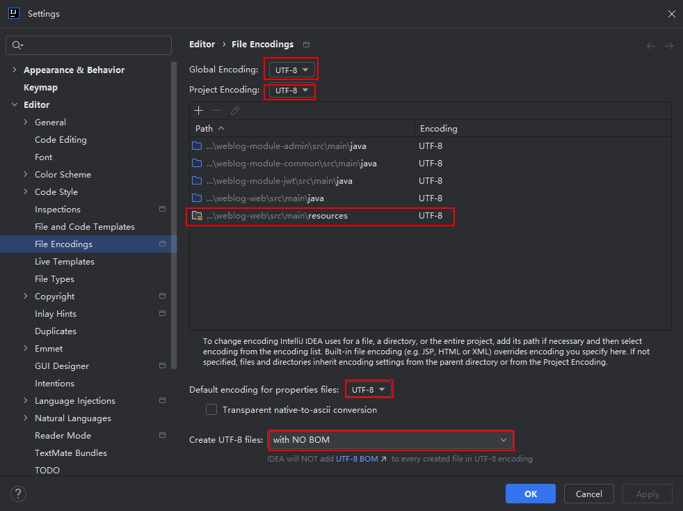

# 记录项目练习过程中遇到的一些情况

## 一、备注一个编码不兼容的报错

在启动项目时报错，内容如下：

> org.yaml.snakeyaml.error.YAMLException: java.nio.charset.MalformedInputException: Input length = 1

报错发生场景：

> 从github克隆代码到一台设备并尝试运行时

报错原因：

> 文件编码与IDEA编码不一致

修复措施：

