# 一、搭建Spring Boot多模块工程(Spring Initializr)

## 1.1、IDEA搭建多模块工程骨架

**创建项目**

首先选择一个位置创建Back目录用于存放后端项目、以及Front目录存放前端项目

**创建父项目**

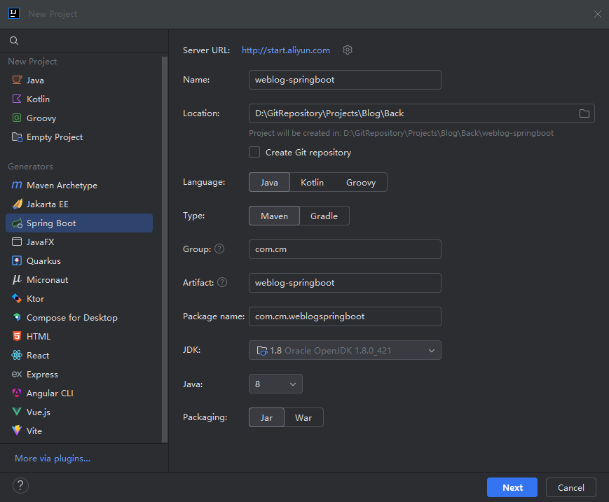

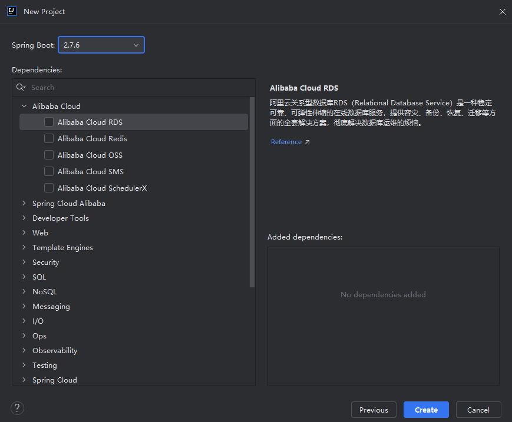

删除无用文件及目录，最终结构如下：

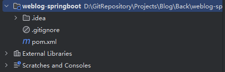

接下来，开始整理一下父项目的 `pom.xml` 文件，整理后内容如下：

```xml
<?xml version="1.0" encoding="UTF-8"?>
<project
        xmlns="http://maven.apache.org/POM/4.0.0"
        xmlns:xsi="http://www.w3.org/2001/XMLSchema-instance"
        xsi:schemaLocation="http://maven.apache.org/POM/4.0.0 https://maven.apache.org/xsd/maven-4.0.0.xsd"
>
    <modelVersion>4.0.0</modelVersion>

    <parent>
        <groupId>org.springframework.boot</groupId>
        <artifactId>spring-boot-starter-parent</artifactId>
        <!-- 将 Spring Boot 的版本号切换成 2.6 版本 -->
        <version>2.6.3</version>
        <relativePath/> <!-- lookup parent from repository -->
    </parent>

    <groupId>com.cm</groupId>
    <artifactId>weblog-springboot</artifactId>
    <version>${revision}</version>
    <name>weblog-springboot</name>
    <description>前后端分离博客 Weblog By CM</description>

    <!-- 多模块项目父工程打包模式必须指定为 pom -->
    <packaging>pom</packaging>

    <!-- 子模块管理 -->
    <modules>
    </modules>

    <!-- 版本号统一管理 -->
    <properties>
        <!-- 项目版本号 -->
        <revision>0.0.1-SNAPSHOT</revision>
        <java.version>1.8</java.version>
        <project.build.sourceEncoding>UFT-8</project.build.sourceEncoding>

        <!-- Maven 相关 -->
        <maven.compiler.source>${java.version}</maven.compiler.source>
        <maven.compiler.target>${java.version}</maven.compiler.target>
    </properties>

    <!-- 统一依赖管理 -->
    <dependencyManagement>
    </dependencyManagement>

    <build>
        <!-- 统一插件管理 -->
        <pluginManagement>
        </pluginManagement>
    </build>

    <!-- 使用阿里云的 Maven 仓库源，提升包下载速度 -->
    <repositories>
        <repository>
            <id>aliyunmaven</id>
            <name>aliyun</name>
            <url>https://maven.aliyun.com/repository/public</url>
        </repository>
    </repositories>
</project>
```

## 1.2、创建 web 模块(访问 + 打包模块)

在父项目上右键，添加模块Module

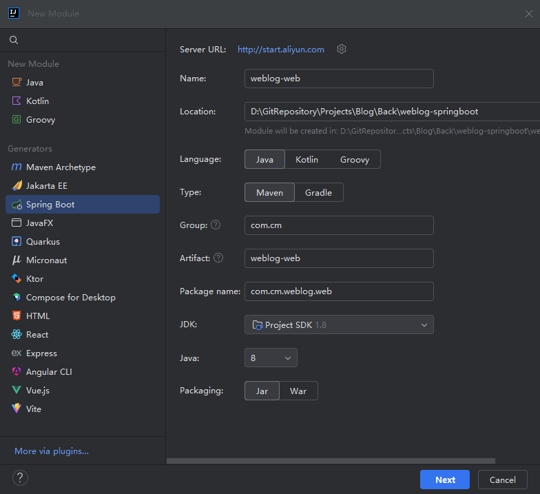

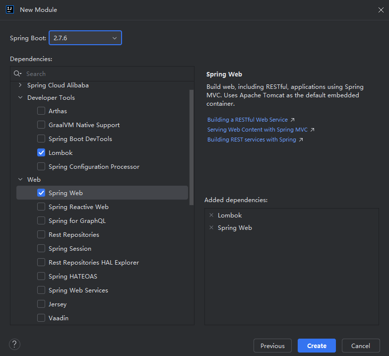

删除多余文件，最终目录结构：

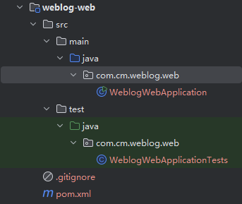

在父项目中添加子模块及spring-boot-maven-plugin

```xml
<!-- 子模块管理 -->
<modules>
    <!-- 入口模块 -->
    <module>weblog-web</module>
</modules>

<build>
    <!-- 统一插件管理 -->
    <pluginManagement>
        <plugins>
            <plugin>
                <groupId>org.springframework.boot</groupId>
                <artifactId>spring-boot-maven-plugin</artifactId>
                <configuration>
                    <excludes>
                        <exclude>
                            <groupId>org.projectlombok</groupId>
                            <artifactId>lombok</artifactId>
                        </exclude>
                    </excludes>
                </configuration>
            </plugin>
        </plugins>
    </pluginManagement>
</build>
```

编辑weblog-web中的pom.xml

```xml
<?xml version="1.0" encoding="UTF-8"?>
<project xmlns="http://maven.apache.org/POM/4.0.0" xmlns:xsi="http://www.w3.org/2001/XMLSchema-instance"
         xsi:schemaLocation="http://maven.apache.org/POM/4.0.0 https://maven.apache.org/xsd/maven-4.0.0.xsd">
    <modelVersion>4.0.0</modelVersion>

    <parent>
        <groupId>com.cm</groupId>
        <artifactId>weblog-springboot</artifactId>
        <version>${revision}</version>
    </parent>

    <artifactId>weblog-web</artifactId>
    <name>weblog-web</name>
    <description>weblog-web</description>

    <dependencies>
        <!-- Web依赖 -->
        <dependency>
            <groupId>org.springframework.boot</groupId>
            <artifactId>spring-boot-starter-web</artifactId>
        </dependency>

        <!-- 免写冗余的Java样板式代码 -->
        <dependency>
            <groupId>org.projectlombok</groupId>
            <artifactId>lombok</artifactId>
            <optional>true</optional>
        </dependency>
        <!-- 单元测试 -->
        <dependency>
            <groupId>org.springframework.boot</groupId>
            <artifactId>spring-boot-starter-test</artifactId>
            <scope>test</scope>
        </dependency>
    </dependencies>

    <build>
        <plugins>
            <plugin>
                <groupId>org.springframework.boot</groupId>
                <artifactId>spring-boot-maven-plugin</artifactId>
            </plugin>
        </plugins>
    </build>

</project>

```

> 消除IDEA中pom.xml的黄色波浪线
>
> 1. 打开 **Settings**（设置），可以同时按 *Ctrl+Alt+S*。
>
> 2. 搜索 **Inspections**。
>
> 3. 找到 **Security** 下的两项并取消勾选。
>
>    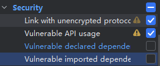
>
> 4. 点击 **Apply** 和 **OK**。

## 1.3、创建 Admin 管理后台功能模块

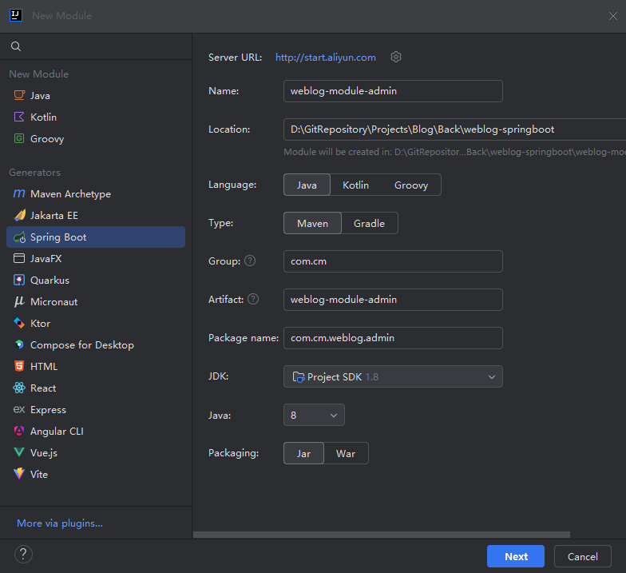

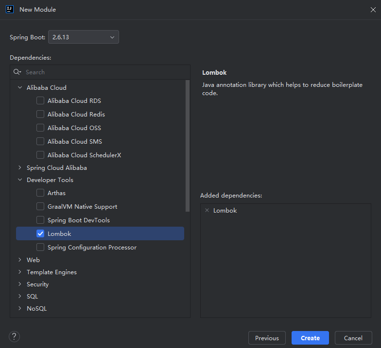

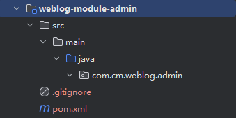

在父项目中添加模块：

```xml
 <!-- 子模块管理 -->
    <modules>
        <!-- 入口模块 -->
        <module>weblog-web</module>
        <!-- 管理后台 -->
        <module>weblog-module-admin</module>
    </modules>
```

修改模块pom.xml：

```xml
<?xml version="1.0" encoding="UTF-8"?>
<project xmlns="http://maven.apache.org/POM/4.0.0" xmlns:xsi="http://www.w3.org/2001/XMLSchema-instance"
         xsi:schemaLocation="http://maven.apache.org/POM/4.0.0 https://maven.apache.org/xsd/maven-4.0.0.xsd">
    <modelVersion>4.0.0</modelVersion>

    <parent>
        <groupId>com.cm</groupId>
        <artifactId>weblog-springboot</artifactId>
        <version>${revision}</version>
    </parent>

    <artifactId>weblog-module-admin</artifactId>
    <name>weblog-module-admin</name>
    <description>weblog-admin(负责管理后台相关功能)</description>

    <dependencies>
        <dependency>
            <groupId>org.projectlombok</groupId>
            <artifactId>lombok</artifactId>
            <optional>true</optional>
        </dependency>

        <!-- 单元测试 -->
        <dependency>
            <groupId>org.springframework.boot</groupId>
            <artifactId>spring-boot-starter-test</artifactId>
            <scope>test</scope>
        </dependency>
    </dependencies>

</project>

```

## 1.4、创建 common 公共功能模块

与上面admin模块一样，最终pom.xml文件如下：

```xml
<?xml version="1.0" encoding="UTF-8"?>
<project xmlns="http://maven.apache.org/POM/4.0.0" xmlns:xsi="http://www.w3.org/2001/XMLSchema-instance"
         xsi:schemaLocation="http://maven.apache.org/POM/4.0.0 https://maven.apache.org/xsd/maven-4.0.0.xsd">
    <modelVersion>4.0.0</modelVersion>

    <parent>
        <groupId>com.cm</groupId>
        <artifactId>weblog-springboot</artifactId>
        <version>${revision}</version>
    </parent>

    <artifactId>weblog-module-common</artifactId>
    <name>weblog-module-common</name>
    <description>weblog-common(此模块用于存放一些通用的功能)</description>

    <dependencies>
        <dependency>
            <groupId>org.projectlombok</groupId>
            <artifactId>lombok</artifactId>
            <optional>true</optional>
        </dependency>

        <!-- 单元测试 -->
        <dependency>
            <groupId>org.springframework.boot</groupId>
            <artifactId>spring-boot-starter-test</artifactId>
            <scope>test</scope>
        </dependency>

        <!-- 常用工具库 -->
        <dependency>
            <groupId>com.google.guava</groupId>
            <artifactId>guava</artifactId>
        </dependency>
    </dependencies>

</project>

```

## 1.5、修改父模块依赖管理并修改子模块相互依赖关系

父模块：

```xml
<!-- 版本号统一管理 -->
<properties>
    <!-- 项目版本号 -->
    <revision>0.0.1-SNAPSHOT</revision>
    <java.version>1.8</java.version>
    <project.build.sourceEncoding>UFT-8</project.build.sourceEncoding>

    <!-- Maven 相关 -->
    <maven.compiler.source>${java.version}</maven.compiler.source>
    <maven.compiler.target>${java.version}</maven.compiler.target>

    <!-- 依赖包版本 -->
    <lombok.version>1.18.28</lombok.version>
    <guava.version>31.1-jre</guava.version>
    <commons-lang3.version>3.12.0</commons-lang3.version>
</properties>
```

```xml
<!-- 统一依赖管理 -->
<dependencyManagement>
    <dependencies>
        <dependency>
            <groupId>com.cm</groupId>
            <artifactId>weblog-module-admin</artifactId>
            <version>${revision}</version>
        </dependency>

        <dependency>
            <groupId>com.cm</groupId>
            <artifactId>weblog-module-common</artifactId>
            <version>${revision}</version>
        </dependency>

        <!-- 常用工具库 -->
        <dependency>
            <groupId>com.google.guava</groupId>
            <artifactId>guava</artifactId>
            <version>${guava.version}</version>
        </dependency>

        <dependency>
            <groupId>org.apache.commons</groupId>
            <artifactId>commons-lang3</artifactId>
            <version>${commons-lang3.version}</version>
        </dependency>
    </dependencies>
</dependencyManagement>
```

web 模块：

```xml
<dependency>
    <groupId>com.cm</groupId>
    <artifactId>weblog-module-common</artifactId>
</dependency>

<dependency>
    <groupId>com.cm</groupId>
    <artifactId>weblog-module-admin</artifactId>
</dependency>
```

admin 模块：

```xml
<dependency>
    <groupId>com.cm</groupId>
    <artifactId>weblog-module-common</artifactId>
</dependency>
```

## 1.6、测试

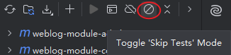

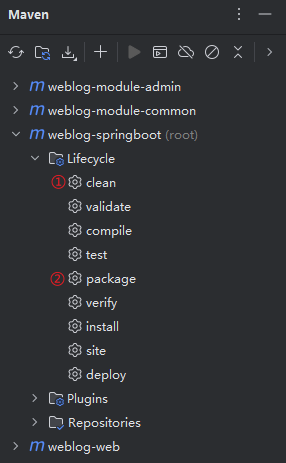

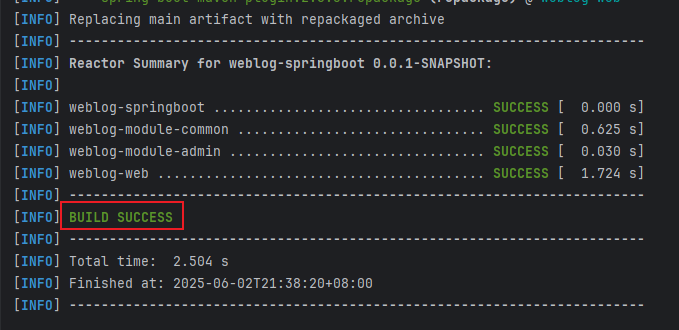

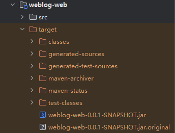

# 二、Spring Boot多环境配置

## 2.1、新建yml配置文件

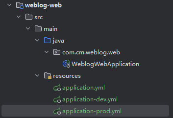

## 2.2、默认激活dev环境

修改 `application.yml`文件：

```yml
spring:
  profiles:
    # 默认激活 dev 环境
    active: dev
```

## 2.3、验证是否生效

启动项目：


#  三、整合Logback日志

## 3.1、引入依赖

由于 Spring Boot 默认使用 Logback，所以当你在 `pom.xml` 中加入 `spring-boot-starter-web` 依赖时，它会自动包含 Logback 相关依赖，无需额外添加 Logback 依赖。编辑 `weblog-web` 入口模块的 `pom.xml`, 添加如下依赖：

```xml
<dependency>
    <groupId>org.springframework.boot</groupId>
    <artifactId>spring-boot-starter-web</artifactId>
</dependency>
```

## 3.2、自定义Logback配置

在`weblog-web`模块的`src/main/resources`目录下，创建一个`logback-weblog.xml`文件

文件内容如下：

```xml
<?xml version="1.0" encoding="UTF-8"?>
<configuration >
    <jmxConfigurator />
    <include resource="org/springframework/boot/logging/logback/defaults.xml" />

    <!-- 应用名称 -->
    <property scope="context" name="appName" value="weblog" />
    <!-- 自定义日志输出路径及日志前缀 -->
    <!-- 输出到控制台 -->
    <property name="LOG_FILE" value="/app/weblog/logs/${appName}.%d{yyyy-MM-dd}" />
    <!-- 输出到文件 -->
    <!-- <property name="LOG_FILE" value="D:\\GitRepository\\Projects\\Blog\\Back\\weblog-springboot\\logs\\${appName}.%d{yyyy-MM-dd}" /> -->
    <property name="FILE_LOG_PATTERN" value="%d{yyyy-MM-dd HH:mm:ss.SSS} [%thread] %-5level %logger{50} - %msg%n" />

    <appender name="FILE" class="ch.qos.logback.core.rolling.RollingFileAppender">
        <rollingPolicy class="ch.qos.logback.core.rolling.TimeBasedRollingPolicy">
            <!-- 日志文件输出的文件名 -->
            <FileNamePattern>${LOG_FILE}-%i.log</FileNamePattern>
            <!-- 日志文件保留天数 -->
            <MaxHistory>30</MaxHistory>
            <!-- 日志文件最大的大小 -->
            <TimeBasedFileNamingAndTriggeringPolicy class="ch.qos.logback.core.rolling.SizeAndTimeBasedFNATP">
                <maxFileSize>10MB</maxFileSize>
            </TimeBasedFileNamingAndTriggeringPolicy>
        </rollingPolicy>
        <encoder class="ch.qos.logback.classic.encoder.PatternLayoutEncoder">
            <!-- 格式化输出：%d 表示日期，%thread 表示线程名，%-5level：级别从左显示 5 个字符宽度 %errorMessage：日志消息，%n 是换行符-->
            <pattern>${FILE_LOG_PATTERN}</pattern>
        </encoder>
    </appender>

    <!-- dev 环境（仅输出到控制台） -->
    <springProfile name="dev">
        <include resource="org/springframework/boot/logging/logback/console-appender.xml" />
        <root level="info">
            <appender-ref ref="CONSOLE" />
        </root>
    </springProfile>

    <!-- prod 环境（仅输出到文件中） -->
    <springProfile name="prod">
        <include resource="org/springframework/boot/logging/logback/console-appender.xml" />
        <root level="INFO">
            <appender-ref ref="FILE" />
        </root>
    </springProfile>
</configuration>
```

## 3.3、测试

在测试类`WeblogWebApplicationTests`中新建一个测试方法：

```java
package com.cm.weblog.web;

import lombok.extern.slf4j.Slf4j;
import org.junit.jupiter.api.Test;
import org.springframework.boot.test.context.SpringBootTest;

@SpringBootTest
@Slf4j
class WeblogWebApplicationTests {

    @Test
    void contextLoads() {
    }

    @Test
    void testLog() {
        log.info("这是一行 Info 级别日志");
        log.warn("这是一行 Warn 级别日志");
        log.error("这是一行 Error 级别日志");

        // 占位符
        String author = "CM";
        log.info("这是一行带有占位符日志，作者：{}", author);
    }

}
```

### 3.3.1、控制台打印

> `dev` 环境

修改logback-weblog.xml中的LOG_FILE路径

```xml
<property name="LOG_FILE" value="/app/weblog/logs/${appName}.%d{yyyy-MM-dd}" />
```

### 3.3.2、输出到文件

> `prod` 环境

修改logback-weblog.xml中的LOG_FILE路径

```xml
<property name="LOG_FILE" value="D:\\GitRepository\\Projects\\Blog\\Back\\weblog-springboot\\logs\\${appName}.%d{yyyy-MM-dd}" />
```

# 四、自定义注解，实现API请求日志切面

## 4.1、添加依赖

在`weblog-springbbot`模块下的`pom.xml`文件中添加`jackson`依赖

```xml
<!-- 版本号统一管理 -->
<properties>
    ...省略
    <jackson.version>2.15.2</jackson.version>
</properties>

<dependencies>
	...省略

	<!-- Jackson -->
	<dependency>
		<groupId>com.fasterxml.jackson.core</groupId>
		<artifactId>jackson-databind</artifactId>
		<version>${jackson.version}</version>
	</dependency>
			
	<dependency>
		<groupId>com.fasterxml.jackson.core</groupId>
		<artifactId>jackson-core</artifactId>
		<version>${jackson.version}</version>
	</dependency>

</dependencies>
```

在`weblog-module-common`模块中引用依赖

```xml
<dependencies>
	...省略

	<!-- AOP 切面 -->
	<dependency>
		<groupId>org.springframework.boot</groupId>
		<artifactId>spring-boot-starter-aop</artifactId>
		</dependency>

	<!-- Jackson -->
	<dependency>
		<groupId>com.fasterxml.jackson.core</groupId>
		<artifactId>jackson-databind</artifactId>
	</dependency>
		
	<dependency>
         <groupId>com.fasterxml.jackson.core</groupId>
         <artifactId>jackson-core</artifactId>
    </dependency>
</dependencies>
```

## 4.2、自定义注解

在`weblog-module-common`模块下新建`aspect`包放置切面相关类并新建一个ApiOpreationLog注解，内容如下：

```java
package com.cm.weblog.common.aspect;

import java.lang.annotation.*;

@Retention(RetentionPolicy.RUNTIME)
@Target({ElementType.METHOD})
@Documented
public @interface ApiOperationLog {
    /**
     * API功能描述
     */
    String description() default "";
}

```

> 元注解说明：
>
> - **@Retention(RetentionPolicy.RUNTIME)**： 这个元注解用于指定注解的保留策略，即注解在何时生效。`RetentionPolicy.RUNTIME` 表示该注解将在运行时保留，这意味着它可以通过反射在运行时被访问和解析。
> - **@Target({ElementType.METHOD})**： 这个元注解用于指定注解的目标元素，即可以在哪些地方使用这个注解。`ElementType.METHOD` 表示该注解只能用于方法上。这意味着您只能在方法上使用这个特定的注解。
> - **@Documented**： 这个元注解用于指定被注解的元素是否会出现在生成的Java文档中。如果一个注解使用了 `@Documented`，那么在生成文档时，被注解的元素及其注解信息会被包含在文档中。这可以帮助文档生成工具（如 JavaDoc）在生成文档时展示关于注解的信息。

> aspectj注解说明：
>
> - **@Aspect**：声明该类为一个切面类；
> - **@Pointcut**：定义一个切点，后面跟随一个表达式，表达式可以定义为切某个注解，也可以切某个 package 下的方法；
>
> `切点定义好后，就是围绕这个切点做文章了：`
>
> - **@Before**: 在切点之前，织入相关代码；
> - **@After**: 在切点之后，织入相关代码;
> - **@AfterReturning**: 在切点返回内容后，织入相关代码，一般用于对返回值做些加工处理的场景；
> - **@AfterThrowing**: 用来处理当织入的代码抛出异常后的逻辑处理;
> - **@Around**: 环绕，可以在切入点前后织入代码，并且可以自由的控制何时执行切点；

## 4.3、创建JSON工具类

在 `weblog-module-common` 通用模块下，创建一个 `utils` 包，用于统一放置工具类相关，然后，新建一个名为 `JsonUtil` 的工具类， 代码如下：

```java
package com.cm.weblog.common.utils;

import com.fasterxml.jackson.core.JsonProcessingException;
import com.fasterxml.jackson.databind.ObjectMapper;
import lombok.extern.slf4j.Slf4j;

@Slf4j
public class JsonUtil {
    private static final ObjectMapper objectMapper = new ObjectMapper();
    
    public static String toJsonString(Object obj) {
        try {
            return objectMapper.writeValueAsString(obj);
        } catch (JsonProcessingException e) {
            return obj.toString();
        }
    }
}

```

## 4.4、自定义日志切面类

在 `aspect` 包下，新建切面类 `ApiOperationLogAspect` , 代码如下:

```java
package com.cm.weblog.common.aspect;

import com.cm.weblog.common.utils.JsonUtil;
import lombok.extern.slf4j.Slf4j;
import org.aspectj.lang.ProceedingJoinPoint;
import org.aspectj.lang.annotation.Around;
import org.aspectj.lang.annotation.Aspect;
import org.aspectj.lang.annotation.Pointcut;
import org.aspectj.lang.reflect.MethodSignature;
import org.slf4j.MDC;
import org.springframework.stereotype.Component;

import java.lang.reflect.Method;
import java.util.Arrays;
import java.util.UUID;
import java.util.function.Function;
import java.util.stream.Collectors;

@Aspect
@Component
@Slf4j
public class ApiOperationLogAspect {
    /**
     * 以自定义 @ApiOperationLog 注解为切点，凡是添加 @ApiOperationLog 的方法，都会执行环绕中的代码
     * */
    @Pointcut("@annotation(com.cm.weblog.common.aspect.ApiOperationLog)")
    public void apiOperationLog() {}

    @Around("apiOperationLog()")
    public Object doAround(ProceedingJoinPoint joinPoint) throws Throwable {
        try {
            long startTime = System.currentTimeMillis();

            MDC.put("traceId", UUID.randomUUID().toString());

            // 获取被请求的类和方法
            String className = joinPoint.getTarget().getClass().getSimpleName();
            String methodName = joinPoint.getSignature().getName();

            // 请求入参
            Object[] args = joinPoint.getArgs();
            // 入参转城JSON字符
            String argsJsonStr = Arrays.stream(args).map(toJsonStr()).collect(Collectors.joining(", "));

            // 功能描述
            String description = getApiOperationLogDescription(joinPoint);

            // 打印请求相关参数
            log.info("====== 请求开始: [{}], 入参: {}, 请求类: {}, 请求方法: {} =================================== ", description, argsJsonStr, className, methodName);

            // 执行切点方法
            Object result = joinPoint.proceed();

            long executionTime = System.currentTimeMillis() - startTime;

            // 打印出参等相关信息
            log.info("====== 请求结束: [{}], 耗时: {}ms, 出参: {} =================================== ", description, executionTime, JsonUtil.toJsonString(result));
            
            return result;
        } finally {
            MDC.clear();
        }
    }

    private Function<Object, String> toJsonStr() {
        return JsonUtil::toJsonString;
    }

    private String getApiOperationLogDescription(ProceedingJoinPoint joinPoint) {
        MethodSignature signature = (MethodSignature) joinPoint.getSignature();

        Method method = signature.getMethod();

        ApiOperationLog annotation = method.getAnnotation(ApiOperationLog.class);

        return annotation.description();
    }
}

```

## 4.5、添加包扫描

在启动类 `WeblogWebApplication` 中，手动添加包扫描 `@ComponentScan, 指定扫描 com.cm.weblog 包下面的所有类:`

```java
package com.cm.weblog.web;

import org.springframework.boot.SpringApplication;
import org.springframework.boot.autoconfigure.SpringBootApplication;
import org.springframework.context.annotation.ComponentScan;

@SpringBootApplication
@ComponentScan({"com.cm.weblog.*"}) // 多模块项目中，必需手动指定扫描 com.cm.weblog 包下面的所有类

public class WeblogWebApplication {

    public static void main(String[] args) {
        SpringApplication.run(WeblogWebApplication.class, args);
    }

}

```

## 4.6、新增测试接口

在 `weblog-module-web` 模块中，新建 `controller` 包用于统一存放接口定义，另外，再定义一个 `model` 模型包，用于放置 pojo 对象

新增一个 `User` 对象类，代码如下：

```java
package com.cm.weblog.web.model;

import lombok.Data;

@Data
public class User {
    private String username;
    private Integer sex;
}
```

新增 `TestController` 类，定义一个 POST 格式，路径为 `/test` 接口，代码如下：

```java
package com.cm.weblog.web.controller;

import com.cm.weblog.common.aspect.ApiOperationLog;
import com.cm.weblog.web.model.User;
import lombok.extern.slf4j.Slf4j;
import org.springframework.web.bind.annotation.PostMapping;
import org.springframework.web.bind.annotation.RequestBody;
import org.springframework.web.bind.annotation.RestController;

@RestController
@Slf4j
public class TestController {
    @PostMapping("/test")
    @ApiOperationLog(description = "测试接口")
    public User test(@RequestBody User user) {
        return user;
    }
}
```

测试结果：

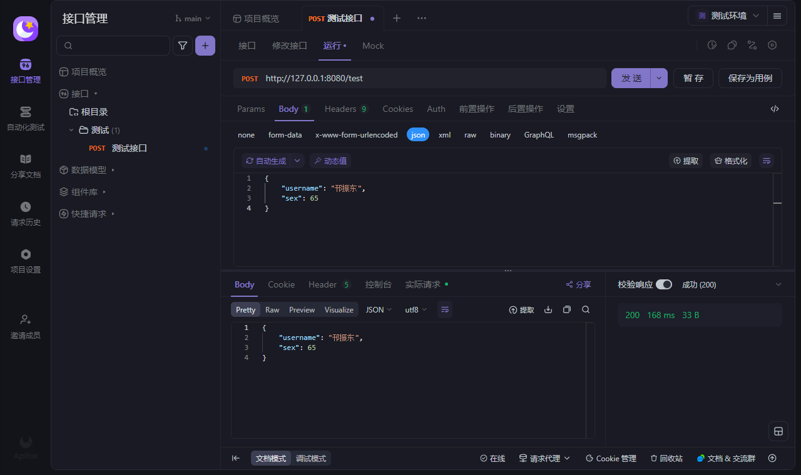

```cmd
2025-07-01 21:11:56.190  INFO 1768 --- [nio-8080-exec-1] c.c.w.c.aspect.ApiOperationLogAspect     : ====== 请求开始: [测试接口], 入参: {"username":"邗振东","sex":65}, 请求类: TestController, 请求方法: test =================================== 
2025-07-01 21:11:56.197  INFO 1768 --- [nio-8080-exec-1] c.c.w.c.aspect.ApiOperationLogAspect     : ====== 请求结束: [测试接口], 耗时: 67ms, 出参: {"username":"邗振东","sex":65} =================================== 
```

# 五、Spring Boot 通过 MDC 实现日志跟踪

## 5.1、日志切面中设置MDC值

编辑 `ApiOperationLogAspect` 日志切面类，在 `doAround()` 方法中处理请求开始的时候, 将请求的跟踪标识放入MDC 中：

```java
/**
	* 环绕
	* @param joinPoint
	* @return
	* @throws Throwable
*/
@Around("apiOperationLog()")
public Object doAround(ProceedingJoinPoint joinPoint) throws Throwable {
	try {
		MDC.put("traceId", UUID.randomUUID().toString());

		... 省略
	} finally {
		MDC.clear();
	}
}
```

## 5.2、配置日志框架引用MDC中的值

在 `logback-weblog.xml` 配置文件中，可以使用 `%X` 来引用MDC中的值。例如，要引用上述的 `traceId`，你可以这样配置：

```xml
<property name="FILE_LOG_PATTERN" value="[TraceId: %X{traceId}] %d{yyyy-MM-dd HH:mm:ss.SSS} [%thread] %-5level %logger{50} - %msg%n"/>
```

## 5.3、测试

在 `logback-weblog.xml` 配置文件中，将日志输出路径改为windows系统路径，将环境切换为prod，重启项目，再次请求`/test`接口，查看日志：

```cmd
[TraceId: 563708d1-2ea8-43bb-9f5b-0c24e3ed89f8] 2025-07-01 21:29:15.619 [http-nio-8080-exec-1] INFO  com.cm.weblog.common.aspect.ApiOperationLogAspect - ====== 请求开始: [测试接口], 入参: {"username":"邗振东","sex":65}, 请求类: TestController, 请求方法: test =================================== 
[TraceId: 563708d1-2ea8-43bb-9f5b-0c24e3ed89f8] 2025-07-01 21:29:15.625 [http-nio-8080-exec-1] INFO  com.cm.weblog.common.aspect.ApiOperationLogAspect - ====== 请求结束: [测试接口], 耗时: 15ms, 出参: {"username":"邗振东","sex":65} =================================== 
```

# 六、参数校验

## 6.1、添加依赖

在 `weblog-web` 模块中的 `pom.xml` 文件添加参数校验依赖：

```xml
<dependency>
    <groupId>org.springframework.boot</groupId>
    <artifactId>spring-boot-starter-validation</artifactId>
</dependency>
```

## 6.2、设置实体类参数校验

在模块`weblog-web`中已有实体类`User`，增加代码如下以测试参数校验：

```java
package com.cm.weblog.web.model;

import lombok.Data;

import javax.validation.constraints.*;

@Data
public class User {
    @NotBlank(message = "用户名不能为空")
    private String username;

    @NotNull(message = "性别不能为空")
    private Integer sex;

    @NotNull(message = "年龄不能为空")
    @Min(value = 18, message = "年龄必须在18-100岁之间")
    @Max(value = 100, message = "年龄必须在18-100岁之间")
    private Integer age;

    @NotBlank(message = "邮箱不能为空")
    @Email(message = "邮箱格式不正确")
    private String email;
}
```

## 6.3、Controller层捕获参数校验结果

编辑 `TestController` 类，代码如下：

```java
package com.cm.weblog.web.controller;

import com.cm.weblog.common.aspect.ApiOperationLog;
import com.cm.weblog.web.model.User;
import lombok.extern.slf4j.Slf4j;
import org.springframework.http.ResponseEntity;
import org.springframework.validation.BindingResult;
import org.springframework.validation.FieldError;
import org.springframework.validation.annotation.Validated;
import org.springframework.web.bind.annotation.PostMapping;
import org.springframework.web.bind.annotation.RequestBody;
import org.springframework.web.bind.annotation.RestController;

import java.util.stream.Collectors;

@RestController
@Slf4j
public class TestController {
    @PostMapping("/test")
    @ApiOperationLog(description = "测试接口")
    public ResponseEntity<String> test(@RequestBody @Validated User user, BindingResult bindingResult) {
        if (bindingResult.hasErrors()) {
            String errorMsg = bindingResult.getFieldErrors()
                    .stream()
                    .map(FieldError::getDefaultMessage)
                    .collect(Collectors.joining(", "));

            return ResponseEntity.badRequest().body(errorMsg);
        }

        return ResponseEntity.ok("参数没有任何问题");
    }
}
```

## 6.4、测试

请求 `/test` 接口

**入参正确的情况**

```json
{
    "username": "cm",
    "sex": 1,
    "age": 32,
    "email": "123124@qq.com"
}
```

**返回：**

```json
参数没有任何问题
```

**入参不正确的情况**

```json
{
    "username": "",
    "sex": null,
    "age": 120,
    "email": "123124qq.com"
}
```

**返回：**

```json
邮箱格式不正确, 年龄必须在18-100岁之间, 用户名不能为空, 性别不能为空
```

# 七、自定义响应工具类