# SpringBoot 后端工程搭建

## 一、搭建 SpringBoot 多模块工程

### 1.1、新建项目  weblog-springboot

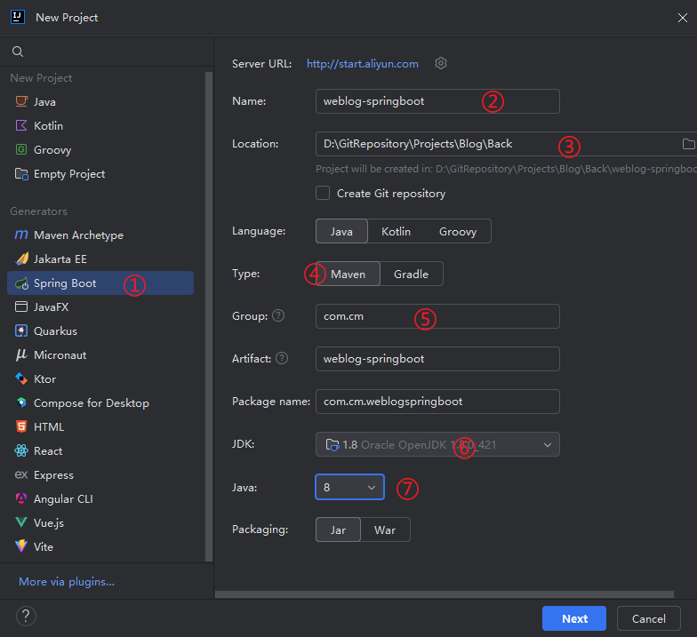

> 默认的官方链接可能无法创建 `Java8`的项目：
>
> 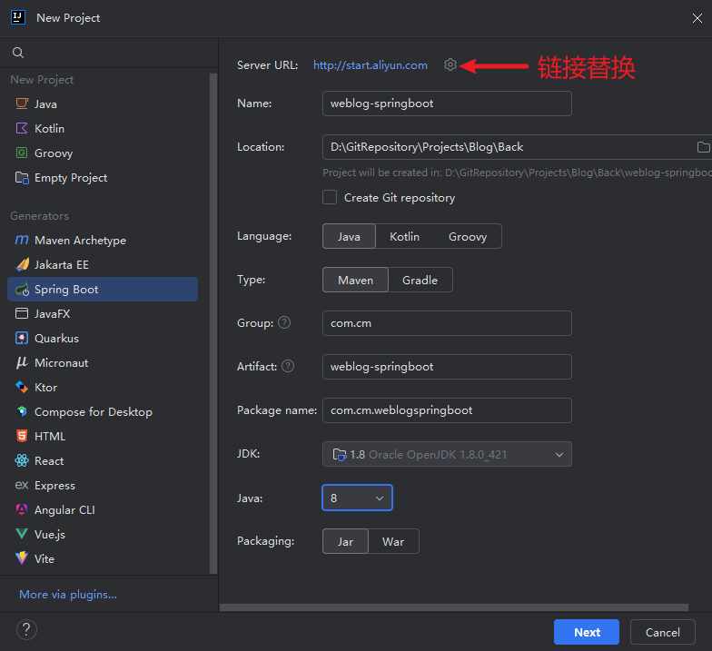

点击`Next`进行下一步：

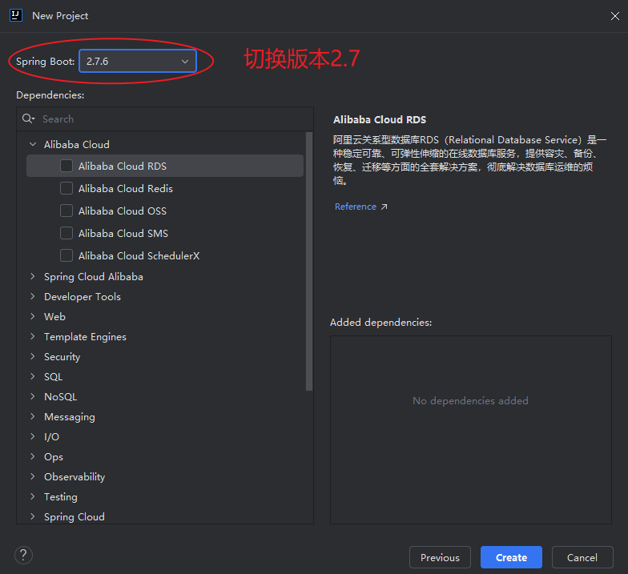

点击`Create`创建项目，创建成功删除多余文件（夹），最终文件目录如下：

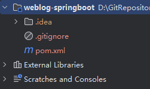

整理该模块的`pom.xml`，内容如下：

```xml
<?xml version="1.0" encoding="UTF-8"?>
<project xmlns="http://maven.apache.org/POM/4.0.0" xmlns:xsi="http://www.w3.org/2001/XMLSchema-instance"
         xsi:schemaLocation="http://maven.apache.org/POM/4.0.0 https://maven.apache.org/xsd/maven-4.0.0.xsd">
    <modelVersion>4.0.0</modelVersion>

    <parent>
        <groupId>org.springframework.boot</groupId>
        <artifactId>spring-boot-starter-parent</artifactId>
        <!-- 切换 SpringBoot 版本号为2.6 -->
        <version>2.6.3</version>
        <relativePath /> <!-- 不依赖本地，从远程仓库拉取 -->
    </parent>

    <groupId>com.cm</groupId>
    <artifactId>weblog-springboot</artifactId>
    <version>${revision}</version>
    <name>weblog-springboot</name>
    <description>前后端分离博客项目</description>

    <!-- 多模块项目父工程打包模式必须指定为pom -->
    <packaging>pom</packaging>

    <!-- 子模块管理 -->
    <modules>
    </modules>

    <!-- 版本号统一管理 -->
    <properties>
        <!-- 项目版本号 -->
        <revision>0.0.1-SNAPSHOT</revision>
        <java.version>1.8</java.version>
        <project.build.sourceEncoding>UTF-8</project.build.sourceEncoding>

        <!-- Maven相关 -->
        <maven.complier.source>${java.version}</maven.complier.source>
        <maven.complier.target>${java.version}</maven.complier.target>
    </properties>

    <!-- 统一依赖管理-->
    <dependencyManagement>
    </dependencyManagement>

    <build>
        <!-- 统一插件管理 -->
        <pluginManagement>
        </pluginManagement>
    </build>


    <!-- 使用阿里云的 Maven 仓库源提升包下载速度 -->
    <repositories>
        <repository>
            <id>aliyunmaven</id>
            <name>aliyun</name>
            <url>https://maven.aliyun.com/repository/public</url>
        </repository>
    </repositories>
</project>

```

### 1.2、创建 Web 访问（打包）模块

在父项目上右击，添加`Module`：

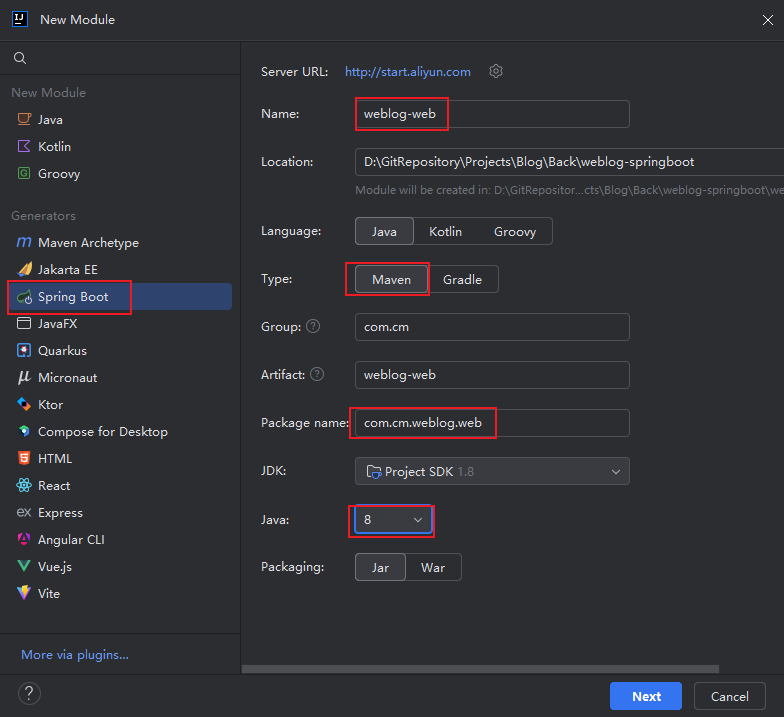

点击`Next`进行下一步：

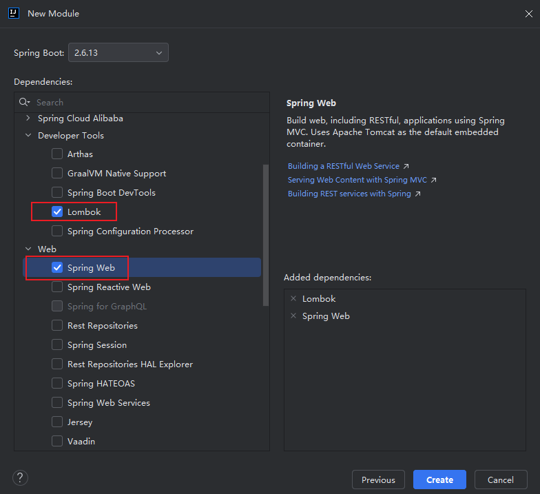

点击`Create`创建子模块`weblog-web`，并删除多余文件（夹），最终文件目录如下：

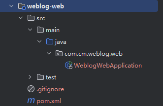

整理该模块的`pom.xml`，内容如下：

```xml
<?xml version="1.0" encoding="UTF-8"?>
<project xmlns="http://maven.apache.org/POM/4.0.0" xmlns:xsi="http://www.w3.org/2001/XMLSchema-instance"
         xsi:schemaLocation="http://maven.apache.org/POM/4.0.0 https://maven.apache.org/xsd/maven-4.0.0.xsd">
    <modelVersion>4.0.0</modelVersion>

    <parent>
        <groupId>com.cm</groupId>
        <artifactId>weblog-springboot</artifactId>
        <version>${revision}</version>
    </parent>

    <artifactId>weblog-web</artifactId>
    <version>0.0.1-SNAPSHOT</version>
    <name>weblog-web</name>
    <description>入口模块 负责博客前台展示、打包</description>

    <dependencies>
        <dependency>
            <groupId>org.springframework.boot</groupId>
            <artifactId>spring-boot-starter-web</artifactId>
        </dependency>

        <!-- 免写冗余的 Java 样板式代码 -->
        <dependency>
            <groupId>org.projectlombok</groupId>
            <artifactId>lombok</artifactId>
            <optional>true</optional>
        </dependency>

        <!-- 单测 -->
        <dependency>
            <groupId>org.springframework.boot</groupId>
            <artifactId>spring-boot-starter-test</artifactId>
            <scope>test</scope>
        </dependency>
    </dependencies>

    <build>
        <plugins>
            <plugin>
                <groupId>org.springframework.boot</groupId>
                <artifactId>spring-boot-maven-plugin</artifactId>
            </plugin>
        </plugins>
    </build>

</project>
```

### 1.3、创建 Admin  后台管理功能模块

在父项目上右击，添加`Module`：


点击`Next`进行下一步：

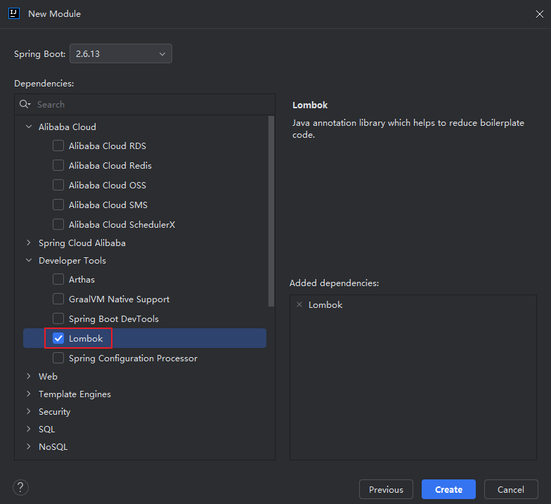

点击`Create`创建子模块`weblog-module-admin`，并删除多余文件（夹），最终文件目录如下：

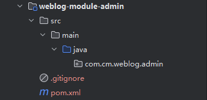

整理该模块的`pom.xml`，内容如下：

```xml
<?xml version="1.0" encoding="UTF-8"?>
<project xmlns="http://maven.apache.org/POM/4.0.0" xmlns:xsi="http://www.w3.org/2001/XMLSchema-instance"
         xsi:schemaLocation="http://maven.apache.org/POM/4.0.0 https://maven.apache.org/xsd/maven-4.0.0.xsd">
    <modelVersion>4.0.0</modelVersion>

    <parent>
        <groupId>com.cm</groupId>
        <artifactId>weblog-springboot</artifactId>
        <version>${revision}</version>
    </parent>

    <artifactId>weblog-module-admin</artifactId>
    <version>0.0.1-SNAPSHOT</version>
    <name>weblog-module-admin</name>
    <description>管理后台相关功能</description>

    <dependencies>
        <!-- 免写冗余的 Java 样板式代码 -->
        <dependency>
            <groupId>org.projectlombok</groupId>
            <artifactId>lombok</artifactId>
            <optional>true</optional>
        </dependency>

        <!-- 单测 -->
        <dependency>
            <groupId>org.springframework.boot</groupId>
            <artifactId>spring-boot-starter-test</artifactId>
            <scope>test</scope>
        </dependency>
    </dependencies>

</project>

```

### 1.4、创建  Common 公共功能模块

在父项目上右击，添加`Module`：

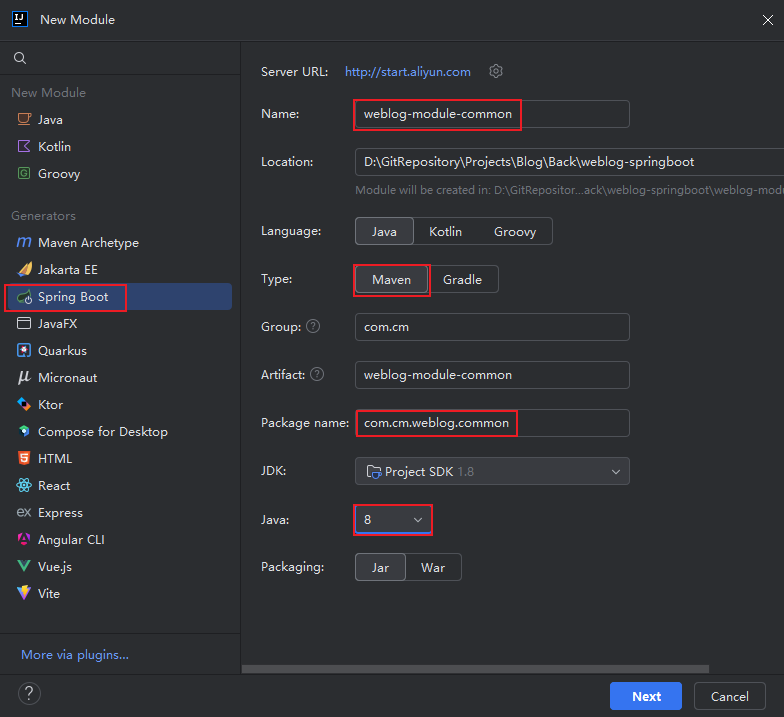

点击`Next`进行下一步：


点击`Create`创建子模块`weblog-module-admin`，并删除多余文件（夹），最终文件目录如下：

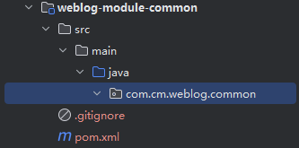

整理该模块的`pom.xml`，内容如下：

```xml
<?xml version="1.0" encoding="UTF-8"?>
<project xmlns="http://maven.apache.org/POM/4.0.0" xmlns:xsi="http://www.w3.org/2001/XMLSchema-instance"
         xsi:schemaLocation="http://maven.apache.org/POM/4.0.0 https://maven.apache.org/xsd/maven-4.0.0.xsd">
    <modelVersion>4.0.0</modelVersion>

    <parent>
        <groupId>com.cm</groupId>
        <artifactId>weblog-springboot</artifactId>
        <version>${revision}</version>
    </parent>

    <artifactId>weblog-module-common</artifactId>
    <version>0.0.1-SNAPSHOT</version>
    <name>weblog-module-common</name>
    <description>存放通用功能</description>

    <dependencies>
        <!-- 免写冗余的 Java 样板式代码 -->
        <dependency>
            <groupId>org.projectlombok</groupId>
            <artifactId>lombok</artifactId>
            <optional>true</optional>
        </dependency>

        <!-- 常用工具库 -->
        <dependency>
            <groupId>com.google.guava</groupId>
            <artifactId>guava</artifactId>
        </dependency>

        <!-- 单测 -->
        <dependency>
            <groupId>org.springframework.boot</groupId>
            <artifactId>spring-boot-starter-test</artifactId>
            <scope>test</scope>
        </dependency>
    </dependencies>

</project>

```

### 1.5、补充要用的依赖包以及各模块之间的依赖关系

**weblog-springboot**

`pom.xml`

```xml
	...省略

	<!-- 子模块管理 -->
    <modules>
        <!-- 入口模块 -->
        <module>weblog-web</module>
        <!-- 管理后台 -->
        <module>weblog-module-admin</module>
        <!-- 通用模块 -->
        <module>weblog-module-common</module>
    </modules>

    <!-- 版本号统一管理 -->
    <properties>
        ...省略
       	<!-- 依赖包版本 -->
        <lombok.version>1.18.28</lombok.version>
        <guava.version>31.1-jre</guava.version>
        <commons-lang3.version>3.12.0</commons-lang3.version>
    </properties>

    <!-- 统一依赖管理-->
    <dependencyManagement>
        <dependencies>
            <dependency>
                <groupId>com.cm</groupId>
                <artifactId>weblog-module-admin</artifactId>
                <version>${revision}</version>
            </dependency>

            <dependency>
                <groupId>com.cm</groupId>
                <artifactId>weblog-module-common</artifactId>
                <version>${revision}</version>
            </dependency>

            <!-- 常用工具库 -->
            <dependency>
                <groupId>com.google.guava</groupId>
                <artifactId>guava</artifactId>
                <version>${guava.version}</version>
            </dependency>

            <dependency>
                <groupId>org.apache.commons</groupId>
                <artifactId>commons-lang3</artifactId>
                <version>${commons-lang3.version}</version>
            </dependency>
        </dependencies>
    </dependencyManagement>

    <build>
        <!-- 统一插件管理 -->
        <pluginManagement>
            <plugins>
                <plugin>
                    <groupId>org.springframework.boot</groupId>
                    <artifactId>spring-boot-maven-plugin</artifactId>
                    <configuration>
                        <!-- 排除lombok在最终构建产物中 -->
                        <excludes>
                            <exclude>
                                <groupId>org.projectlombok</groupId>
                                <artifactId>lombok</artifactId>
                            </exclude>
                        </excludes>
                    </configuration>
                </plugin>
            </plugins>
        </pluginManagement>
    </build>


    <!-- 使用阿里云的 Maven 仓库源提升包下载速度 -->
    <repositories>
        <repository>
            <id>aliyunmaven</id>
            <name>aliyun</name>
            <url>https://maven.aliyun.com/repository/public</url>
        </repository>
    </repositories>
</project>

```

**weblog-web**：依赖 `Admin`包和`Common`包

`pom.xml`

```xml
	...省略
	<dependencies>
        <dependency>
            <groupId>com.cm</groupId>
            <artifactId>weblog-module-common</artifactId>
        </dependency>

        <dependency>
            <groupId>com.cm</groupId>
            <artifactId>weblog-module-admin</artifactId>
        </dependency>

        ...省略
    </dependencies>

```

**weblog-module-admin**：依赖`Common`包

`pom.xml`

```xml
	...省略
	<dependencies>
        <dependency>
            <groupId>com.cm</groupId>
            <artifactId>weblog-module-common</artifactId>
        </dependency>

        ...省略
    </dependencies>

```

### 备注：解决 pom.xml 黄色波浪线警告

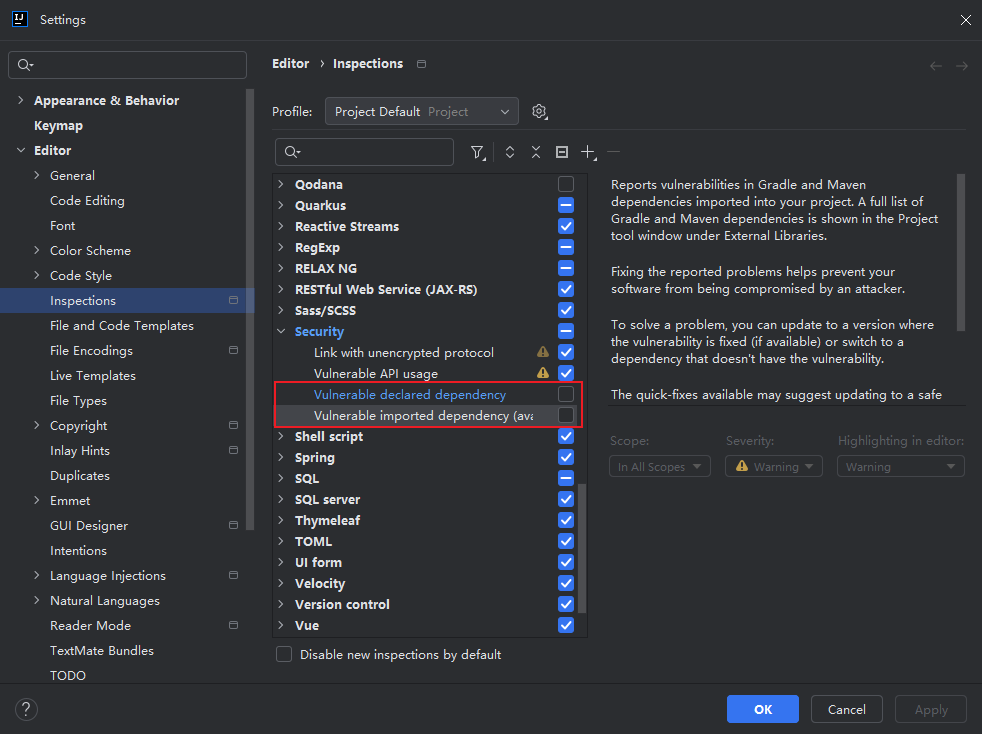

### 1.6、测试

刷新`Maven`下载依赖包：

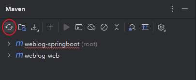

选中跳过测试的按钮：

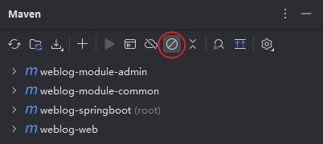

打包：

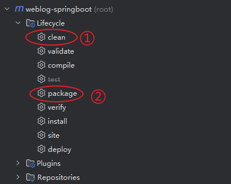

打包成功会在`target`目录下输出`jar`包

启动项目：启动`weblog-springboot`的`WeblogWebApplication`类：

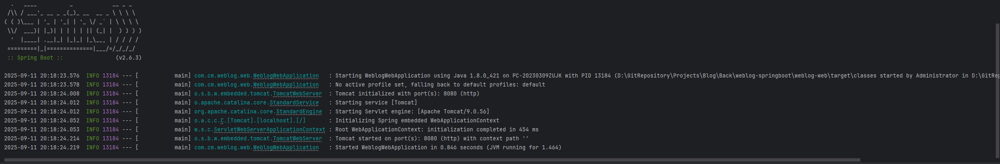

## 二、项目多环境配置

### 2.1、配置 weblog-springboot 环境

修改`pom.xml`，内容如下：

```xml
<project>
	...省略
    
	<profiles>
        <profile>
            <id>dev</id>
            <properties>
                <env>dev</env>
            </properties>
            <activation>
                <activeByDefault>true</activeByDefault>
            </activation>
        </profile>

        <profile>
            <id>prod</id>
            <properties>
                <env>prod</env>
            </properties>
        </profile>
    </profiles>
    
</project>
```

### 2.2、新建环境配置文件

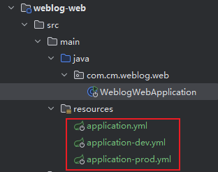

### 2.3、测试

切换环境：

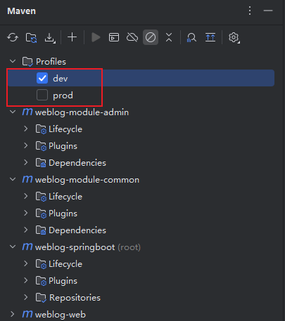

输出结果：


## 三、整合 Logback 日志

### 3.1、引入依赖

由于之前在`weblog-web`模块中已引入过`spring-boot-starter-web`依赖，它会自动包含`Logback`相关依赖，所以无需再额外添加依赖

### 3.2、配置

在`weblog-web/src/main/resources`目录下新建文件`logback-weblog.xml`配置文件，内容如下：

```xml
<?xml version="1.0" encoding="UTF-8" ?>
<configuration>
    <jmxConfigurator />
    <include resource="org/springframework/boot/logging/logback/defaults.xml" />

    <property scope="context" name="appName" value="weblog" />
    <!-- 自定义日志输出路径及名称前缀-->
    <property name="LOG_FILE" value="/app/weblog/logs/${appName}.%d{yyyy-MM-dd}" /> <!-- 输出控制台路径 -->
    <!-- <property name="LOG_FILE" value="D:\\GitRepository\\Projects\\Blog\\Back\\weblog-springboot\\logs\\${appName}.%d{yyyy-MM-dd}" /> --> <!-- 输出文件路径 -->
    <!-- 格式化输出：%d 表示日期，%thread 表示线程，%-5level表示从左显示5个字符宽度， %msg% 表示日志消息  -->
    <property name="FILE_LOG_PATTERN" value="%d{yyyy-MM-dd HH:mm:ss.SSS} [%thread] %-5level %logger{50} - %msg%n" />

    <appender name="FILE" class="ch.qos.logback.core.rolling.RollingFileAppender">
        <rollingPolicy class="ch.qos.logback.core.rolling.TimeBasedRollingPolicy">
            <!-- 日志输出文件名 -->
            <FileNamePattern>${LOG_FILE}-%i.log</FileNamePattern>
            <!-- 日志保留天数-->
            <MaxHistory>30</MaxHistory>
            <!-- 日志文件最大大小 -->
            <TimeBasedFileNamingAndTriggeringPolicy class="ch.qos.logback.core.rolling.SizeAndTimeBasedFNATP">
                <maxFileSize>10MB</maxFileSize>
            </TimeBasedFileNamingAndTriggeringPolicy>
        </rollingPolicy>

        <encoder class="ch.qos.logback.classic.encoder.PatternLayoutEncoder">
            <!-- 格式化输出： -->
            <pattern>${FILE_LOG_PATTERN}</pattern>
        </encoder>
    </appender>

    <!-- dev环境下日志仅输出到控制台 -->
    <springProfile name="dev">
        <include resource="org/springframework/boot/logging/logback/console-appender.xml" />
        <root level="info">
            <appender-ref ref="CONSOLE" />
        </root>
    </springProfile>

    <!-- PROD环境下日志输出到文件 -->
    <springProfile name="prod">
        <include resource="org/springframework/boot/logging/logback/console-appender.xml" />
        <root level="INFO">
            <appender-ref ref="FILE" />
        </root>
    </springProfile>
</configuration>
```

由于输出日志到文件只需在生产环境开启，所以仅需在生产环境`application-prod.yml`配置

```yml
# 日志
logging:
  config: classpath:logback-weblog.xml
```

### 3.3、测试

在单元测试包下的`WeblogWebApplicationTests`类中新增一个`testLog`测试方法以及`@Slf4j`注解，代码如下：

```java
package com.cm.weblog.web;

import lombok.extern.slf4j.Slf4j;
import org.junit.jupiter.api.Test;
import org.springframework.boot.test.context.SpringBootTest;

@SpringBootTest
@Slf4j // 自动生成日志实例
class WeblogWebApplicationTests {

    @Test
    void contextLoads() {
    }

    @Test
    void testLog() {
        log.info("这是一行 INFO 级别日志");
        log.warn("这是一行 WARN 级别日志");
        log.error("这是一行 ERROR 级别日志");

        // 占位符
        String author = "CM";
        log.info("这是一行带有占位符的日志记录，作者：{}", author);
    }
}

```

在`dev`环境下运行测试方法，结果如下：

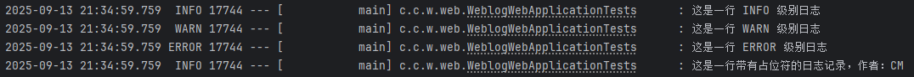

在`prod`环境下运行测试方法，日志成功输出到指定文件

> 测试完记得把环境改回`dev`

## 四、自定义注解实现 AOP 请求日志切面

### 4.1、引入依赖

父项目中添加`jackson`工具版本号及依赖管理，它用于将出入参转为`JSON`字符串

```xml
<!-- 版本号统一管理 -->
<properties>
    ...省略
    <jackson.version>2.15.2</jackson.version>
</properties>

 <!-- 统一依赖管理-->
<dependencyManagement>
    <dependencies>
    	...省略
        <dependency>
        	<groupId>com.fasterxml.jackson.core</groupId>
        	<artifactId>jackson-databind</artifactId>
        	<version>${jackson.version}</version>
       	</dependency>

        <dependency>
        	<groupId>com.fasterxml.jackson.core</groupId>
        	<artifactId>jackson-core</artifactId>
        	<version>${jackson.version}</version>
        </dependency>
    </dependencies>
</dependencyManagement>
```

在`weblog-module-common`中引用依赖：

```xml
...省略
<!-- AOP 切面 -->
<dependency>
	<groupId>org.springframework.boot</groupId>
	<artifactId>spring-boot-starter-aop</artifactId>
</dependency>

<!-- Jackson -->
<dependency>
	<groupId>com.fasterxml.jackson.core</groupId>
	<artifactId>jackson-databind</artifactId>
</dependency>

<dependency>
	<groupId>com.fasterxml.jackson.core</groupId>
	<artifactId>jackson-core</artifactId>
</dependency>
```

### 4.2、自定义注解

在`weblog-module-common`模块下新建`aspect`包用于放置切面相关的功能类，在其中创建一个`ApiOpeationLog`的注解，内容如下：

```java
package com.cm.weblog.common.aspect;

import java.lang.annotation.*;

@Retention(RetentionPolicy.RUNTIME) // 指定注解在运行时保留(可以通过反射在运行时被访问和解析)
@Target({ElementType.METHOD}) // 指定该注解作用于方法
@Documented // 生成文档时注解元素及注解信息会被包含
public @interface ApiOperationLog {
    /**
     * API 功能描述
     * @return String
     */
    String description() default "";
}

```

### 4.3、创建 JSON 工具类

在`weblog-module-common`模块下新建`utils`包，在其中新建一个`JsonUtil`类，用于转成`JSON`字符串，内容如下：

```java
package com.cm.weblog.common.utils;

import com.fasterxml.jackson.core.JsonProcessingException;
import com.fasterxml.jackson.databind.ObjectMapper;

/**
 * JSON 工具类
 */
public class JsonUtil {
    private static final ObjectMapper mapper = new ObjectMapper();

    public static String toJson(Object obj) {
        try {
            return mapper.writeValueAsString(obj);
        } catch (JsonProcessingException e) {
            return obj.toString();
        }
    }
}
```

### 4.4、自定义切面类

在`aspect`包下新建`ApiOperationLogAspect`类，代码如下：

```java
package com.cm.weblog.common.aspect;

import com.cm.weblog.common.utils.JsonUtil;
import lombok.extern.slf4j.Slf4j;
import org.aspectj.lang.ProceedingJoinPoint;
import org.aspectj.lang.annotation.Around;
import org.aspectj.lang.annotation.Aspect;
import org.aspectj.lang.annotation.Pointcut;
import org.aspectj.lang.reflect.MethodSignature;
import org.slf4j.MDC;
import org.springframework.stereotype.Component;

import java.lang.reflect.Method;
import java.util.Arrays;
import java.util.UUID;
import java.util.function.Function;
import java.util.stream.Collectors;

/**
 * 自定义切面类
 */
@Aspect // 声明该类为一个切面类
@Component
@Slf4j
public class ApiOperationLogAspect {
    /**
     * 以自定义 @ApiOperationLog 注解为切点
     * 凡是添加该注解的方法都会执行环绕中的代码
     */
    @Pointcut("@annotation(com.cm.weblog.common.aspect.ApiOperationLog)")
    public void apiOperationLog() {}

    /**
     * 环绕
     * @param joinPoint 切点
     * @return 请求结果
     * @throws Throwable 异常
     */
    @Around("apiOperationLog()")
    public Object doAround(ProceedingJoinPoint joinPoint) throws Throwable {
        try {
            long startTime = System.currentTimeMillis();

            MDC.put("traceId", UUID.randomUUID().toString());

            // 获取处理请求的类和方法
            String className = joinPoint.getTarget().getClass().getSimpleName();
            String methodName = joinPoint.getSignature().getName();

            // 获取请求入参并转成 JSON 字符串
            Object[] args = joinPoint.getArgs();
            String argsJson = Arrays.stream(args).map(toJsonString()).collect(Collectors.joining(", "));

            // 功能描述信息
            String description = getApiOperationLogDescription(joinPoint);

            // 打印入参
            log.info("====== 请求开始：[{}]，入参：{}，请求类：{}, 请求方法：{} ============================ ", description, argsJson, className, methodName);

            // 执行切点方法
            Object result = joinPoint.proceed(args);

            // 计算执行耗时
            long executionTime = System.currentTimeMillis() - startTime;

            // 打印出参
            log.info("====== 请求结束：[{}]，耗时：{}ms， 出参：{} ============================ ", description, executionTime, JsonUtil.toJson(result));

            return result;
        } finally {
            MDC.clear();
        }
    }

    /**
     * 转 JSON
     * @return Function
     */
    private Function<Object, String> toJsonString() {
        return JsonUtil::toJson;
    }

    /**
     * 获取注解的描述信息
     * @param joinPoint 切点
     * @return 注解描述
     */
    private String getApiOperationLogDescription(ProceedingJoinPoint joinPoint) {
        // 获取方法签名
        MethodSignature methodSignature = (MethodSignature) joinPoint.getSignature();

        // 获取被注解的方法
        Method method = methodSignature.getMethod();

        // 提取注解
        ApiOperationLog annotation = method.getAnnotation(ApiOperationLog.class);

        // 提取 description 属性
        return annotation.description();
    }
}

```

### 4.5、添加包扫描

在`weblog-web`的启动类中添加包扫描

```java
package com.cm.weblog.web;

import org.springframework.boot.SpringApplication;
import org.springframework.boot.autoconfigure.SpringBootApplication;
import org.springframework.context.annotation.ComponentScan;

@SpringBootApplication
@ComponentScan({"com.cm.weblog.*"}) // 多模块项目中必须手动指定要扫描的包下面的所有类
public class WeblogWebApplication {

    public static void main(String[] args) {
        SpringApplication.run(WeblogWebApplication.class, args);
    }

}

```

### 4.6、测试

在`weblog-web`模块下新建`model`包存储`pojo`对象，新建`User`类用于测试：

```java
package com.cm.weblog.web.model;

import lombok.Data;

@Data
public class User {
    private String username;
    private Integer sex;
}

```

在`weblog-web`模块下新建`controller`包，新建`TestController`类测试请求，内容如下：

```java
package com.cm.weblog.web.controller;

import com.cm.weblog.common.aspect.ApiOperationLog;
import com.cm.weblog.web.model.User;
import org.springframework.web.bind.annotation.PostMapping;
import org.springframework.web.bind.annotation.RequestBody;
import org.springframework.web.bind.annotation.RestController;

/**
 * 测试请求类
 */
@RestController
public class TestController {
    @PostMapping("/test")
    @ApiOperationLog(description = "测试接口")
    public User test(@RequestBody User user) {
        return user;
    }
}

```

发送请求：

**入参**：

```json
{
    "username": "昌帅",
    "sex": 2
}
```

**出参**：

```json
{
    "username": "昌帅",
    "sex": 2
}
```

**打印日志**：

```json
请求开始：[测试接口]，入参：{"username":"昌帅","sex":25}，请求类：TestController, 请求方法：test ============================ 
请求结束：[测试接口]，耗时：1ms， 出参：{"username":"昌帅","sex":25} ============================ 
```

## 五、MDC 跟踪日志

上文中在`ApiOperationLogAspect`切面类中依然放置了`MDC`相关代码：

```java
// ...省略
MDC.put("traceId", UUID.randomUUID().toString());

// ...省略
MDC.clear();
```

一是为了向请求放入跟踪标识，二是为了避免污染其他请求清除值

若要引用该请求标识，可修改`logback-weblog.xml`配置文件中`FILE_LOG_PATTERN`配置，向其中加入`TraceId`：

```xml
<property name="FILE_LOG_PATTERN" value="[TraceId: %X{traceId}] %d{yyyy-MM-dd HH:mm:ss.SSS} [%thread] %-5level %logger{50} - %msg%n" />
```

这样日志中即使有多线程情况下高并发的请求也可以通过这个标识识别每个请求的记录

修改环境为`prod`，重新启动项目，再次请求`/test`接口，查看日志中是否已经加入了`TraceId`

## 六、参数校验

### 6.1、引入依赖

在`weblog-web`模块中引入`spring-boot-starter-validation`依赖

```xml
<!-- 参数校验 -->
<dependency>
	<groupId>org.springframework.boot</groupId>
	<artifactId>spring-boot-starter-validation</artifactId>
</dependency>
```

### 6.2、配置实体类校验规则

修改`User`类，新增年龄和邮箱字段并配置校验规则：

- 用户名和性别：不能为空

- 年龄：
  - 不能为空
  - 18 ~ 100

- 邮箱：
  - 不能为空
  - 邮箱格式

修改后内容如下：

```java
package com.cm.weblog.web.model;

import lombok.Data;

import javax.validation.constraints.*;

@Data
public class User {
    @NotBlank(message = "用户名不能为空")
    private String username;

    @NotNull(message = "性别不能为空")
    private Integer sex;

    @NotNull(message = "年龄不能为空")
    @Min(value = 18, message = "年龄必须在18到100岁之间")
    @Max(value = 100, message = "年龄必须在18到100岁之间")
    private Integer age;

    @NotBlank(message = "邮箱不能为空")
    @Email(message = "邮箱格式不正确")
    private String email;
}

```

### 6.3、在 Controller 层中捕获校验结果

修改`TestController`类，内容如下：

```java
package com.cm.weblog.web.controller;

import com.cm.weblog.common.aspect.ApiOperationLog;
import com.cm.weblog.web.model.User;
import org.springframework.http.ResponseEntity;
import org.springframework.validation.BindingResult;
import org.springframework.validation.FieldError;
import org.springframework.validation.annotation.Validated;
import org.springframework.web.bind.annotation.PostMapping;
import org.springframework.web.bind.annotation.RequestBody;
import org.springframework.web.bind.annotation.RestController;

import java.util.stream.Collectors;

/**
 * 测试请求类
 */
@RestController
public class TestController {
    @PostMapping("/test")
    @ApiOperationLog(description = "测试接口")
    public ResponseEntity<String> test(@RequestBody @Validated User user, BindingResult bindingResult) {
        /*
            项目初始化启动测试代码
        */
        // return user;

        /*
            参数校验测试代码
        */
        if (bindingResult.hasErrors()) {
            String errorMessage = bindingResult.getFieldErrors()
                    .stream()
                    .map(FieldError::getDefaultMessage)
                    .collect(Collectors.joining("，"));

            return ResponseEntity.badRequest().body(errorMessage);
        }

        return ResponseEntity.ok("参数没有任何问题");
    }
}

```

### 6.4、测试

入参：

```json
{
    "username": "渠磊",
    "sex": 1,
    "age": 28,
    "email": "lm1md22@yahoo.cn"
}
```

出参：

```json
参数没有任何问题
```

结果正常

入参错误的情况：

```json
{
    "username": "",
    "sex": null,
    "age": 128,
    "email": "lm1md22yahoo.cn"
}
```

出参：

```json
用户名不能为空，邮箱格式不正确，年龄必须在18到100岁之间，性别不能为空
```

## 七、自定义响应工具类

### 7.1、设计响应模型

**成功响应：**

```json
{
    "success": true,
    "data": null
}
```

- `success`：是否请求成功
- `data`：响应数据

**失败响应：**

```json
{
    "success": false,
    "code": "10000",
    "message": "用户名不能为空"
}
```

- `message`：服务端响应消息
- `success`：同上
- `errorCode`：异常码

### 7.2、创建响应参数工具类：

在`weblog-module-common`模块下新建`utils`包，然后创建`Response`工具类，内容如下：

```java
package com.cm.weblog.common.utils;

import com.cm.weblog.common.exception.BaseExceptionInterface;
import com.cm.weblog.common.exception.BizException;
import lombok.Data;

import java.io.Serializable;

/**
 * 自定义响应工具类
 */
@Data
public class Response<T> implements Serializable {
    private boolean success = true;
    private String message;
    private String code;
    private T data;

    /*
    * 成功响应
    * */
    public static <T> Response<T> success() {
        return new Response<>();
    }

    public static <T> Response<T> success(T data) {
        Response<T> response = new Response<>();
        response.setData(data);
        return response;
    }

    /*
    * 失败响应
    * */
    public static <T> Response<T> fail() {
        Response<T> response = new Response<>();
        response.setSuccess(false);
        return response;
    }

    public static <T> Response<T> fail(String message) {
        Response<T> response = new Response<>();
        response.setSuccess(false);
        response.setMessage(message);
        return response;
    }

    public static <T> Response<T> fail(String code, String message) {
        Response<T> response = new Response<>();
        response.setSuccess(false);
        response.setCode(code);
        response.setMessage(message);
        return response;
    }

    /**
     * 处理业务异常
     * @param bizException 自定义业务异常
     * @return Response
     * @param <T> ?
     */
    public static <T> Response<T> fail(BizException bizException) {
        Response<T> response = new Response<>();
        response.setSuccess(false);
        response.setCode(bizException.getErrorCode());
        response.setMessage(bizException.getErrorMessage());
        return response;
    }

    /**
     * 支持直接传入异常码枚举
     * @param baseExceptionInterface 枚举
     * @return Response
     * @param <T> ?
     */
    public static <T> Response<T> fail(BaseExceptionInterface baseExceptionInterface) {
        Response<T> response = new Response<>();
        response.setSuccess(false);
        response.setCode(baseExceptionInterface.getErrorCode());
        response.setMessage(baseExceptionInterface.getErrorMessage());
        return response;
    }
}

```

### 7.3、在 Controller 中使用

在`TestController`类中使用：

```java
package com.cm.weblog.web.controller;

import com.cm.weblog.common.aspect.ApiOperationLog;
import com.cm.weblog.common.utils.Response;
import com.cm.weblog.web.model.User;
import org.springframework.http.ResponseEntity;
import org.springframework.validation.BindingResult;
import org.springframework.validation.FieldError;
import org.springframework.validation.annotation.Validated;
import org.springframework.web.bind.annotation.PostMapping;
import org.springframework.web.bind.annotation.RequestBody;
import org.springframework.web.bind.annotation.RestController;

import java.util.stream.Collectors;

/**
 * 测试请求类
 */
@RestController
public class TestController {
    @PostMapping("/test")
    @ApiOperationLog(description = "测试接口")
    public Response<?> test(@RequestBody @Validated User user, BindingResult bindingResult) {
        /*
            项目初始化启动测试代码
        */
        // return user;

        /*
            参数校验测试代码
        */
        /*if (bindingResult.hasErrors()) {
            String errorMessage = bindingResult.getFieldErrors()
                    .stream()
                    .map(FieldError::getDefaultMessage)
                    .collect(Collectors.joining("，"));

            return ResponseEntity.badRequest().body(errorMessage);
        }

        return ResponseEntity.ok("参数没有任何问题");*/

        /*
            自定义响应工具类测试代码
        */
        if (bindingResult.hasErrors()) {
            String errorMessage = bindingResult.getFieldErrors()
                    .stream()
                    .map(FieldError::getDefaultMessage)
                    .collect(Collectors.joining("，"));

            return Response.fail(errorMessage);
        }

        return Response.success(user);
    }
}

```

### 7.4、测试

重启项目，测试`/test`请求

**失败响应：**

入参：

```json
{
    "username": "",
    "sex": null,
    "age": 128,
    "email": "lm1md22yahoo.cn"
}
```

返回：

```json
{
    "success": false,
    "errorMessage": "性别不能为空，用户名不能为空，年龄必须在18到100岁之间，邮箱格式不正确",
    "errorCode": null,
    "data": null
}
```

**成功响应：**

入参：

```json
{
    "username": "渠磊",
    "sex": 1,
    "age": 28,
    "email": "lm1md22@yahoo.cn"
}
```

返回：

```json
{
    "success": true,
    "errorMessage": null,
    "errorCode": null,
    "data": {
        "username": "渠磊",
        "sex": 1,
        "age": 28,
        "email": "lm1md22@yahoo.cn"
    }
}
```

## 八、全局异常管理

### 8.1、自定义基础异常接口

在`weblog-module-common`模块中新建`exception`包，自定义`BaseExceptionInterface`基础异常接口：

```java
package com.cm.weblog.common.exception;

/**
 * 基础异常接口
 */
public interface BaseExceptionInterface {
    String getErrorCode();

    String getErrorMessage();
}

```

### 8.2、自定义错误码枚举

新建`enums`包统一放置枚举，新建`ResponseCodeEnum`枚举类：

```java
package com.cm.weblog.common.enums;

import com.cm.weblog.common.exception.BaseExceptionInterface;
import lombok.AllArgsConstructor;
import lombok.Getter;

/**
 * 响应异常码枚举
 */
@Getter
@AllArgsConstructor
public enum ResponseCodeEnum implements BaseExceptionInterface {
    /*
    * 通用异常状态码
    * */
    SYSTEM_ERROR("10000", "出错啦，后台小哥正在努力修复中..."),

    /*
    * 业务异常状态码
    * */
    PRODUCT_NOT_FOUND("20000", "该产品不存在（测试使用）"),
    ;

    private final String errorCode;

    private final String errorMessage;
}

```

### 8.3、自定义业务异常

创建`BizException`类处理自定义业务异常：

```java
package com.cm.weblog.common.exception;

import lombok.Getter;
import lombok.Setter;

/**
 * 业务异常类
 */
@Getter
@Setter
public class BizException extends RuntimeException {
    private String errorCode;

    private String errorMessage;

    public BizException(BaseExceptionInterface baseExceptionInterface) {
        this.errorCode = baseExceptionInterface.getErrorCode();
        this.errorMessage = baseExceptionInterface.getErrorMessage();
    }
}

```

### 8.4、响应工具类拓展异常响应方法

在`Response`响应工具类中添加方法处理自定义业务异常及支持直接传入异常码枚举：

```java
/**
* 处理业务异常
* @param bizException 自定义业务异常
* @return Response
* @param <T> ?
*/
public static <T> Response<T> fail(BizException bizException) {
	Response<T> response = new Response<>();
	response.setSuccess(false);
	response.setCode(bizException.getErrorCode());
	response.setMessage(bizException.getErrorMessage());
	return response;
}

/**
* 支持直接传入异常码枚举
* @param baseExceptionInterface 枚举
* @return Response
* @param <T> ?
*/
public static <T> Response<T> fail(BaseExceptionInterface baseExceptionInterface) {
	Response<T> response = new Response<>();
	response.setSuccess(false);
	response.setCode(baseExceptionInterface.getErrorCode());
	response.setMessage(baseExceptionInterface.getErrorMessage());
	return response;
}
```

### 8.5、创建全局异常处理类

在`weblog-module-common`模块中引入`sprint-boot-start-web`以使用`@ControllerAdvice`注解创建全局异常处理类

```xml
...省略
<dependency>
	<groupId>org.springframework.boot</groupId>
    <artifactId>spring-boot-starter-web</artifactId>
</dependency>
```

在`exception`包下创建全局异常处理类`GlobalExceptionHandler`处理业务异常及运行异常：

```java
package com.cm.weblog.common.exception;

import com.cm.weblog.common.enums.ResponseCodeEnum;
import com.cm.weblog.common.utils.Response;
import lombok.extern.slf4j.Slf4j;
import org.springframework.web.bind.annotation.ControllerAdvice;
import org.springframework.web.bind.annotation.ExceptionHandler;
import org.springframework.web.bind.annotation.ResponseBody;

import javax.servlet.http.HttpServletRequest;

/**
 * 全局异常处理类
 */
@ControllerAdvice
@Slf4j
public class GlobalExceptionHandler {
    /**
     * 处理自定义业务异常
     * @param request 请求对象
     * @param e 业务异常
     * @return Response
     */
    @ExceptionHandler({ BizException.class })
    @ResponseBody
    public Response<Object> handleBizException(HttpServletRequest request, BizException e) {
        log.warn("{} request fail, errorCode: {}, errorMessage: {}", request.getRequestURI(), e.getErrorCode(), e.getErrorMessage());
        return Response.fail(e);
    }

    /**
     * 处理运行时业务异常
     * @param request 请求对象
     * @param e 异常
     * @return Response
     */
    @ExceptionHandler({ Exception.class })
    @ResponseBody
    public Response<Object> handleOtherException(HttpServletRequest request, Exception e) {
        log.warn("{} request error", request.getRequestURI(), e);
        return Response.fail(ResponseCodeEnum.SYSTEM_ERROR);
    }
}

```

### 8.6、测试

修改`TestController`中的`test`方法手动抛出一个业务异常：

```java
 /*
	自定义业务异常测试代码
*/
throw new BizException(ResponseCodeEnum.PRODUCT_NOT_FOUND);
```

请求`/test`接口：

```json
{
    "success": false,
    "message": "该产品不存在（测试使用）",
    "code": "20000",
    "data": null
}
```

修改`TestController`中的`test`方法手动抛出一个运行时异常：

```java
/*
	运行时异常测试代码
*/
int i = 1 / 0;
return Response.success();
```

请求`/test`接口：

```json
{
    "success": false,
    "message": "出错啦，后台小哥正在努力修复中...",
    "code": "10000",
    "data": null
}
```

