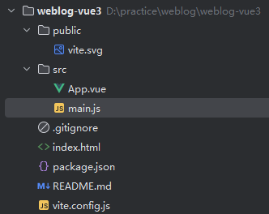
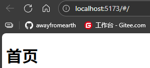
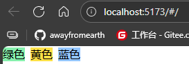
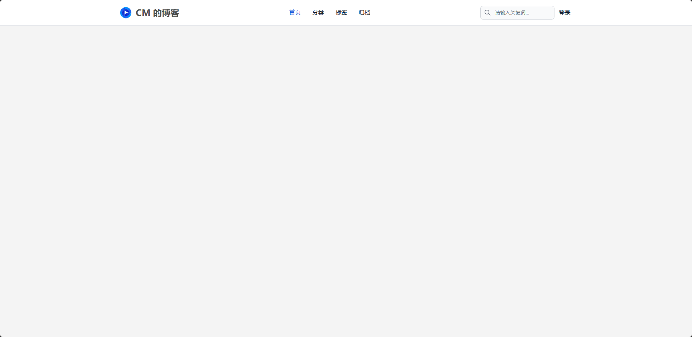
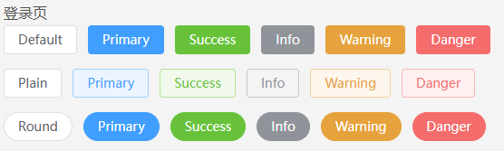

# Vue3 前端工程搭建

## 一、初始化脚手架

```cmd
pnpm create vite@latest
```

删除多余文件及多余的文件内容，最终文件结构如下：



`App.vue`的内容如下：

```vue
<template>
</template>
```

`main.js`的内容如下：

```js
import { createApp } from 'vue'
import App from './App.vue'

createApp(App).mount('#app')

```

## 二、配置别名

修改`vite.config.js`配置

```js
import { defineConfig } from 'vite'
import { resolve } from "path"

import vue from '@vitejs/plugin-vue'

// https://vite.dev/config/
export default defineConfig({
  plugins: [vue()],
  resolve: {
    alias: {
      "@": resolve(__dirname, "./src")
    }
  }
})

```

## 三、整合路由

### 2.1、安装 vue-router

```cmd
pnpm i vue-router
```

### 2.2、配置 vue-router

**准备工作：**

在`src`目录下新建`pages`目录用于存放页面相关代码，在`pages`目录下新建`admin`以及`frontend`目录

- `admin`：存放后台管理相关代码
- `frontend`: 存放前台展示相关代码

在`/frontend`文件夹下，创建`index.vue`首页文件，代码如下：

```vue
<template>
    <h1>首页</h1>
</template>
```

**配置路由：**

在`src`目录下新建`router`目录，在`router`目录下新建`routes.js`及`index.js`

- `routes.js`：存放实际路由元素对象
- `index.js`: 路由配置

初始化`routes.js`代码如下：

```js
const routes = [
  {
    path: "/", // 路由地址
    component: Index, // 对应组件
    meta: { // meta 信息
      title: "Weblog 首页" // 页面标题
    }
  }
]

export default routes
```

创建路由`index.js`代码如下：

```js
import Index from "@/pages/frontend/index.vue"
import routes from "./routes"

import { createRouter, createWebHashHistory } from "vue-router"

const router = createRouter({
  // 指定路由的历史管理方式，hash 模式指的是 URL 的路径是通过 hash 符号（#）进行标识
  history: createWebHashHistory(),
  routes, 
})

export default router

```

**测试路由切换：**

在`main.js`中引入并注册路由：

```js
import { createApp } from 'vue'

import router from "./router/index"
import App from './App.vue'

const app = createApp(App)
app.use(router)
app.mount('#app')

```

在`App.vue`中添加`router-view`组件：

```vue
<template>
  <router-view />
</template>
```

运行项目，访问`http://localhost:5176/#/`查看效果：



## 四、整合 Tailwind CSS

### 4.1、安装依赖及配置

安装依赖：

```cmd
pnpm i tailwindcss@3 postcss autoprefixer -D
```

生成配置文件：

```cmd
npx tailwindcss init -p
```

执行命令后生成两个配置文件：

- `tailwind.config.js`：定制`Tailwind`的默认设置，比如框架的颜色、字体、断点、间距
- `postcss.config.js`：配置`PostCSS`(`CSS`处理工具)

修改`tailwind.config.js`配置文件，添加所有模板文件的路径：

```js
/** @type {import('tailwindcss').Config} */
export default {
  content: [
      "./index.html",
      "./src/**/*.{vue,js,ts,jsx,tsx}"
  ],
  theme: {
    extend: {},
  },
  plugins: [],
}

```

### 4.2、在项目中使用 Tailwind

在`src/assets/styles`目录下新建`main.css`文件，引入`tailwind`样式：

```css
@tailwind base;
@tailwind components;
@tailwind utilities;
```

在`main.js`中引入：

```js
import "@/assets/styles/main.css"
```

### 4.3、在项目中测试 Tailwind 的使用

修改`frontend/index.vue`文件，测试`Tailwind`的使用：

```vue
<template>
  <div class="bg-green-300 inline">绿色</div>
  <div class="bg-yellow-300 ml-2 inline">黄色</div>
  <div class="bg-blue-300 ml-2 inline">蓝色</div>
</template>
```

效果如下：



## 五、整合 Tailwind CSS 组件库 Flowbite

### 5.1、安装依赖及配置

安装依赖：

```cmd
pnpm i flowbite@1.8.1
```

在`tailwind.config.js`文件中添加`Flowbite`插件：

```js
export default {
    // ...省略
    plugins: [
        require("flowbite/plugin")
    ],
    content: [
        "./node_modules/flowbite/**/*.js"
    ]
}
```

### 5.2、在项目中使用 Flowbite

在`frontend/index.vue`文件中创建`Navbar`：

```vue
<script setup>
import { onMounted } from "vue"
import { initCollapses } from "flowbite"

onMounted(initCollapses)
</script>

<template>
  <nav class="bg-white border-gray-200 border-b dark:bg-gray-900">
    <div class="max-w-screen-xl flex flex-wrap items-center justify-between mx-auto p-4">
      <a href="/" class="flex items-center outline-none">
        
        <span class="self-center text-2xl font-semibold whitespace-nowrap dark:text-white">
          CM 的博客
        </span>
      </a>
      <div class="flex items-center md:order-2">
        <button type="button" data-collapse-toggle="navbar-search" aria-controls="navbar-search"
          aria-expanded="false"
          class="md:hidden text-gry-500 dark:text-gray-400 hover:bg-gray-100 dark:hover:bg-gray-700 focus:outline-none focus:ring-4 focus:ring-gray-200 dark:focus:ring-gray-700 rounded-lg text-sm p-2.5 mr-1"
        >
          <svg class="w- 5 h-5" aria-hidden="true" xmlns="http://www.w3.org/2000/svg" fill="none" viewBox="0 0 20 20">
            <path stroke="currentColo" stroke-linecap="round" stroke-linejoin="round" stroke-width="2" d="m19 19-4-4m0-7A7 7 0 1 1 1 8a7 7 0 0 1 14 0Z" />
          </svg>
          <span class="sr-only">Search</span>
        </button>
        <div class="relative hidden mr-2 md:block">
          <div class="absolute inset-y-0 left-0 flex items-center pl-3 pointer-events-none">
            <svg class="w-4 h-4 text-gray-500 dark:text-gray-400" aria-hidden="true"
                 xmlns="http://www.w3.org/2000/svg" fill="none" viewBox="0 0 20 20">
              <path stroke="currentColor" stroke-linecap="round" stroke-linejoin="round" stroke-width="2"
                    d="m19 19-4-4m0-7A7 7 0 1 1 1 8a7 7 0 0 1 14 0Z" />
            </svg>
            <span class="sr-only">Search icon</span>
          </div>
          <input type="text" id="search-navbar"
            class="block w-full p-2 pl-10 text-sm text-gray-900 border border-gray-300 rounded-lg bg-gray-50 focus:ring-blue-500 focus:border-blue-500 dark:bg-gray-700 dark:border-gray-600 dark:placeholder-gray-400 dark:text-white dark:focus:ring-blue-500 dark:focus:border-blue-500"
            placeholder="请输入关键词..."
          >
        </div>

        <div class="text-gray-900 ml-1 mr-1 hover:text-blue-700">登录</div>

        <button data-collapse-toggle="navbar-search" type="button" aria-controls="navbar-search" aria-expanded="false"
          class="inline-flex items-center p-2 w-10 h-10 justify-center text-sm text-gray-500 rounded-lg md:hidden hover:bg-gray-100 focus:outline-none focus:ring-2 focus:ring-gray-200 dark:text-gray-400 dark:hover:bg-gray-700 dark:focus:ring-gray-600"
        >
          <span class="sr-only">Open main menu</span>
          <svg class="w-5 h-5" aria-hidden="true" xmlns="http://www.w3.org/2000/svg" fill="none"
               viewBox="0 0 17 14">
            <path stroke="currentColor" stroke-linecap="round" stroke-linejoin="round" stroke-width="2"
                  d="M1 1h15M1 7h15M1 13h15" />
          </svg>
        </button>
      </div>
      <div class="items-center justify-between hidden w-full md:flex md:w-auto md:order-1" id="navbar-search">
        <div class="relative mt-3 md:hidden">
          <div class="absolute inset-y-0 left-0 flex items-center pl-3 pointer-events-none">
            <svg class="w-4 h-4 text-gray-500 dark:text-gray-400" aria-hidden="true"
                 xmlns="http://www.w3.org/2000/svg" fill="none" viewBox="0 0 20 20">
              <path stroke="currentColor" stroke-linecap="round" stroke-linejoin="round" stroke-width="2"
                    d="m19 19-4-4m0-7A7 7 0 1 1 1 8a7 7 0 0 1 14 0Z" />
            </svg>
          </div>
          <input type="text" id="search-navbar"
                 class="block w-full p-2 pl-10 text-sm text-gray-900 border border-gray-300 rounded-lg bg-gray-50 focus:ring-blue-500 focus:border-blue-500 dark:bg-gray-700 dark:border-gray-600 dark:placeholder-gray-400 dark:text-white dark:focus:ring-blue-500 dark:focus:border-blue-500"
                 placeholder="Search...">
        </div>
        <ul class="flex flex-col p-4 md:p-0 mt-4 font-medium border border-gray-100 rounded-lg bg-gray-50 md:flex-row md:space-x-8 md:mt-0 md:border-0 md:bg-white dark:bg-gray-800 md:dark:bg-gray-900 dark:border-gray-700">
          <li>
            <a href="#" class="block py-2 pl-3 pr-4 text-white bg-blue-700 rounded md:bg-transparent md:text-blue-700 md:p-0 md:dark:text-blue-500" aria-current="page">首页</a>
          </li>
          <li>
            <a href="#" class="block py-2 pl-3 pr-4 text-gray-900 rounded hover:bg-gray-100 md:hover:bg-transparent md:hover:text-blue-700 md:p-0 md:dark:hover:text-blue-500 dark:text-white dark:hover:bg-gray-700 dark:hover:text-white md:dark:hover:bg-transparent dark:border-gray-700">分类</a>
          </li>
          <li>
            <a href="#" class="block py-2 pl-3 pr-4 text-gray-900 rounded hover:bg-gray-100 md:hover:bg-transparent md:hover:text-blue-700 md:p-0 md:dark:hover:text-blue-500 dark:text-white dark:hover:bg-gray-700 dark:hover:text-white md:dark:hover:bg-transparent dark:border-gray-700">标签</a>
          </li>
          <li>
            <a href="#" class="block py-2 pl-3 pr-4 text-gray-900 rounded hover:bg-gray-100 md:hover:bg-transparent md:hover:text-blue-700 md:p-0 md:dark:hover:text-blue-500 dark:text-white dark:hover:bg-gray-700 dark:hover:text-white md:dark:hover:bg-transparent dark:border-gray-700">归档</a>
          </li>
        </ul>
      </div>
    </div>
  </nav>
</template>
```

在`main.js`中引入：

```js
import "@/assets/styles/main.css"
```

在`main.css`中修改`body`的基本样式：

```css
@tailwind base;
@tailwind components;
@tailwind utilities;

body {
    font-family: -apple-system-font,BlinkMacSystemFont,Helvetica Neue,PingFang SC,Hiragino Sans GB,Microsoft YaHei UI,Microsoft YaHei,Arial,sans-serif;
    color: #4c4e4d;
    font-size: 16px;
    background: #f4f4f4;
    line-height: 1.6;
    overflow: hidden;
}
```

运行项目，效果如下：



## 六、整合 ElmentPlus 组件库

### 6.1、安装依赖及配置

安装依赖：

```cmd
pnpm i element-plus
```

配置自动导入：

```cmd
pnpm i unplugin-vue-components unplugin-auto-import -D
```

修改`viite.config.js`配置：

```js
import { defineConfig } from 'vite'
import { resolve } from "path"
import { ElementPlusResolver } from "unplugin-vue-components/resolvers"

import vue from '@vitejs/plugin-vue'
import AutoImport from "unplugin-auto-import/vite"
import Components from "unplugin-vue-components/vite"

// https://vite.dev/config/
export default defineConfig({
  plugins: [
    vue(),
    AutoImport({
      resolvers: [ElementPlusResolver()]
    }),
    Components({
      resolvers: [ElementPlusResolver()]
    })
  ],
  resolve: {
    alias: {
      "@": resolve(__dirname, "./src")
    }
  }
})

```

### 6.2、测试

为上文`Navbar`中的登录按钮添加路由跳转事件：

```vue
<div class="text-gray-900 ml-1 mr-1 hover:text-blue-700" @click="$router.push('/login')">登录</div>
```

添加登录路由：

```js
// ...省略
const routes = [
    // ...省略
    {
        path: "/login",
        component: Login,
        meta: {
            title: "Weblog 登录页"
        }
    }
]
```

在登录页中试用`ElementPlus`组件：

```vue
<template>
    <div class="p-2">
        <h1>登录页</h1>
        <el-row class="mb-4">
            <el-button>Default</el-button>
            <el-button type="primary">Primary</el-button>
            <el-button type="success">Success</el-button>
            <el-button type="info">Info</el-button>
            <el-button type="warning">Warning</el-button>
            <el-button type="danger">Danger</el-button>
        </el-row>

        <el-row class="mb-4">
            <el-button plain>Plain</el-button>
            <el-button type="primary" plain>Primary</el-button>
            <el-button type="success" plain>Success</el-button>
            <el-button type="info" plain>Info</el-button>
            <el-button type="warning" plain>Warning</el-button>
            <el-button type="danger" plain>Danger</el-button>
        </el-row>

        <el-row class="mb-4">
            <el-button round>Round</el-button>
            <el-button type="primary" round>Primary</el-button>
            <el-button type="success" round>Success</el-button>
            <el-button type="info" round>Info</el-button>
            <el-button type="warning" round>Warning</el-button>
            <el-button type="danger" round>Danger</el-button>
        </el-row>

    </div>
</template>

```

重启项目，效果如下：


