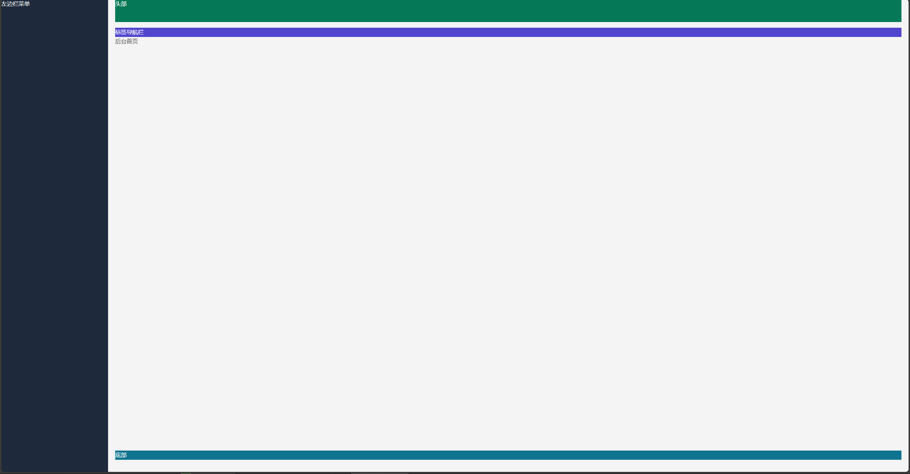
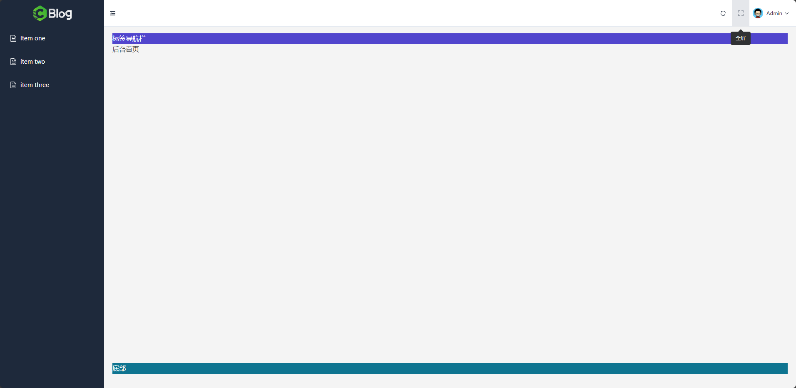

# 搭建管理后台骨架

## 一、搭建管理后台基本布局

### 1.1、搭建基础结构

在`src`目录下新建`/layouts/admin`目录，在该目录下新建`Admin.vue`文件，布局基本结构：

```vue
<script setup>

</script>

<template>
  <!-- 外层容器 -->
  <el-container>

    <!-- 左边侧边栏 -->
    <el-aside>左边侧边栏</el-aside>

    <!-- 右边主内容区域 -->
    <el-container>
      <!-- 顶栏容器 -->
      <el-header>头部</el-header>

      <el-main>
        标签导航栏

        <!-- 主内容（根据路由动态展示不同页面） -->
        <router-view />
      </el-main>

      <!-- 底栏容器 -->
      <el-footer>底部</el-footer>
    </el-container>
  </el-container>
</template>

<style scoped>

</style>
```

### 1.2、拆分组件

在 `/layouts/admin` 文件夹下，新建 `/components` 文件夹，用于放置后台组件

**头部组件**

新建`AdminHeader.vue`，代码如下：

```vue
<template>
    <div class="bg-emerald-700 h-[64px] text-white">
        头部
    </div>
</template>
```

**左边菜单栏**

新建 `AdminMenu.vue` , 代码如下：

```vue
<template>
    <div class="bg-slate-800 h-screen text-white">左边栏菜单</div>
</template>
```

**标签导航栏**

新建 `AdminTagList.vue`, 代码如下：

```vue
<template>
    <div class="bg-indigo-700 text-white">
        标签导航栏
    </div>
</template>
```

**页脚**

新建 `AdminFooter.vue` , 代码如下：

```vue
<template>
    <div class="bg-cyan-700 text-white">
        底部
    </div>
</template>
```

**在`Admin.vue`中组合这些组件**

```vue
<script setup>
import AdminHeader from "@/layouts/admin/components/AdminHeader.vue"
import AdminMenu from "@/layouts/admin/components/AdminMenu.vue"
import AdminTagsList from "@/layouts/admin/components/AdminTagsList.vue"
import AdminFooter from "@/layouts/admin/components/AdminFooter.vue"
</script>

<template>
  <!-- 外层容器 -->
  <el-container>

    <!-- 左边侧边栏 -->
    <el-aside>
      <AdminMenu />
    </el-aside>

    <!-- 右边主内容区域 -->
    <el-container>
      <!-- 顶栏容器 -->
      <el-header>
        <AdminHeader />
      </el-header>

      <el-main>
        <AdminTagsList />

        <!-- 主内容（根据路由动态展示不同页面） -->
        <router-view />
      </el-main>

      <!-- 底栏容器 -->
      <el-footer>
        <AdminFooter />
      </el-footer>
    </el-container>
  </el-container>
</template>

<style scoped>

</style>
```

### 1.3、改造后台路由

```js
import Index from "@/pages/frontend/index.vue"
import Login from "@/pages/admin/Login.vue"
import AdminIndex from "@/pages/admin/index.vue"
import Admin from "@/layouts/admin/Admin.vue"

const routes = [
    {
        path: "/", // 路由地址
        component: Index, // 对应组件
        meta: { // meta 信息
            title: "Weblog 首页" // 页面标题
        }
    },
    {
        path: "/login",
        component: Login,
        meta: {
            title: "Weblog 登录页"
        }
    },
    {
       path: "/admin",
        component: Admin,
        children: [
            {
                path: "/admin/index", // 后台首页
                component: AdminIndex,
                meta: {
                    title: "Admin 后台首页"
                }
            }
        ]
    }
]

export default routes
```

### 1.4、测试

运行项目查看效果：



## 二、后台公共 Header 头：样式布局

### 2.1、边距问题

修改`Admin.vue`文件，取消头部组件的边距：

```vue
<style scoped>
.el-header {
  padding: 0 !important;
}
</style>
```

### 2.2、整合组件

头部组件左侧添加控制菜单栏折叠的图标按钮，右侧添加切换全屏的图标按钮与用户头像以及对应的下拉菜单（修改密码、退出登录），修改`AdminHeader.vue`文件：

```vue
<template>
	<!-- 通过 flex 指定水平布局 -->
    <div class="bg-emerald-700 h-[64px] text-white flex">
        <!-- 左边栏收缩、展开 -->
        <el-icon>
            <Fold />
        </el-icon>

        <!-- 右边容器，通过 ml-auto 让其在父容器的右边 -->
        <div class="ml-auto">
            <!-- 点击刷新页面 -->
            <el-icon>
			  <Refresh />
	        </el-icon>
            <!-- 点击全屏展示 -->
            <el-icon>
                <FullScreen />
            </el-icon>

            <!-- 登录用户头像 -->
            <el-dropdown>
                <span class="el-dropdown-link text-white">
                    <!-- 头像 Avatar -->
                    <el-avatar :size="25" src="https://img.quanxiaoha.com/quanxiaoha/f97361c0429d4bb1bc276ab835843065.jpg" />
                    Admin
                    <el-icon class="el-icon--right">
                        <arrow-down />
                    </el-icon>
                </span>
                <template #dropdown>
                    <el-dropdown-menu>
                        <el-dropdown-item>修改密码</el-dropdown-item>
                        <el-dropdown-item>退出登录</el-dropdown-item>
                    </el-dropdown-menu>
                </template>
            </el-dropdown>
        </div>
    </div>
</template>
```

### 2.3、调整样式

**调整父容器样式**

```html
<!-- 设置背景色为白色、高度为 64px，padding-right 为 4， border-bottom 为 slate 200 -->
<div class="bg-white h-[64px] flex pr-4 border-b border-slate-200">
</div>
```

**调整图标样式**

```html
<!-- 左边栏收缩、展开 -->
<div class="w-[42px] h-[64px] cursor-pointer flex items-center justify-center text-gray-700 hover:bg-gray-200">
    <el-icon>
        <Fold />
    </el-icon>
</div>

<!-- 省略 -->

<!-- 点击刷新页面 -->
<div class="w-[42px] h-[64px] cursor-pointer flex items-center justify-center text-gray-700 hover:bg-gray-200">
	<el-icon>
		<Refresh />
	</el-icon>
</div>
<!-- 点击全屏展示 -->
<div class="w-[42px] h-[64px] cursor-pointer flex items-center justify-center text-gray-700 mr-2 hover:bg-gray-200">
    <el-icon>
    	<FullScreen />
    </el-icon>
</div>
```

**头像区域样式调整**

给`el-dropdown`的父容器设置`flex`布局

然后调整头像样式：

```html
<el-dropdown trigger="click">
	<span class="el-dropdown-link flex items-center justify-center text-gray-700 text-xs">
		<!-- 头像 Avatar -->
		<el-avatar class="mr-2" :size="25" :src="AvatarImg" />
		Admin
		<el-icon class="el-icon--right">
			<arrow-down />
		</el-icon>
	</span>
	<template #dropdown>
		<el-dropdown-menu>
			<el-dropdown-item>修改密码</el-dropdown-item>
			<el-dropdown-item>退出登录</el-dropdown-item>
		</el-dropdown-menu>
	</template>
</el-dropdown>
```

### 2.4、图标添加文字提示

```html
<!-- 点击刷新页面 -->
<el-tooltip class="box-item" effect="dark" content="刷新" placement="bottom">
	<div class="w-[42px] h-[64px] cursor-pointer flex items-center justify-center text-gray-700 hover:bg-gray-200">
		<el-icon>
			<Refresh />
		</el-icon>
	</div>
</el-tooltip>
<!-- 点击全屏展示 -->
<el-tooltip class="box-item" effect="dark" content="全屏" placement="bottom">
	<div class="w-[42px] h-[64px] cursor-pointer flex items-center justify-center text-gray-700 mr-2 hover:bg-gray-200">
		<el-icon>
			<FullScreen />
		</el-icon>
	</div>
</el-tooltip>
```

### 2.5、最终效果如下



## 三、左侧菜单栏：样式布局

### 3.1、引入 ElementPlus 的菜单组件

修改`AdminMenu.vue`文件，引入组件：

```vue
<template>
  <div class="bg-slate-800 h-screen text-white">
    <el-menu
        default-active="2"
        class="el-menu-vertical-demo"
    >
      <el-sub-menu index="1">
        <template #title>
          <el-icon><location /></el-icon>
          <span>Navigator One</span>
        </template>
        <el-menu-item-group title="Group One">
          <el-menu-item index="1-1">item one</el-menu-item>
          <el-menu-item index="1-2">item two</el-menu-item>
        </el-menu-item-group>
        <el-menu-item-group title="Group Two">
          <el-menu-item index="1-3">item three</el-menu-item>
        </el-menu-item-group>
        <el-sub-menu index="1-4">
          <template #title>item four</template>
          <el-menu-item index="1-4-1">item one</el-menu-item>
        </el-sub-menu>
      </el-sub-menu>
      <el-menu-item index="2">
        <el-icon><icon-menu /></el-icon>
        <span>Navigator Two</span>
      </el-menu-item>
      <el-menu-item index="3" disabled>
        <el-icon><document /></el-icon>
        <span>Navigator Three</span>
      </el-menu-item>
      <el-menu-item index="4">
        <el-icon><setting /></el-icon>
        <span>Navigator Four</span>
      </el-menu-item>
    </el-menu>
  </div>
</template>
```

### 3.2、调整结构

该项目仅需一级菜单且需要在菜单项上方加项目`Logo`，调整`AdminMenu.vue`代码如下：

```vue
<template>
  <div class="bg-slate-800 h-screen text-white">
    <!-- 顶部 Logo, 指定高度为 64px, 和右边的 Header 头保持一样高 -->
    <div class="flex items-center justify-center h-[64px]">
      
    </div>
    
    <!-- 下方菜单 -->
    <el-menu default-active="2" class="el-menu-vertical-demo">
      <el-menu-item index="1-1">item one</el-menu-item>
      <el-menu-item index="1-2">item two</el-menu-item>
      <el-menu-item index="1-3">item three</el-menu-item>
    </el-menu>
  </div>
</template>
```

### 3.3、改善样式

修改`AdminMenu.vue`的样式如下：

```vue
<style scoped>
.el-menu {
  background-color: rgb(30 41 59 / 1);
  border-right: 0;
}
.el-menu-item.is-active {
  background-color: var(--el-color-primary);
  color: #fff;
}
.el-menu-item.is-active:hover {
  background-color: var(--el-color-primary);
}
.el-menu-item {
  color: #fff;
}
.el-menu-item:hover {
  background-color: #ffffff10;
}
</style>
```

## 四、后台公共 Header 头：功能开发

### 4.1、整合 Pinia

**安装**

```powershell
pnpm install pinia
```

**注册**

在`main.js`中注册状态管理库：

```js
import { createPinia } from "pinia"

const pinia = createPinia()

app.use(pinia)
```

### 4.2、展开与折叠菜单栏功能

**创建`Store`**

在`src`目录下创建`stores`目录，在该目录中创建`menu.js`，统一管理菜单相关的全局状态：

```js
import { defineStore } from "pinia"
import { ref } from "vue"

export const useMenuStore = defineStore("menu", () => {
  const isMenuCollapsed = ref(false)

  function toggleMenuCollapsed() {
    isMenuCollapsed.value = !isMenuCollapsed.value
  }

  return { isMenuCollapsed, toggleMenuCollapsed }
})
```

**绑定`Store`中的`isMenuCollapsed`到菜单组件的`collapse`属性**

```vue
<script setup>
import { useMenuStore } from "@/stores/menu"
import { computed } from "vue"

const menuStore = useMenuStore()

const isCollapsed = computed(() => menuStore.isCollapsed)
</script>

<template>
  <div class="bg-slate-800 h-screen text-white">
    <!-- 顶部 Logo, 指定高度为 64px, 和右边的 Header 头保持一样高 -->
    <div class="flex items-center justify-center h-[64px]">
      Logo
    </div>

    <!-- 下方菜单 -->
    <el-menu
        default-active="2"
        class="el-menu-vertical-demo"
        :collapse="isCollapsed"
    >
      <el-menu-item index="1-1">
        <el-icon><document /></el-icon>
        <span>item one</span>
      </el-menu-item>
      <el-menu-item index="1-2">
        <el-icon><document /></el-icon>
        <span>item two</span>
      </el-menu-item>
      <el-menu-item index="1-3">
        <el-icon><document /></el-icon>
        <span>item three</span>
      </el-menu-item>
    </el-menu>
  </div>
</template>

<style scoped>
.el-menu {
  background-color: rgb(30 41 59 / 1);
  border-right: 0;
}
.el-menu-item.is-active {
  background-color: var(--el-color-primary);
  color: #fff;
}
.el-menu-item.is-active:hover {
  background-color: var(--el-color-primary);
}
.el-menu-item {
  color: #fff;
}
.el-menu-item:hover {
  background-color: #ffffff10;
}
</style>
```

**菜单组件父容器宽度动态变化**

菜单组件的父容器宽度要随着折叠变量的改变而变化：

```vue
<script setup>
// 省略...

import { useMenuStore } from '@/stores/menu'

const menuStore = useMenuStore()
</script>

<!-- 左边侧边栏 -->
<el-aside :width="menuStore.isMenuCollapsed ? '64px' : '250px'">
	<AdminMenu />
</el-aside>
```

**折叠图标动态变化**

修改`AdminHeader.vue`：

```vue
<script setup>
import { useMenuStore } from "@/stores/menu"

const menuStore = useMenuStore()
</script>

<!-- 左边栏收缩、展开 -->
<div class="w-[42px] h-[64px] cursor-pointer flex items-center justify-center text-gray-700 hover:bg-gray-200">
	<el-icon>
		<Fold v-if="!menuStore.isMenuCollapsed" />
		<Expand v-else />
	</el-icon>
</div>
```

**`Logo`动态变化**

修改`AdminMenu.vue`：

```vue
<!-- 顶部 Logo, 指定高度为 64px, 和右边的 Header 头保持一样高 -->
<div class="flex items-center justify-center h-[64px]">
	
	
</div>
```

**置换过渡动画**

修改`AdminMenu.vue`，给`ElementPlus`菜单组件添加属性`:collapse-transition="false"`，为顶层的`div`添加`Tailwind CSS` 提供的动画 `transition-all`：

```vue
<script setup>
import { useMenuStore } from "@/stores/menu"
import { computed } from "vue"

const menuStore = useMenuStore()

const isCollapsed = computed(() => menuStore.isMenuCollapsed)
</script>

<template>
  <div class="bg-slate-800 h-screen text-white transition-all">
    <!-- 顶部 Logo, 指定高度为 64px, 和右边的 Header 头保持一样高 -->
    <div class="flex items-center justify-center h-[64px]">
      
      
    </div>

    <!-- 下方菜单 -->
    <el-menu
        default-active="2"
        class="el-menu-vertical-demo"
        :collapse="isCollapsed"
        :collapse-transition="false"
    >
      <el-menu-item index="1-1">
        <el-icon><document /></el-icon>
        <span>item one</span>
      </el-menu-item>
      <el-menu-item index="1-2">
        <el-icon><document /></el-icon>
        <span>item two</span>
      </el-menu-item>
      <el-menu-item index="1-3">
        <el-icon><document /></el-icon>
        <span>item three</span>
      </el-menu-item>
    </el-menu>
  </div>
</template>

<style scoped>
.el-menu {
  background-color: rgb(30 41 59 / 1);
  border-right: 0;
}
.el-menu-item.is-active {
  background-color: var(--el-color-primary);
  color: #fff;
}
.el-menu-item.is-active:hover {
  background-color: var(--el-color-primary);
}
.el-menu-item {
  color: #fff;
}
.el-menu-item:hover {
  background-color: #ffffff10;
}
</style>
```

同时也为`Admin.vue`中的`el-aside`组件添加 `transition-all`：

```vue
<!-- 左边侧边栏 -->
<el-aside class="transition-all" :width="menuStore.isMenuCollapsed ? '64px' : '250px'">
	<AdminMenu />
</el-aside>
```

**添加点击事件**

为 `AdminHeader` 组件中的收缩 `Icon` 添加点击事件：

```vue
<!-- 左边栏收缩、展开 -->
<div class="w-[42px] h-[64px] cursor-pointer flex items-center justify-center text-gray-700 hover:bg-gray-200" @click="menuStore.toggleMenuCollapsed">
	<el-icon>
		<Fold v-if="!menuStore.isMenuCollapsed" />
		<Expand v-else />
	</el-icon>
</div>
```

### 4.3、刷新功能

编辑 `AdminHeader` 组件，给刷新图标添加点击事件，点击后刷新页面：

```vue
<script setup>
// ...省略
function handleRefresh() {
  location.reload()
}
</script>

<!-- 点击刷新页面 -->
<el-tooltip class="box-item" effect="dark" content="刷新" placement="bottom">
	<div class="w-[42px] h-[64px] cursor-pointer flex items-center justify-center text-gray-700 hover:bg-gray-200" @click="handleRefresh">
		<el-icon>
			<Refresh />
		</el-icon>
	</div>
</el-tooltip>
```

### 4.4、全屏切换功能

安装 `VueUse` 核心库：

```powershell
pnpm i @vueuse/core
```

编辑 `AdminHeader.vue` 组件，添加全屏图标点击事件：

```vue
<script setup>
// ...省略
import { useFullscreen } from "@vueuse/core"
    
const { isFullscreen, toggle } = useFullscreen()
</script>

<!-- 点击全屏展示 -->
<el-tooltip class="box-item" effect="dark" content="全屏" placement="bottom">
	<div class="w-[42px] h-[64px] cursor-pointer flex items-center justify-center text-gray-700 mr-2 hover:bg-gray-200" @click="toggle">
		<el-icon>
			<FullScreen />
		</el-icon>
	</div>
</el-tooltip>
```

修改代码，让图标和提示文字也跟随变化：

```vue
<!-- 点击全屏展示 -->
<el-tooltip class="box-item" effect="dark" :content="isFullscreen ? '取消全屏' : '全屏'" placement="bottom">
	<div class="w-[42px] h-[64px] cursor-pointer flex items-center justify-center text-gray-700 mr-2 hover:bg-gray-200" @click="toggle">
		<el-icon>
			<FullScreen v-if="!isFullscreen"/>
			<Aim v-else/>
		</el-icon>
	</div>
</el-tooltip>
```

## 五、左侧菜单栏：功能开发

### 5.1、菜单栏数据替换

在`src`目录下新建`constants`目录，统一存放自定义常量，在该目录下新建`menus.js`文件，存放菜单相关常量：

```js
export const MENUS = [
  {
    name: "仪表盘",
    icon: "Monitor",
    path: "/admin/index"
  },
  {
    name: "文章管理",
    icon: "Document",
    path: "/admin/article/list"
  },
  {
    name: "分类管理",
    icon: "FolderOpened",
    path: "/admin/category/list"
  },
  {
    name: "标签管理",
    icon: "PriceTag",
    path: "/admin/tag/list"
  },
  {
    name: "博客设置",
    icon: "Notebook",
    path: "/admin/blog/setting"
  }
]
```

修改`AdminMenu.vue`代码，循环生成菜单项：

```vue
<!-- 下方菜单 -->
<el-menu
	default-active="2"
	class="el-menu-vertical-demo"
	:collapse="isCollapsed"
	:collapse-transition="false"
>
	<el-menu-item v-for="(item, index) in MENUS" :key="index" :index="item.path">
		<el-icon>
			<component :is="item.icon" />
		</el-icon>
		<span>{{ item.name }}</span>
	</el-menu-item>
</el-menu>
```

### 5.2、默认选中当前路由对应项

