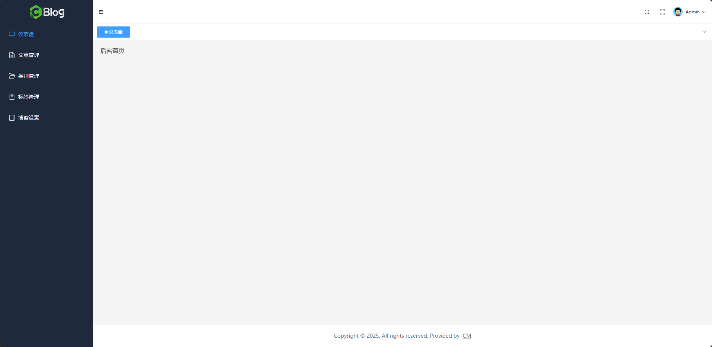

# 搭建管理后台骨架

## 一、搭建管理后台基本布局

### 1.1、搭建基础结构

在`src`目录下新建`/layouts/admin`目录，在该目录下新建`Admin.vue`文件，布局基本结构：

```vue
<script setup>

</script>

<template>
  <!-- 外层容器 -->
  <el-container>

    <!-- 左边侧边栏 -->
    <el-aside>左边侧边栏</el-aside>

    <!-- 右边主内容区域 -->
    <el-container>
      <!-- 顶栏容器 -->
      <el-header>头部</el-header>

      <el-main>
        标签导航栏

        <!-- 主内容（根据路由动态展示不同页面） -->
        <router-view />
      </el-main>

      <!-- 底栏容器 -->
      <el-footer>底部</el-footer>
    </el-container>
  </el-container>
</template>

<style scoped>

</style>
```

### 1.2、拆分组件

在 `/layouts/admin` 文件夹下，新建 `/components` 文件夹，用于放置后台组件

**头部组件**

新建`AdminHeader.vue`，代码如下：

```vue
<template>
    <div class="bg-emerald-700 h-[64px] text-white">
        头部
    </div>
</template>
```

**左边菜单栏**

新建 `AdminMenu.vue` , 代码如下：

```vue
<template>
    <div class="bg-slate-800 h-screen text-white">左边栏菜单</div>
</template>
```

**标签导航栏**

新建 `AdminTagList.vue`, 代码如下：

```vue
<template>
    <div class="bg-indigo-700 text-white">
        标签导航栏
    </div>
</template>
```

**页脚**

新建 `AdminFooter.vue` , 代码如下：

```vue
<template>
    <div class="bg-cyan-700 text-white">
        底部
    </div>
</template>
```

**在`Admin.vue`中组合这些组件**

```vue
<script setup>
import AdminHeader from "@/layouts/admin/components/AdminHeader.vue"
import AdminMenu from "@/layouts/admin/components/AdminMenu.vue"
import AdminTagsList from "@/layouts/admin/components/AdminTagsList.vue"
import AdminFooter from "@/layouts/admin/components/AdminFooter.vue"
</script>

<template>
  <!-- 外层容器 -->
  <el-container>

    <!-- 左边侧边栏 -->
    <el-aside>
      <AdminMenu />
    </el-aside>

    <!-- 右边主内容区域 -->
    <el-container>
      <!-- 顶栏容器 -->
      <el-header>
        <AdminHeader />
      </el-header>

      <el-main>
        <AdminTagsList />

        <!-- 主内容（根据路由动态展示不同页面） -->
        <router-view />
      </el-main>

      <!-- 底栏容器 -->
      <el-footer>
        <AdminFooter />
      </el-footer>
    </el-container>
  </el-container>
</template>

<style scoped>

</style>
```

### 1.3、改造后台路由

```js
import Index from "@/pages/frontend/index.vue"
import Login from "@/pages/admin/Login.vue"
import AdminIndex from "@/pages/admin/index.vue"
import Admin from "@/layouts/admin/Admin.vue"

const routes = [
    {
        path: "/", // 路由地址
        component: Index, // 对应组件
        meta: { // meta 信息
            title: "Weblog 首页" // 页面标题
        }
    },
    {
        path: "/login",
        component: Login,
        meta: {
            title: "Weblog 登录页"
        }
    },
    {
       path: "/admin",
        component: Admin,
        children: [
            {
                path: "/admin/index", // 后台首页
                component: AdminIndex,
                meta: {
                    title: "Admin 后台首页"
                }
            }
        ]
    }
]

export default routes
```

### 1.4、测试

运行项目查看效果：


## 二、后台公共 Header 头：样式布局

### 2.1、边距问题

修改`Admin.vue`文件，取消头部组件的边距：

```vue
<style scoped>
.el-header {
  padding: 0 !important;
}
</style>
```

### 2.2、整合组件

头部组件左侧添加控制菜单栏折叠的图标按钮，右侧添加切换全屏的图标按钮与用户头像以及对应的下拉菜单（修改密码、退出登录），修改`AdminHeader.vue`文件：

```vue
<template>
	<!-- 通过 flex 指定水平布局 -->
    <div class="bg-emerald-700 h-[64px] text-white flex">
        <!-- 左边栏收缩、展开 -->
        <el-icon>
            <Fold />
        </el-icon>

        <!-- 右边容器，通过 ml-auto 让其在父容器的右边 -->
        <div class="ml-auto">
            <!-- 点击刷新页面 -->
            <el-icon>
			  <Refresh />
	        </el-icon>
            <!-- 点击全屏展示 -->
            <el-icon>
                <FullScreen />
            </el-icon>

            <!-- 登录用户头像 -->
            <el-dropdown>
                <span class="el-dropdown-link text-white">
                    <!-- 头像 Avatar -->
                    <el-avatar :size="25" src="https://img.quanxiaoha.com/quanxiaoha/f97361c0429d4bb1bc276ab835843065.jpg" />
                    Admin
                    <el-icon class="el-icon--right">
                        <arrow-down />
                    </el-icon>
                </span>
                <template #dropdown>
                    <el-dropdown-menu>
                        <el-dropdown-item>修改密码</el-dropdown-item>
                        <el-dropdown-item>退出登录</el-dropdown-item>
                    </el-dropdown-menu>
                </template>
            </el-dropdown>
        </div>
    </div>
</template>
```

### 2.3、调整样式

**调整父容器样式**

```html
<!-- 设置背景色为白色、高度为 64px，padding-right 为 4， border-bottom 为 slate 100 -->
<div class="bg-white h-[64px] flex pr-4 border-b border-slate-100">
</div>
```

**调整图标样式**

```html
<!-- 左边栏收缩、展开 -->
<div class="w-[42px] h-[64px] cursor-pointer flex items-center justify-center text-gray-700 hover:bg-gray-200">
    <el-icon>
        <Fold />
    </el-icon>
</div>

<!-- 省略 -->

<!-- 点击刷新页面 -->
<div class="w-[42px] h-[64px] cursor-pointer flex items-center justify-center text-gray-700 hover:bg-gray-200">
	<el-icon>
		<Refresh />
	</el-icon>
</div>
<!-- 点击全屏展示 -->
<div class="w-[42px] h-[64px] cursor-pointer flex items-center justify-center text-gray-700 mr-2 hover:bg-gray-200">
    <el-icon>
    	<FullScreen />
    </el-icon>
</div>
```

**头像区域样式调整**

给`el-dropdown`的父容器设置`flex`布局

然后调整头像样式：

```html
<el-dropdown trigger="click" class="flex items-center justify-center">
	<span class="el-dropdown-link flex items-center justify-center text-gray-700 text-xs">
		<!-- 头像 Avatar -->
		<el-avatar class="mr-2" :size="25" :src="AvatarImg" />
		Admin
		<el-icon class="el-icon--right">
			<arrow-down />
		</el-icon>
	</span>
	<template #dropdown>
		<el-dropdown-menu>
			<el-dropdown-item>修改密码</el-dropdown-item>
			<el-dropdown-item>退出登录</el-dropdown-item>
		</el-dropdown-menu>
	</template>
</el-dropdown>
```

### 2.4、图标添加文字提示

```html
<!-- 点击刷新页面 -->
<el-tooltip class="box-item" effect="dark" content="刷新" placement="bottom">
	<div class="w-[42px] h-[64px] cursor-pointer flex items-center justify-center text-gray-700 hover:bg-gray-200">
		<el-icon>
			<Refresh />
		</el-icon>
	</div>
</el-tooltip>
<!-- 点击全屏展示 -->
<el-tooltip class="box-item" effect="dark" content="全屏" placement="bottom">
	<div class="w-[42px] h-[64px] cursor-pointer flex items-center justify-center text-gray-700 mr-2 hover:bg-gray-200">
		<el-icon>
			<FullScreen />
		</el-icon>
	</div>
</el-tooltip>
```

### 2.5、最终效果如下


## 三、左侧菜单栏：样式布局

### 3.1、引入 ElementPlus 的菜单组件

修改`AdminMenu.vue`文件，引入组件：

```vue
<template>
  <div class="bg-slate-800 h-screen text-white">
    <el-menu
        default-active="2"
        class="el-menu-vertical-demo"
    >
      <el-sub-menu index="1">
        <template #title>
          <el-icon><location /></el-icon>
          <span>Navigator One</span>
        </template>
        <el-menu-item-group title="Group One">
          <el-menu-item index="1-1">item one</el-menu-item>
          <el-menu-item index="1-2">item two</el-menu-item>
        </el-menu-item-group>
        <el-menu-item-group title="Group Two">
          <el-menu-item index="1-3">item three</el-menu-item>
        </el-menu-item-group>
        <el-sub-menu index="1-4">
          <template #title>item four</template>
          <el-menu-item index="1-4-1">item one</el-menu-item>
        </el-sub-menu>
      </el-sub-menu>
      <el-menu-item index="2">
        <el-icon><icon-menu /></el-icon>
        <span>Navigator Two</span>
      </el-menu-item>
      <el-menu-item index="3" disabled>
        <el-icon><document /></el-icon>
        <span>Navigator Three</span>
      </el-menu-item>
      <el-menu-item index="4">
        <el-icon><setting /></el-icon>
        <span>Navigator Four</span>
      </el-menu-item>
    </el-menu>
  </div>
</template>
```

### 3.2、调整结构

该项目仅需一级菜单且需要在菜单项上方加项目`Logo`，调整`AdminMenu.vue`代码如下：

```vue
<template>
  <div class="bg-slate-800 h-screen text-white">
    <!-- 顶部 Logo, 指定高度为 64px, 和右边的 Header 头保持一样高 -->
    <div class="flex items-center justify-center h-[64px]">
      
    </div>
    
    <!-- 下方菜单 -->
    <el-menu default-active="2" class="el-menu-vertical-demo">
      <el-menu-item index="1-1">item one</el-menu-item>
      <el-menu-item index="1-2">item two</el-menu-item>
      <el-menu-item index="1-3">item three</el-menu-item>
    </el-menu>
  </div>
</template>
```

### 3.3、改善样式

修改`AdminMenu.vue`的样式如下：

```vue
<style scoped>
.el-menu {
  background-color: rgb(30 41 59 / 1);
  border-right: 0;
}
.el-menu-item.is-active {
  background-color: var(--el-color-primary);
  color: #fff;
}
.el-menu-item.is-active:hover {
  background-color: var(--el-color-primary);
}
.el-menu-item {
  color: #fff;
}
.el-menu-item:hover {
  background-color: #ffffff10;
}
</style>
```

## 四、后台公共 Header 头：功能开发

### 4.1、整合 Pinia

**安装**

```powershell
pnpm install pinia
```

**注册**

在`main.js`中注册状态管理库：

```js
import { createPinia } from "pinia"

const pinia = createPinia()

app.use(pinia)
```

### 4.2、展开与折叠菜单栏功能

**创建`Store`**

在`src`目录下创建`stores`目录，在该目录中创建`menu.js`，统一管理菜单相关的全局状态：

```js
import { defineStore } from "pinia"
import { ref } from "vue"

export const useMenuStore = defineStore("menu", () => {
  const isMenuCollapsed = ref(false)

  function toggleMenuCollapsed() {
    isMenuCollapsed.value = !isMenuCollapsed.value
  }

  return { isMenuCollapsed, toggleMenuCollapsed }
})
```

**绑定`Store`中的`isMenuCollapsed`到菜单组件的`collapse`属性**

```vue
<script setup>
import { useMenuStore } from "@/stores/menu"
import { computed } from "vue"

const menuStore = useMenuStore()

const isCollapsed = computed(() => menuStore.isCollapsed)
</script>

<template>
  <div class="bg-slate-800 h-screen text-white">
    <!-- 顶部 Logo, 指定高度为 64px, 和右边的 Header 头保持一样高 -->
    <div class="flex items-center justify-center h-[64px]">
      Logo
    </div>

    <!-- 下方菜单 -->
    <el-menu
        default-active="2"
        class="el-menu-vertical-demo"
        :collapse="isCollapsed"
    >
      <el-menu-item index="1-1">
        <el-icon><document /></el-icon>
        <span>item one</span>
      </el-menu-item>
      <el-menu-item index="1-2">
        <el-icon><document /></el-icon>
        <span>item two</span>
      </el-menu-item>
      <el-menu-item index="1-3">
        <el-icon><document /></el-icon>
        <span>item three</span>
      </el-menu-item>
    </el-menu>
  </div>
</template>

<style scoped>
.el-menu {
  background-color: rgb(30 41 59 / 1);
  border-right: 0;
}
.el-menu-item.is-active {
  color: var(--el-color-primary);
}
.el-menu-item.is-active:hover {
  background-color: rgb(30 41 59 / 1);
}
.el-menu-item {
  color: #fff;
}
.el-menu-item:hover {
  background-color: #ffffff10;
}
</style>
```

**菜单组件父容器宽度动态变化**

菜单组件的父容器宽度要随着折叠变量的改变而变化：

```vue
<script setup>
// 省略...

import { useMenuStore } from '@/stores/menu'

const menuStore = useMenuStore()
</script>

<!-- 左边侧边栏 -->
<el-aside :width="menuStore.isMenuCollapsed ? '64px' : '250px'">
	<AdminMenu />
</el-aside>
```

**折叠图标动态变化**

修改`AdminHeader.vue`：

```vue
<script setup>
import { useMenuStore } from "@/stores/menu"

const menuStore = useMenuStore()
</script>

<!-- 左边栏收缩、展开 -->
<div class="w-[42px] h-[64px] cursor-pointer flex items-center justify-center text-gray-700 hover:bg-gray-200">
	<el-icon>
		<Fold v-if="!menuStore.isMenuCollapsed" />
		<Expand v-else />
	</el-icon>
</div>
```

**`Logo`动态变化**

修改`AdminMenu.vue`：

```vue
<!-- 顶部 Logo, 指定高度为 64px, 和右边的 Header 头保持一样高 -->
<div class="flex items-center justify-center h-[64px]">
	
	
</div>
```

**置换过渡动画**

修改`AdminMenu.vue`，给`ElementPlus`菜单组件添加属性`:collapse-transition="false"`，为顶层的`div`添加`Tailwind CSS` 提供的动画 `transition-all`：

```vue
<script setup>
import { useMenuStore } from "@/stores/menu"
import { computed } from "vue"

const menuStore = useMenuStore()

const isCollapsed = computed(() => menuStore.isMenuCollapsed)
</script>

<template>
  <div class="bg-slate-800 h-screen text-white transition-all">
    <!-- 顶部 Logo, 指定高度为 64px, 和右边的 Header 头保持一样高 -->
    <div class="flex items-center justify-center h-[64px]">
      
      
    </div>

    <!-- 下方菜单 -->
    <el-menu
        default-active="2"
        class="el-menu-vertical-demo"
        :collapse="isCollapsed"
        :collapse-transition="false"
    >
      <el-menu-item index="1-1">
        <el-icon><document /></el-icon>
        <span>item one</span>
      </el-menu-item>
      <el-menu-item index="1-2">
        <el-icon><document /></el-icon>
        <span>item two</span>
      </el-menu-item>
      <el-menu-item index="1-3">
        <el-icon><document /></el-icon>
        <span>item three</span>
      </el-menu-item>
    </el-menu>
  </div>
</template>

<style scoped>
.el-menu {
  background-color: rgb(30 41 59 / 1);
  border-right: 0;
}
.el-menu-item.is-active {
  color: var(--el-color-primary);
}
.el-menu-item.is-active:hover {
  background-color: rgb(30 41 59 / 1);
}
.el-menu-item {
  color: #fff;
}
.el-menu-item:hover {
  background-color: #ffffff10;
}
</style>
```

同时也为`Admin.vue`中的`el-aside`组件添加 `transition-all`：

```vue
<!-- 左边侧边栏 -->
<el-aside class="transition-all" :width="menuStore.isMenuCollapsed ? '64px' : '250px'">
	<AdminMenu />
</el-aside>
```

**添加点击事件**

为 `AdminHeader` 组件中的收缩 `Icon` 添加点击事件：

```vue
<!-- 左边栏收缩、展开 -->
<div class="w-[42px] h-[64px] cursor-pointer flex items-center justify-center text-gray-700 hover:bg-gray-200" @click="menuStore.toggleMenuCollapsed">
	<el-icon>
		<Fold v-if="!menuStore.isMenuCollapsed" />
		<Expand v-else />
	</el-icon>
</div>
```

### 4.3、刷新功能

编辑 `AdminHeader` 组件，给刷新图标添加点击事件，点击后刷新页面：

```vue
<script setup>
// ...省略
function handleRefresh() {
  location.reload()
}
</script>

<!-- 点击刷新页面 -->
<el-tooltip class="box-item" effect="dark" content="刷新" placement="bottom">
	<div class="w-[42px] h-[64px] cursor-pointer flex items-center justify-center text-gray-700 hover:bg-gray-200" @click="handleRefresh">
		<el-icon>
			<Refresh />
		</el-icon>
	</div>
</el-tooltip>
```

### 4.4、全屏切换功能

安装 `VueUse` 核心库：

```powershell
pnpm i @vueuse/core
```

编辑 `AdminHeader.vue` 组件，添加全屏图标点击事件：

```vue
<script setup>
// ...省略
import { useFullscreen } from "@vueuse/core"
    
const { isFullscreen, toggle } = useFullscreen()
</script>

<!-- 点击全屏展示 -->
<el-tooltip class="box-item" effect="dark" content="全屏" placement="bottom">
	<div class="w-[42px] h-[64px] cursor-pointer flex items-center justify-center text-gray-700 mr-2 hover:bg-gray-200" @click="toggle">
		<el-icon>
			<FullScreen />
		</el-icon>
	</div>
</el-tooltip>
```

修改代码，让图标和提示文字也跟随变化：

```vue
<!-- 点击全屏展示 -->
<el-tooltip class="box-item" effect="dark" :content="isFullscreen ? '取消全屏' : '全屏'" placement="bottom">
	<div class="w-[42px] h-[64px] cursor-pointer flex items-center justify-center text-gray-700 mr-2 hover:bg-gray-200" @click="toggle">
		<el-icon>
			<FullScreen v-if="!isFullscreen"/>
			<Aim v-else/>
		</el-icon>
	</div>
</el-tooltip>
```

## 五、左侧菜单栏：功能开发

### 5.1、菜单栏数据替换

在`src`目录下新建`constants`目录，统一存放自定义常量，在该目录下新建`menus.js`文件，存放菜单相关常量：

```js
export const MENUS = [
  {
    name: "仪表盘",
    icon: "Monitor",
    path: "/admin/index"
  },
  {
    name: "文章管理",
    icon: "Document",
    path: "/admin/article/list"
  },
  {
    name: "分类管理",
    icon: "FolderOpened",
    path: "/admin/category/list"
  },
  {
    name: "标签管理",
    icon: "PriceTag",
    path: "/admin/tag/list"
  },
  {
    name: "博客设置",
    icon: "Notebook",
    path: "/admin/blog/setting"
  }
]
```

修改`AdminMenu.vue`代码，循环生成菜单项：

```vue
<!-- 下方菜单 -->
<el-menu
	default-active="2"
	class="el-menu-vertical-demo"
	:collapse="isCollapsed"
	:collapse-transition="false"
>
	<el-menu-item v-for="(item, index) in MENUS" :key="index" :index="item.path">
		<el-icon>
			<component :is="item.icon" />
		</el-icon>
		<span>{{ item.name }}</span>
	</el-menu-item>
</el-menu>
```

### 5.2、默认选中当前路由对应项

为`el-menu`组件添加`default-active`属性，指定默认高亮的菜单项：

```vue
<script setup>
// ...省略
import {useRoute, useRouter} from "vue-router"

const route = useRoute()
</script>

<!-- 下方菜单 -->
<el-menu
	class="el-menu-vertical-demo"
	:collapse="isCollapsed"
	:collapse-transition="false"
	:default-active="route.path"
>
    <!-- 省略 -->
</el-menu>
```

### 5.3、跳转路由

点击每项菜单后分别跳转到对应的页面：

```vue
<!-- 下方菜单 -->
<el-menu
	class="el-menu-vertical-demo"
	:collapse="isCollapsed"
	:collapse-transition="false"
	:default-active="route.path"
	@select="p => router.push(p)"
>
    <!-- 省略 -->
</el-menu>
```

测试前先在`pages/admin`目录下分别建好每个路由对应的页面：

文章管理页`ArticleList.vue`：

```vue
<template>
  文章管理页
</template>
```

类别管理页`CategoryList.vue`：

```vue
<template>
  类别管理页
</template>
```

标签管理页`TagList.vue`：

```vue
<template>
  标签管理页
</template>
```

博客设置页`BlogSetting.vue`：

```vue
<template>
  博客设置页
</template>
```

创建好后在`router/route.js`中注册路由：

```js
// ...省略
{
	path: "/admin",
	component: Admin,
	children: [
		{
			path: "/admin/index",
			component: AdminIndex,
			meta: {
				title: "仪表盘"
			}
		},
		{
			path: "/admin/article/list",
			component: () => import("@/pages/admin/ArticleList.vue"),
			meta: {
				title: "文章管理"
			}
		},
		{
			path: "/admin/category/list",
			component: () => import("@/pages/admin/CategoryList.vue"),
			meta: {
 				title: "类别管理"
			}
		},
		{
			path: "/admin/tag/list",
			component: () => import("@/pages/admin/TagList.vue"),
			meta: {
				title: "标签管理"
			}
		},
		{
			path: "/admin/blog/setting",
			component: () => import("@/pages/admin/BlogSetting.vue"),
			meta: {
				title: "博客设置"
			}
		}
	]
}
```

点击菜单项查看效果

## 六、标签导航栏

### 6.1、样式布局

基本布局：左侧标签导航，右侧下拉关闭菜单

```vue
<template>
  <div>
    <!-- 左侧：标签导航 -->
    <el-tabs type="card" closable>
      <el-tab-pane key="1" label="Tab 1" name="1">
        Content 1
      </el-tab-pane>
      <el-tab-pane key="2" label="Tab 2" name="2">
        Content 2
      </el-tab-pane>
    </el-tabs>

    <!-- 右侧：下拉菜单 -->
    <el-dropdown>
      <span class="el-dropdown-link">
        <el-icon class="el-icon--right">
          <arrow-down />
        </el-icon>
      </span>
      <template #dropdown>
        <el-dropdown-menu>
          <el-dropdown-item>关闭其他</el-dropdown-item>
          <el-dropdown-item>关闭全部</el-dropdown-item>
        </el-dropdown-menu>
      </template>
    </el-dropdown>
  </div>
</template>
```

样式美化：

```vue
<template>
  <div class="fixed top-[64px] h-[44px] px-2 right-0 z-50 flex items-center bg-white" style="left: 250px;">
    <!-- 左侧：标签导航 -->
    <el-tabs type="card" closable style="min-width: 10px;">
      <el-tab-pane key="1" label="Tab 1" name="1">
      </el-tab-pane>
      <el-tab-pane key="2" label="Tab 2" name="2">
      </el-tab-pane>
    </el-tabs>

    <!-- 右侧：下拉菜单 -->
    <span class="ml-auto flex items-center justify-center h-[32px] w-[32px]">
      <el-dropdown>
        <span class="el-dropdown-link">
          <el-icon class="el-icon--right">
            <arrow-down />
          </el-icon>
        </span>
        <template #dropdown>
          <el-dropdown-menu>
            <el-dropdown-item>关闭其他</el-dropdown-item>
            <el-dropdown-item>关闭全部</el-dropdown-item>
          </el-dropdown-menu>
        </template>
      </el-dropdown>
    </span>
  </div>
  <div class="h-[44px]"></div>
</template>

<style scoped>
:deep(.el-tabs__item) {
  font-size: 12px;
  border: 1px solid #d8dce5!important;
  border-radius: 3px!important;
}

:deep(.el-tabs--card>.el-tabs__header .el-tabs__item) {
  margin-left: 0.1rem!important;
  margin-right: 0.1rem!important;
}

:deep(.el-tabs__item.is-active) {
  background-color: var(--el-color-primary) !important;
  color: #fff;
}

:deep(.el-tabs__item.is-active::before) {
  content: "";
  background-color: #fff;
  display: inline-block;
  width: 8px;
  height: 8px;
  border-radius: 50%;
  position: relative;
  margin-right: 4px;
}

:deep(.el-tabs) {
  height: 32px;
}

:deep(.el-tabs__header) {
  margin-bottom: 0;
}

:deep(.el-tabs--card>.el-tabs__header .el-tabs__nav) {
  border: 0;
}

:deep(.el-tabs--card>.el-tabs__header .el-tabs__item) {
  height: 32px;
  line-height: 32px;
  border: 0;
  background: #fff;
}

:deep(.el-tabs--card>.el-tabs__header) {
  border: 0;
}

:deep(.el-tabs__nav-prev, .el-tabs__nav-next) {
  line-height: 35px;
}

:deep(.is-disabled) {
  cursor: not-allowed;
  color: #d1d5db;
}
</style>
```

解决子标签过多导致超过页面宽度却无法滚动的问题：

给`el-tabs`组件添加一个`min-width: 10px`：

```html
<el-tabs type="card" closable style="min-width: 10px;">
    <!--省略-->
</el-tabs>
```

跟随左侧菜单折叠与展开：

设置`left`定位值随折叠展开的变化而改变以及增加过渡效果：

```vue
<script setup>
import { useMenuStore } from "@/stores/menu"

const menuStore = useMenuStore()
</script>

<div class="fixed top-[64px] h-[44px] px-2 right-0 z-50 flex items-center bg-white transition-all" :style="{ left: menuStore.isMenuCollapsed ? '64px' : '250px' }">
    <!--省略-->
</div>
```

### 6.2、功能实现

#### 6.2.1、标签项与路由一致

修改`AdminTagList.vue`中的`tabs`组件，由真实路由循环生成：

```vue
<script setup>
import { MENUS } from "@/constants/menus"
</script>
 <!-- 左侧：标签导航 -->
<el-tabs type="card" closable style="min-width: 10px;">
  <el-tab-pane
	v-for="(m, i) in MENUS"
	:key="m.path"
	:label="m.name"
	:name="m.path"
  />
</el-tabs>
```

根据当前路由切换选中路由

继续编辑`AdminTagList.vue`，给`tabs`组件绑定`activeTab`变量：

```vue
<script setup>
import { ref } from "vue"
import { useRoute } from "vue-router"
    
const route = useRoute()

const activeTab = ref(route.path)
</script>

<el-tabs v-model="activeTab" type="card" closable style="min-width: 10px;">
	<!--省略-->
</el-tabs>
```

添加`closable`属性设置首页标签栏无法关闭：

```vue
<el-tab-pane
   v-for="(m, i) in MENUS"
   :key="m.path"
   :label="m.name"
   :name="m.path"
   :closable="i > 0"
/>
```

#### 6.2.2、动态添加标签

修改循环的数组，初始状态仅保留仪表盘页：

```vue
<script setup>
import { useMenuStore } from "@/stores/menu"
import { ref } from "vue"
import { useRoute } from "vue-router"

const menuStore = useMenuStore()

const route = useRoute()

const activeTab = ref(route.path)

const tabList = ref([
  {
    name: "仪表盘",
    path: "/admin/index"
  }
])
</script>

<template>
  <div class="fixed top-[64px] h-[44px] px-2 right-0 z-50 flex items-center bg-white transition-all" :style="{ left: menuStore.isMenuCollapsed ? '64px' : '250px' }">
    <!-- 左侧：标签导航 -->
    <el-tabs v-model="activeTab" type="card" closable style="min-width: 10px;">
      <el-tab-pane
        v-for="(m, i) in tabList"
        :key="m.path"
        :label="m.name"
        :name="m.path"
        :closable="i > 0"
      />
    </el-tabs>

    <!-- 右侧：下拉菜单 -->
    <span class="ml-auto flex items-center justify-center h-[32px] w-[32px]">
      <el-dropdown>
        <span class="el-dropdown-link">
          <el-icon class="el-icon--right">
            <arrow-down />
          </el-icon>
        </span>
        <template #dropdown>
          <el-dropdown-menu>
            <el-dropdown-item>关闭其他</el-dropdown-item>
            <el-dropdown-item>关闭全部</el-dropdown-item>
          </el-dropdown-menu>
        </template>
      </el-dropdown>
    </span>
  </div>
  <div class="h-[44px]"></div>
</template>

<style scoped>
:deep(.el-tabs__item) {
  font-size: 12px;
  border: 1px solid #d8dce5!important;
  border-radius: 3px!important;
}

:deep(.el-tabs--card>.el-tabs__header .el-tabs__item) {
  margin-left: 0.1rem!important;
  margin-right: 0.1rem!important;
}

:deep(.el-tabs__item.is-active) {
  background-color: var(--el-color-primary) !important;
  color: #fff;
}

:deep(.el-tabs__item.is-active::before) {
  content: "";
  background-color: #fff;
  display: inline-block;
  width: 8px;
  height: 8px;
  border-radius: 50%;
  position: relative;
  margin-right: 4px;
}

:deep(.el-tabs) {
  height: 32px;
}

:deep(.el-tabs__header) {
  margin-bottom: 0;
}

:deep(.el-tabs--card>.el-tabs__header .el-tabs__nav) {
  border: 0;
}

:deep(.el-tabs--card>.el-tabs__header .el-tabs__item) {
  height: 32px;
  line-height: 32px;
  border: 0;
  background: #fff;
}

:deep(.el-tabs--card>.el-tabs__header) {
  border: 0;
}

:deep(.el-tabs__nav-prev, .el-tabs__nav-next) {
  line-height: 35px;
}

:deep(.is-disabled) {
  cursor: not-allowed;
  color: #d1d5db;
}
</style>
```

在`vue-router`的`onBeforeRouteUpdate`生命周期钩子中添加标签：

```vue
<script setup>
import { useMenuStore } from "@/stores/menu"
import { ref } from "vue"
import { useRoute, onBeforeRouteUpdate, } from "vue-router"

const menuStore = useMenuStore()

const route = useRoute()

const activeTab = ref(route.path)

const tabList = ref([
  {
    name: "仪表盘",
    path: "/admin/index"
  }
])

function addTab(tab) {
  let isTabExisted = tabList.value.find(item => item.path === tab.path)
  if (!isTabExisted) {
    tabList.value.push(tab)
  }
}

onBeforeRouteUpdate((to, from) => {
  activeTab.value = to.path
  addTab({
    name: to.meta.title,
    path: to.path
  })
})
</script>

<template>
  <div class="fixed top-[64px] h-[44px] px-2 right-0 z-50 flex items-center bg-white transition-all" :style="{ left: menuStore.isMenuCollapsed ? '64px' : '250px' }">
    <!-- 左侧：标签导航 -->
    <el-tabs v-model="activeTab" type="card" closable style="min-width: 10px;">
      <el-tab-pane
        v-for="(m, i) in tabList"
        :key="m.path"
        :label="m.name"
        :name="m.path"
        :closable="i > 0"
      />
    </el-tabs>

    <!-- 右侧：下拉菜单 -->
    <span class="ml-auto flex items-center justify-center h-[32px] w-[32px]">
      <el-dropdown>
        <span class="el-dropdown-link">
          <el-icon class="el-icon--right">
            <arrow-down />
          </el-icon>
        </span>
        <template #dropdown>
          <el-dropdown-menu>
            <el-dropdown-item>关闭其他</el-dropdown-item>
            <el-dropdown-item>关闭全部</el-dropdown-item>
          </el-dropdown-menu>
        </template>
      </el-dropdown>
    </span>
  </div>
  <div class="h-[44px]"></div>
</template>

<style scoped>
:deep(.el-tabs__item) {
  font-size: 12px;
  border: 1px solid #d8dce5!important;
  border-radius: 3px!important;
}

:deep(.el-tabs--card>.el-tabs__header .el-tabs__item) {
  margin-left: 0.1rem!important;
  margin-right: 0.1rem!important;
}

:deep(.el-tabs__item.is-active) {
  background-color: var(--el-color-primary) !important;
  color: #fff;
}

:deep(.el-tabs__item.is-active::before) {
  content: "";
  background-color: #fff;
  display: inline-block;
  width: 8px;
  height: 8px;
  border-radius: 50%;
  position: relative;
  margin-right: 4px;
}

:deep(.el-tabs) {
  height: 32px;
}

:deep(.el-tabs__header) {
  margin-bottom: 0;
}

:deep(.el-tabs--card>.el-tabs__header .el-tabs__nav) {
  border: 0;
}

:deep(.el-tabs--card>.el-tabs__header .el-tabs__item) {
  height: 32px;
  line-height: 32px;
  border: 0;
  background: #fff;
}

:deep(.el-tabs--card>.el-tabs__header) {
  border: 0;
}

:deep(.el-tabs__nav-prev, .el-tabs__nav-next) {
  line-height: 35px;
}

:deep(.is-disabled) {
  cursor: not-allowed;
  color: #d1d5db;
}
</style>
```

点击标签跳转路由：

```vue
<script setup>
import { useMenuStore } from "@/stores/menu"
import { ref } from "vue"
import { useRoute, onBeforeRouteUpdate, useRouter } from "vue-router"

const menuStore = useMenuStore()

const route = useRoute()
const router = useRouter()

const activeTab = ref(route.path)

const tabList = ref([
  {
    name: "仪表盘",
    path: "/admin/index"
  }
])

function addTab(tab) {
  let isTabExisted = tabList.value.find(item => item.path === tab.path)
  if (!isTabExisted) {
    tabList.value.push(tab)
  }
}

onBeforeRouteUpdate((to, from) => {
  activeTab.value = to.path
  addTab({
    name: to.meta.title,
    path: to.path
  })
})

function handleTabChange(path) {
  activeTab.value = path
  router.push(path)
}
</script>

<template>
  <div class="fixed top-[64px] h-[44px] px-2 right-0 z-50 flex items-center bg-white transition-all" :style="{ left: menuStore.isMenuCollapsed ? '64px' : '250px' }">
    <!-- 左侧：标签导航 -->
    <el-tabs v-model="activeTab" @tab-change="handleTabChange" type="card" closable style="min-width: 10px;">
      <el-tab-pane
        v-for="(m, i) in tabList"
        :key="m.path"
        :label="m.name"
        :name="m.path"
        :closable="i > 0"
      />
    </el-tabs>

    <!-- 右侧：下拉菜单 -->
    <span class="ml-auto flex items-center justify-center h-[32px] w-[32px]">
      <el-dropdown>
        <span class="el-dropdown-link">
          <el-icon class="el-icon--right">
            <arrow-down />
          </el-icon>
        </span>
        <template #dropdown>
          <el-dropdown-menu>
            <el-dropdown-item>关闭其他</el-dropdown-item>
            <el-dropdown-item>关闭全部</el-dropdown-item>
          </el-dropdown-menu>
        </template>
      </el-dropdown>
    </span>
  </div>
  <div class="h-[44px]"></div>
</template>

<style scoped>
:deep(.el-tabs__item) {
  font-size: 12px;
  border: 1px solid #d8dce5!important;
  border-radius: 3px!important;
}

:deep(.el-tabs--card>.el-tabs__header .el-tabs__item) {
  margin-left: 0.1rem!important;
  margin-right: 0.1rem!important;
}

:deep(.el-tabs__item.is-active) {
  background-color: var(--el-color-primary) !important;
  color: #fff;
}

:deep(.el-tabs__item.is-active::before) {
  content: "";
  background-color: #fff;
  display: inline-block;
  width: 8px;
  height: 8px;
  border-radius: 50%;
  position: relative;
  margin-right: 4px;
}

:deep(.el-tabs) {
  height: 32px;
}

:deep(.el-tabs__header) {
  margin-bottom: 0;
}

:deep(.el-tabs--card>.el-tabs__header .el-tabs__nav) {
  border: 0;
}

:deep(.el-tabs--card>.el-tabs__header .el-tabs__item) {
  height: 32px;
  line-height: 32px;
  border: 0;
  background: #fff;
}

:deep(.el-tabs--card>.el-tabs__header) {
  border: 0;
}

:deep(.el-tabs__nav-prev, .el-tabs__nav-next) {
  line-height: 35px;
}

:deep(.is-disabled) {
  cursor: not-allowed;
  color: #d1d5db;
}
</style>
```

#### 6.2.3、标签持久化

在`utils`目录下的`cookie.js`中新增标签相关的方法，将标签项存储到`cookie`中并在需要的地方取用：

```js
import { useCookies } from "@vueuse/integrations/useCookies"

const TOKEN_KEY = "Authorization"
const TAB_LIST_LEY = "tabList"

const cookie = useCookies()

export function getToken() {
    return cookie.get(TOKEN_KEY)
}

export function setToken(token) {
    return cookie.set(TOKEN_KEY, token)
}

export function removeToken() {
    return cookie.remove(TOKEN_KEY)
}

export function getTabList() {
    return cookie.get(TAB_LIST_LEY)
}

export function setTabList(tabList) {
    return cookie.set(TAB_LIST_LEY, tabList)
}
```

在`AdminTagList.vue`中访问与设置：

```vue
<script setup>
import { useMenuStore } from "@/stores/menu"
import { ref } from "vue"
import { useRoute, onBeforeRouteUpdate, useRouter } from "vue-router"
import { getTabList, setTabList } from "@/utils/cookie.js"

const menuStore = useMenuStore()

const route = useRoute()
const router = useRouter()

const activeTab = ref(route.path)

const tabList = ref([
  {
    name: "仪表盘",
    path: "/admin/index"
  }
])

function addTab(tab) {
  let isTabExisted = tabList.value.find(item => item.path === tab.path)
  if (!isTabExisted) {
    tabList.value.push(tab)
  }
  setTabList(tabList.value)
}

onBeforeRouteUpdate((to, from) => {
  activeTab.value = to.path
  addTab({
    name: to.meta.title,
    path: to.path
  })
})

function handleTabChange(path) {
  activeTab.value = path
  router.push(path)
}

function initTabList() {
  let tabs = getTabList()
  if (tabs) {
    tabList.value = tabs
  }
}

initTabList()
</script>

<template>
  <div class="fixed top-[64px] h-[44px] px-2 right-0 z-50 flex items-center bg-white transition-all" :style="{ left: menuStore.isMenuCollapsed ? '64px' : '250px' }">
    <!-- 左侧：标签导航 -->
    <el-tabs v-model="activeTab" @tab-change="handleTabChange" type="card" closable style="min-width: 10px;">
      <el-tab-pane
        v-for="(m, i) in tabList"
        :key="m.path"
        :label="m.name"
        :name="m.path"
        :closable="i > 0"
      />
    </el-tabs>

    <!-- 右侧：下拉菜单 -->
    <span class="ml-auto flex items-center justify-center h-[32px] w-[32px]">
      <el-dropdown>
        <span class="el-dropdown-link">
          <el-icon class="el-icon--right">
            <arrow-down />
          </el-icon>
        </span>
        <template #dropdown>
          <el-dropdown-menu>
            <el-dropdown-item>关闭其他</el-dropdown-item>
            <el-dropdown-item>关闭全部</el-dropdown-item>
          </el-dropdown-menu>
        </template>
      </el-dropdown>
    </span>
  </div>
  <div class="h-[44px]"></div>
</template>

<style scoped>
:deep(.el-tabs__item) {
  font-size: 12px;
  border: 1px solid #d8dce5!important;
  border-radius: 3px!important;
}

:deep(.el-tabs--card>.el-tabs__header .el-tabs__item) {
  margin-left: 0.1rem!important;
  margin-right: 0.1rem!important;
}

:deep(.el-tabs__item.is-active) {
  background-color: var(--el-color-primary) !important;
  color: #fff;
}

:deep(.el-tabs__item.is-active::before) {
  content: "";
  background-color: #fff;
  display: inline-block;
  width: 8px;
  height: 8px;
  border-radius: 50%;
  position: relative;
  margin-right: 4px;
}

:deep(.el-tabs) {
  height: 32px;
}

:deep(.el-tabs__header) {
  margin-bottom: 0;
}

:deep(.el-tabs--card>.el-tabs__header .el-tabs__nav) {
  border: 0;
}

:deep(.el-tabs--card>.el-tabs__header .el-tabs__item) {
  height: 32px;
  line-height: 32px;
  border: 0;
  background: #fff;
}

:deep(.el-tabs--card>.el-tabs__header) {
  border: 0;
}

:deep(.el-tabs__nav-prev, .el-tabs__nav-next) {
  line-height: 35px;
}

:deep(.is-disabled) {
  cursor: not-allowed;
  color: #d1d5db;
}
</style>
```

#### 6.2.4、标签项关闭功能

修改`AdminTagList.vue`文件，新增`handleTabRemove`方法绑定在`el-tab`组件的`tab-remove`事件，点击标签项关闭按钮时关闭标签以及其他操作：

```js
function handleTabRemove(path) {
  let tabs = tabList.value
  let actTab = activeTab.value
  
  let tab
  
  if (actTab === path) {
    for (let i = 0; i < tabs.length; i++) {
      tab = tabs[i]
      if (tab.path === path) {
        let nextTab = tabs[i + 1] || tabs[i - 1]
        if(nextTab) {
          actTab = nextTab.path
        }
      }
    }
  }
  
  activeTab.value = tab
  
  tabList.value = tabList.value.filter(t => t.path !== path)
  
  setTabList(tabList.value)
  
  handleTabChange(activeTab.value)
}
```

#### 6.2.5、关闭其它、关闭全部功能

先为`el-dropdown`组件子项添加`command`属性，分别为`others`和`all`，为`dropdown`组件绑定`command`事件，触发`handleCloseTab`函数，做如下处理：

```js
function handleCloseTab(command) {
  let indexPath = "/admin/index"
  if (command === "others") {
    tabList.value = tabList.value.filter(t => t.path === indexPath || t.path === activeTab.value)
  }
  
  if (command === "all") {
    activeTab.value = indexPath
    tabList.value = tabList.value.filter(t => t.path === indexPath)
    handleTabChange(activeTab.value)
  }
  
  setTabList(tabList.value)
}
```

## 七、页脚版权信息组件

`AdminFooter.vue`：

```vue
<template>
  <div class="bg-white py-5 flex items-center justify-center text-sm text-gray-500 shadow-none">
    <!-- Copyright 版权信息 -->
    Copyright © 2023. All rights reserved. Provided by&nbsp; <a class="underline" href="https://www.quanxiaoha.com" target="_blank">犬小哈</a>
  </div>
</template>
```

`Admin.vue`：

```vue
<style scoped>
.el-header, .el-footer {
  padding: 0 !important;
}
</style>
```

最终效果：



## 八、组件缓存

修改`Admin.vue`中的`router-view`组件，使用`keepAlive`缓存组件，提高页面切换性能和响应速度：

```vue
<!-- 主内容（根据路由动态展示不同页面） -->
<router-view v-slot="{ Component }">
  <KeepAlive :max="10">
	<component :is="Component" />
  </KeepAlive>
</router-view>
```

## 九、全局过渡动画

修改`Admin.vue`中的`router-view`组件，将内部所有内容用`Transition`组件包裹并为该组件命名为`fade`：

```vue
<!-- 主内容（根据路由动态展示不同页面） -->
<router-view v-slot="{ Component }">
  <Transition name="fade">
	<KeepAlive :max="10">
	  <component :is="Component" />
	</KeepAlive>
  </Transition>
</router-view>
```

再为该组件自定义淡入淡出动画：

```css
/* 内容区域过渡动画：淡入淡出效果 */
/* 刚开始进入时 */
.fade-enter-from {
    /* 透明度 */
    opacity: 0;
}

/* 刚开始结束 */
.fade-enter-to {
    opacity: 1;
}

/* 刚开始离开 */
.fade-leave-from {
  opacity: 1;
}

/* 离开已结束 */
.fade-leave-to {
  opacity: 0;
}

/* 离开进行中 */
.fade-leave-active {
    transition: all 0.3s;
}

/* 进入进行中 */
.fade-enter-active {
    transition: all 0.3s;
    transition-delay: 0.3s;
}
```

## 十、右侧用户名展示

### 10.1、开发获取当前登录用户信息接口

目标：请求地址`/admin/user/info`，请求方法`GET`，发送该请求后返回用户信息，暂时只需要用户名

目标返回：

```json
{
    "success": true,
    "message": null,
    "code": null,
    "data": {
        "username": "登录用户对应的用户名"
    }
}
```

#### 10.1.1、新建用户信息实体类

在`weblog-module-admin`模块下新建`/model/vo`包，在该包下新建`user`包统一放置用户模块相关的实体类，在`user`包下新建响应实体类`FindUserInfoRspVO`，按照上述目标配置响应模型：

```java
package com.cm.weblog.admin.model.vo.user;

import lombok.AllArgsConstructor;
import lombok.Builder;
import lombok.Data;
import lombok.NoArgsConstructor;

/**
 * 获取用户信息接口返参实体类
 */
@Data
@AllArgsConstructor
@NoArgsConstructor
@Builder
public class FindUserInfoRspVO {
    private String username;
}

```

#### 10.1.2、添加查询用户信息服务及实现类

在`weblog-module-admin`模块下新建`/service/impl`包，在`service`包下创建用户服务接口`AdminUserService`，声明查询用户信息的方法：

```java
package com.cm.weblog.admin.service;

import com.cm.weblog.admin.model.vo.user.FindUserInfoRspVO;
import com.cm.weblog.common.utils.Response;

/**
 * 用户服务接口
 */
public interface AdminUserService {
    /**
     * 获取当前登录用户信息
     * @return 响应用户信息
     */
    Response<FindUserInfoRspVO> findUserInfo();
}

```

在`impl`包下创建对应实现类`AdminUserServiceImpl`，实现该方法，从`Spring Security`上下文环境中读取用户信息：

```java
package com.cm.weblog.admin.service.impl;

import com.cm.weblog.admin.model.vo.user.FindUserInfoRspVO;
import com.cm.weblog.admin.service.AdminUserService;
import com.cm.weblog.common.utils.Response;
import org.springframework.security.core.Authentication;
import org.springframework.security.core.context.SecurityContextHolder;
import org.springframework.stereotype.Service;

@Service
public class AdminUserServiceImpl implements AdminUserService {
    @Override
    public Response<FindUserInfoRspVO> findUserInfo() {
        // 获取上下文中存储的信息
        Authentication authentication = SecurityContextHolder.getContext().getAuthentication();

        // 获取用户名
        String username = authentication.getName();

        return Response.success(FindUserInfoRspVO.builder().username(username).build());
    }
}

```

#### 10.1.3、控制层添加查询用户信息接口

在`weblog-module-admin`模块下新建`controller`包，在该包下创建控制器`AdminUserController`，添加查询用户信息的接口：

```java
package com.cm.weblog.admin.controller;

import com.cm.weblog.admin.model.vo.user.FindUserInfoRspVO;
import com.cm.weblog.admin.service.AdminUserService;
import com.cm.weblog.common.aspect.ApiOperationLog;
import com.cm.weblog.common.utils.Response;
import io.swagger.annotations.Api;
import io.swagger.annotations.ApiOperation;
import org.springframework.web.bind.annotation.GetMapping;
import org.springframework.web.bind.annotation.RequestMapping;
import org.springframework.web.bind.annotation.RestController;

import javax.annotation.Resource;

/**
 * 用户相关接口的控制器
 */
@RestController
@RequestMapping("/admin")
@Api(tags = "Admin 用户模块")
public class AdminUserController {
    @Resource
    private AdminUserService adminUserService;
    
    @GetMapping("/uer/info")
    @ApiOperation(value = "获取用户信息")
    @ApiOperationLog(description = "获取用户信息")
    public Response<FindUserInfoRspVO> findUserInfo() {
        return adminUserService.findUserInfo();
    }
}

```

#### 10.1.4、测试

重启项目，请求该接口，返回如下：

```json
{
    "success": true,
    "message": null,
    "code": null,
    "data": {
        "username": "test"
    }
}
```

### 10.2、Pinia 存储用户信息，动态显示用户名

在`api/admin/user.js`文件中新增一个获取登录用户信息的接口：

```js
/**
 * 获取当前登录用户信息
 * @returns {Promise<axios.AxiosResponse<any>>}
 */
export function getUserInfo() {
  return axios.get("admin/user/info")
}
```

在`stores`目录下新建一个`user.js`文件封装用户相关的全局状态，封装调用接口获取用户信息并存储的方法：

```js
import { defineStore } from "pinia"
import { ref } from "vue"
import { getUserInfo } from "@/api/admin/user.js"

export const useUserStore = defineStore("user", () => {
    const userInfo = ref({})
    
    async function setUserInfo() {
        try {
            const { success, data } = await getUserInfo()
            if (success) {
                userInfo.value = data
            }
        } catch(e) {
            console.log(e)
        }
        
        return { userInfo, setUserInfo }
    }
})
```

修改`Login.vue`文件的`onSubmit`方法，登录成功后调用上面封装的方法将用户信息存储到全局状态中：

```js
import { useUserStore } from "@/stores/user.js"

const userStore = useUserStore()

async function onsubmit() {
    // ... 省略
    
   	userStore.setUserInfo()
}
```

修改`AdminHeader`组件，从全局状态中读取用户名：

```vue
<script setup>
import { useUserStore } from "@/stores/user.js"

const userStore = useUserStore()
</script>

<template>
  <span class="el-dropdown-link flex items-center justify-center text-gray-700 text-xs">
	<!-- 头像 Avatar -->
	<el-avatar class="mr-2" :size="25" :src="AvatarImg" />
	  {{ userStore.userInfo.username }}
	  <el-icon class="el-icon--right">
		<arrow-down />
	  </el-icon>
  </span>
</template>

<style scoped>
```

## 十一、用户信息、菜单信息持久化

目标：解决目前存在的两个问题：

- 打开页面后若是未调用登录接口全局状态中就没有用户信息
- 折叠菜单刷新后会再展开

安装依赖

```shell
pnpm i pinia-plugin-persistedstate
```

编辑 main.js 文件，将插件添加到 Pinia 实例上：

```js
// 省略...

// 引入全局状态管理 Pinia
import piniaPluginPersistedstate from "pinia-plugin-persistedstate"

// 省略...

const pinia = createPinia()
pinia.use(piniaPluginPersistedstate)

// 省略...
```

用户与菜单`Store`开启持久化，只需在对应文件的`defineStore`方法中加一个参数`{ persist: true }`，像下面这样：

```js
export const useSomeStore = defineStore("someType", () => {
    // set something
}, { persist: true })
```

封装`pinia`初始化、持久化等相关操作到`stores/index.js`文件中方便管理：

```js
import { createPinia } from "pinia"

import piniaPluginPersistedstate from "pinia-plugin-persistedstate"

const pinia = createPinia()
pinia.use(piniaPluginPersistedstate)

export default pinia
```

修改`main.js`引用刚创建的`pinia`实例：

```js
import pinia from "@/stores"
```

## 十二、退出登录功能

在`utils`目录下新建`model.js`文件，封装展示确认框的工具函数：

```js
export function showModel(content = "提示内容", type = "warning", title = "") {
  return ElMessageBox.confirm(
    content,
    title,
    {
      confirmButtonText: "确定",
      cancelButtonText: "取消",
      type
    }
  )
}
```

向用户`Store`中添加退出登录的方法，调用时清除`Token`以及用户信息：

```js
function logout() {
  removeToken()
  userInfo.value = {}
}

return { userInfo, setUserInfo, logout }
```

给`AdminHeader`中下拉菜单选项——退出登录绑定事件，调用后显示确认框，确认后调用退出登录方法：

```js
function handleDropdownCommand(command) {
  if (command === "logout") {
    showModel("是否确认要退出登录？").then(() => {
      userStore.logout()
      showMessage("退出登录成功！")
      router.push("/login")
    })
  }
}
```

## 十三、修改密码功能

### 13.1、接口开发

**目标：**

- 请求地址：`/admin/password/update`
- 请求方法：`POST`
- 入参：
  ```json
  {
    "username": "用户名",
    "password": "新密码"
  }
  ```
- 返回：
  - 用户不存在，返回错误提示：
    ```json
    {
      "success": false,
      "message": "该用户不存在",
      "code": "20003",
      "data": null
    }
    ```
  - 用户已存在，更新成功：
    ```json
    {
      "success": true,
      "message": null,
      "code": null,
      "data": null
    }
    ```

#### 13.1.1、创建修改密码入参实体类

首先在`weblog-module-admin`模块的`pom.xml`中引入参数校验依赖：

```xml
<!-- 入参校验 -->
<dependency>
		<groupId>jakarta.validation</groupId>
		<artifactId>jakarta.validation-api</artifactId>
</dependency>
```

在`weblog-module-admin`模块下的`/model/vo`包下新建`UpdateAdminUserPasswordReqVO`入参实体类，按照上述目标配置入参模型以及校验规则（用户名和密码不能为空）：

```java
package com.cm.weblog.admin.model.vo.user;

import io.swagger.annotations.ApiModel;
import io.swagger.annotations.ApiModelProperty;
import lombok.AllArgsConstructor;
import lombok.Builder;
import lombok.Data;
import lombok.NoArgsConstructor;

import javax.validation.constraints.NotBlank;

/**
 * 修改密码接口入参实体类
 */
@Data
@AllArgsConstructor
@NoArgsConstructor
@Builder
@ApiModel(value = "修改用户密码入参")
public class UpdatePasswordReqVO {
    @NotBlank(message = "用户名不能为空")
    @ApiModelProperty(value = "用户名")
    private String username;
    
    @NotBlank(message = "密码不能为空")
    @ApiModelProperty(value = "密码")
    private String password;
}

```

#### 13.1.2、向 UserMapper 中添加更新密码的方法

编辑`weblog-module-common`模块中的`UserMapper`接口，添加`updatePasswordByUsername`默认方法, 代码如下：

```java
default int updatePasswordByUsername(String username, String password) {
	LambdaUpdateWrapper<UserDO> wrapper = new LambdaUpdateWrapper<>();
        
	wrapper.set(UserDO::getPassword, password);
	wrapper.set(UserDO::getUpdateTime, LocalDateTime.now());
        
	wrapper.eq(UserDO::getUsername, username);
        
	return update(null, wrapper);
}
```

#### 13.1.3、向用户服务中添加更新密码方法及实现

首先在`ResponseCodeEnum`枚举类中，添加用户不存在的枚举值：

```java
USERNAME_NOT_FOUND("20003", "该用户不存在")
```

编辑`AdminUserService`，添加更新密码方法：

```java
public interface AdminUserService {
    // ...省略

    /**
     * 修改密码
     * @param updateAdminUserPasswordReqVO 更新密码入参
     * @return Response
     */
    Response updatePassword(UpdateAdminUserPasswordReqVO updateAdminUserPasswordReqVO);
}
```

在`AdminUserServiceImpl`中实现这个方法：

```java
package com.cm.weblog.admin.service.impl;

import com.cm.weblog.admin.model.vo.user.FindUserInfoRspVO;
import com.cm.weblog.admin.model.vo.user.UpdateAdminUserPasswordReqVO;
import com.cm.weblog.admin.service.AdminUserService;
import com.cm.weblog.common.domain.mapper.UserMapper;
import com.cm.weblog.common.enums.ResponseCodeEnum;
import com.cm.weblog.common.utils.Response;
import org.springframework.security.core.Authentication;
import org.springframework.security.core.context.SecurityContextHolder;
import org.springframework.security.crypto.password.PasswordEncoder;
import org.springframework.stereotype.Service;

import javax.annotation.Resource;

@Service
public class AdminUserServiceImpl implements AdminUserService {
    @Resource
    private UserMapper userMapper;
    
    @Resource
    private PasswordEncoder passwordEncoder;
    
    // ...省略

    @Override
    public Response<?> updatePassword(UpdateAdminUserPasswordReqVO updateAdminUserPasswordReqVO) {
        // 1、拿到用户名和新密码
        String username = updateAdminUserPasswordReqVO.getUsername();
        String password = updateAdminUserPasswordReqVO.getPassword();
        
        // 2、加密密码
        String encodePassword = passwordEncoder.encode(password);
        
        // 3、更新到数据库
        int count = userMapper.updatePasswordByUsername(username, encodePassword);
        
        return count > 0 ? Response.success() : Response.fail(ResponseCodeEnum.USERNAME_NOT_FOUND);
    }
}

```

> 两个注意点：
>
> 1. 密码先加密后再存储到数据库中
> 2. 通过返回的影响的记录条数 值进行判断，若等于 1, 则更新成功，同时意味着该用户存在，否则等于 0，则该用户不存在。这样做可以避免更改密码前先查询用户是否存在造成的`SQL`查询冗余

#### 13.1.4、新建更新密码的接口

在`AdminUserController`中添加更新密码的接口：

```java
@PostMapping("/password/update")
@ApiOperation(value = "修改用户密码")
@ApiOperationLog(description = "修改用户密码")
public Response<?> updatePassword(@RequestBody @Validated UpdateAdminUserPasswordReqVO updateAdminUserPasswordReqVO) {
	return adminUserService.updatePassword(updateAdminUserPasswordReqVO);
}
```

#### 13.1.5、测试

重启项目，请求该接口

**用户不存在：**

入参：

```json
{
  "username": "1",
  "password": "1"
}
```

返回：

```json
{
    "success": false,
    "message": "该用户不存在",
    "code": "20003",
    "data": null
}
```

**用户已存在：**

入参：

```json
{
  "username": "test",
  "password": "123"
}
```

返回：

```json
{
    "success": true,
    "message": null,
    "code": null,
    "data": null
}
```

### 13.2、前端功能开发

#### 13.2.1、对话框与表单搭建

向`AdminHeader`组件中添加`ElementPlus`的对话框组件与表单组件，并且点击头像下拉菜单中的修改密码项时弹出这个对话框，监听`store`中的`username`值，如果有变化，则重新设置回`form`表单中即可：

```vue
<script setup>
import AvatarImg from "@/assets/images/avatar.jpg"

import { useMenuStore } from "@/stores/menu"
import { useUserStore } from "@/stores/user.js"
import { useFullscreen } from "@vueuse/core"
import { ref, reactive } from "vue"

const menuStore = useMenuStore()
const userStore = useUserStore()
const { isFullscreen, toggle } = useFullscreen()

function handleRefresh() {
  location.reload()
}

const dialogVisible = ref(false)
const formRef = ref(null)
const form = reactive({
  username: userStore.userInfo.username || '',
  password: '',
  rePassword: ''
})
const rules = {
  username: [
    {
      required: true,
      message: '用户名不能为空',
      trigger: 'blur'
    }
  ],
  password: [
    {
      required: true,
      message: '密码不能为空',
      trigger: 'blur',
    },
  ],
  rePassword: [
    {
      required: true,
      message: '确认密码不能为空',
      trigger: 'blur',
    },
  ]
}
function handleDropdownCommand(command) {
  if (command === "updatePassword") {
    dialogVisible.value = true
  }

  if (command === "logout") {
    showModel("是否确认要退出登录？").then(() => {
      userStore.logout()
      showMessage("退出登录成功！")
      router.push("/login")
    })
  }
}
</script>

<template>
  <!-- 通过 flex 指定水平布局 -->
  <!-- 设置背景色为白色、高度为 64px，padding-right 为 4， border-bottom 为 slate 200 -->
  <div class="bg-white h-[64px] flex pr-4 border-b border-slate-100">
    <!-- 左边栏收缩、展开 -->
    <div class="w-[42px] h-[64px] cursor-pointer flex items-center justify-center text-gray-700 hover:bg-gray-200" @click="menuStore.toggleMenuCollapsed">
      <el-icon>
        <Fold v-if="!menuStore.isMenuCollapsed" />
        <Expand v-else />
      </el-icon>
    </div>

    <!-- 右边容器，通过 ml-auto 让其在父容器的右边 -->
    <div class="ml-auto flex">
      <!-- 点击刷新页面 -->
      <el-tooltip class="box-item" effect="dark" content="刷新" placement="bottom">
        <div class="w-[42px] h-[64px] cursor-pointer flex items-center justify-center text-gray-700 hover:bg-gray-200" @click="handleRefresh">
          <el-icon>
            <Refresh />
          </el-icon>
        </div>
      </el-tooltip>
      <!-- 点击全屏展示 -->
      <el-tooltip class="box-item" effect="dark" :content="isFullscreen ? '取消全屏' : '全屏'" placement="bottom">
        <div class="w-[42px] h-[64px] cursor-pointer flex items-center justify-center text-gray-700 mr-2 hover:bg-gray-200" @click="toggle">
          <el-icon>
            <FullScreen v-if="!isFullscreen"/>
            <Aim v-else/>
          </el-icon>
        </div>
      </el-tooltip>

      <!-- 登录用户头像 -->
      <el-dropdown trigger="click" class="flex items-center justify-center" @command="handleDropdownCommand">
        <span class="el-dropdown-link flex items-center justify-center text-gray-700 text-xs">
          <!-- 头像 Avatar -->
          <el-avatar class="mr-2" :size="25" :src="AvatarImg" />
          {{ userStore.userInfo.username }}
          <el-icon class="el-icon--right">
            <arrow-down />
          </el-icon>
        </span>
        <template #dropdown>
          <el-dropdown-menu>
            <el-dropdown-item command="updatePassword">修改密码</el-dropdown-item>
            <el-dropdown-item command="logout">退出登录</el-dropdown-item>
          </el-dropdown-menu>
        </template>
      </el-dropdown>
    </div>
  </div>
  <!-- 修改密码 -->
  <el-dialog v-model="dialogVisible" title="修改密码" width="40%" :draggable ="true" :close-on-click-modal="false" :close-on-press-escape="false">
    <el-form ref="formRef" :rules="rules" :model="form">
      <el-form-item label="用户名" prop="username" label-width="120px">
        <!-- 输入框组件 -->
        <el-input size="large" v-model="form.username" placeholder="请输入用户名" clearable disabled />
      </el-form-item>
      <el-form-item label="密码" prop="password" label-width="120px">
        <el-input size="large" type="password" v-model="form.password" placeholder="请输入密码"
                  clearable show-password />
      </el-form-item>
      <el-form-item label="确认密码" prop="rePassword" label-width="120px">
        <el-input size="large" type="password" v-model="form.rePassword" placeholder="请确认密码"
                  clearable show-password />
      </el-form-item>
    </el-form>
    <template #footer>
      <span class="dialog-footer">
        <el-button @click="dialogVisible = false">取消</el-button>
        <el-button type="primary" @click="dialogVisible = false">
          提交
        </el-button>
      </span>
    </template>
  </el-dialog>
</template>

<style scoped>
.el-dropdown-link {
  outline: none;
}
:deep(.el-input.is-disabled .el-input__inner) {
  background-color: transparent;
}
</style>

```

#### 13.2.2、功能实现

向`/api/admin/user.js`文件中继续封装修改密码的请求：

```js
/**
 * 修改密码
 * @param data 用户名和新密码
 * @returns { Promise<axios.AxiosResponse<any>> }
 */
export function updatePassword(data) {
  return axios.post("/admin/password/update", data)
}
```

`AdminHeader`组件中处理表单提交事件，给提交按钮绑定点击事件，触发函数`onSubmit`，函数内容如下：

1. 校验表单
2. 通过校验后发送请求

```js
function onSubmit() {
  formRef.value.validate(async valid => {
    if (valid) {
      if (form.password !== form.rePassword) {
        return showMessage("两次密码输入不一致，请检查！", "warning")
      }

      isSubmitButtonLoading.value = true

      try {
        const { success, message } = await updatePassword(form)
        if (success) {
          showMessage("密码重置成功，请重新登录！")

          userStore.logout()

          dialogVisible.value = false
          router.push('/login')
        } else {
          showMessage(message, "error")
        }
      } catch(e) {
        console.log(e)
      } finally {
        isSubmitButtonLoading.value = false
      }
    }
  })
}
```