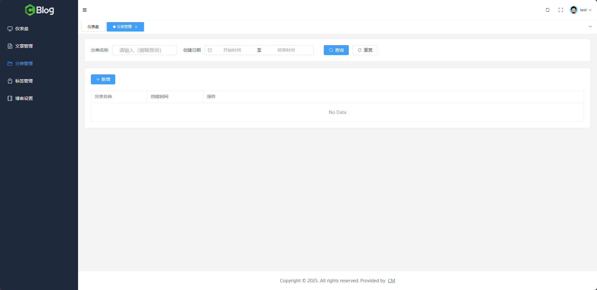

# 分类管理模块

## 一、需求分析

### 1.1、查询

- 前端查询类别数据渲染表格（可模糊查询类别名称）
- 后端分页查询类别接口

### 1.2、新增

- 前端新增分类表单模态框
- 后端新增分类接口

### 1.3、删除

- 前端删除确认框及操作
- 后端删除分类接口

### 1.4、所有分类的列表

- 前端发布文章要从所有分类中选择一个类别
- 后端不分页分类列表接口

## 二、前端分类管理页面样式布局

### 2.1、最终效果



页面大致可分为两个部分，上面是搜索模块可按分类名称或创建日期搜索，下面是表格模块展示查询到的数据，每个部分都分别用一个卡片组件包裹。代码如下：

### 2.2、头部

```vue
<script setup>
import { Search, RefreshRight } from "@element-plus/icons-vue"
</script>

<template>
  <div>
    <!-- 表头分页查询条件， shadow="never" 指定 card 卡片组件没有阴影 -->
    <el-card shadow="never" class="mb-5">
      <!-- flex 布局，内容垂直居中 -->
      <div class="flex items-center">
        <el-text>分类名称</el-text>
        <div class="ml-3 w-52 mr-5"><el-input placeholder="请输入（模糊查询）" /></div>

        <el-text>创建日期</el-text>
        <div class="ml-3 w-30 mr-5">
          <!-- 日期选择组件（区间选择） -->
          <el-date-picker type="daterange" range-separator="至" start-placeholder="开始时间" end-placeholder="结束时间" size="default" />
        </div>

        <el-button type="primary" class="ml-3" :icon="Search">查询</el-button>
        <el-button class="ml-3" :icon="RefreshRight">重置</el-button>
      </div>
    </el-card>
  </div>
</template>
```

### 2.3、表格部分

```html
<el-card shadow="never">
  <!-- 新增按钮 -->
  <div class="mb-5">
    <el-button type="primary">
      <el-icon class="mr-1">
        <Plus />
      </el-icon>
      新增</el-button>
  </div>

  <!-- 分页列表 -->
  <el-table :data="[]" border stripe style="width: 100%">
    <el-table-column prop="name" label="分类名称" width="180" />
    <el-table-column prop="createTime" label="创建时间" width="180" />
    <el-table-column label="操作" >
      <template #default="scope">
        <el-button type="danger" size="small">
          <el-icon class="mr-1">
            <Delete />
          </el-icon>
          删除
        </el-button>
      </template>
    </el-table-column>
  </el-table>

  <div class="mt-10 flex justify-center">
    <el-pagination
      layout="total, sizes, prev, pager, next, jumper"
      :page-sizes="[10, 20, 50]"
      :small="false"
      :background="true"
      :total="50" />
  </div>
</el-card>
```

## 三、新增分类功能开发

### 3.1、新增分类接口开发

#### 3.0、目标

向服务器`/admin/category/add`发送请求，入参如下：

```json
{
  "name": "要新增的分类名称"
}
```

名称填写不规范时返回如下：

```json
{
  "success": false,
  "message": "分类名称字数限制在 1 ~ 10 之间，当前值：输入的分类名称值",
  "code": "10001",
  "data": null
}
```

添加成功的情况：

```json
{
  "success": true,
  "message": null,
  "code": null,
  "data": null
}
```

#### 3.1.1、建表

```sql
CREATE TABLE `t_category` (
  `id` bigint(20) unsigned NOT NULL AUTO_INCREMENT COMMENT '分类id',
  `name` varchar(60) NOT NULL DEFAULT '' COMMENT '分类名称',
  `create_time` datetime NOT NULL DEFAULT CURRENT_TIMESTAMP COMMENT '创建时间',
  `update_time` datetime NOT NULL DEFAULT CURRENT_TIMESTAMP COMMENT '最后一次更新时间',
  `is_deleted` tinyint(2) NOT NULL DEFAULT '0' COMMENT '逻辑删除标志位：0：未删除 1：已删除',
  PRIMARY KEY (`id`) USING BTREE,
  UNIQUE KEY `uk_name` (`name`) USING BTREE,
  KEY `idx_create_time` (`create_time`) USING BTREE
) ENGINE=InnoDB DEFAULT CHARSET=utf8mb4 ROW_FORMAT=DYNAMIC COMMENT='文章分类表';
```

#### 3.1.2、创建对应的 DO 类

在`weblog-module-common`模块中的`/domain/dos`包下，创建`CategoryDO`实体类，字段与表中字段一一对应：

```java
```

#### 3.1.3、创建对应的 mapper

在`/domain/mapper`包下，创建`CategoryMapper`接口，新建根据名称查询类别的默认方法`selectByName`：

```java
```

#### 3.1.4、创建入参实体类

在 weblog-module-admin 的 pom.xml 文件中添加如下依赖：

```xml
<dependency>
		<groupId>org.hibernate.validator</groupId>
		<artifactId>hibernate-validator</artifactId>
</dependency>
```

编辑`weblog-module-admin`子模块，在`vo`包下，新增`category`包，后续所有和分类相关的`VO`实体类均放在此包下，然后创建`AddCategoryReqVO`入参实体类，代码如下：

```java
```