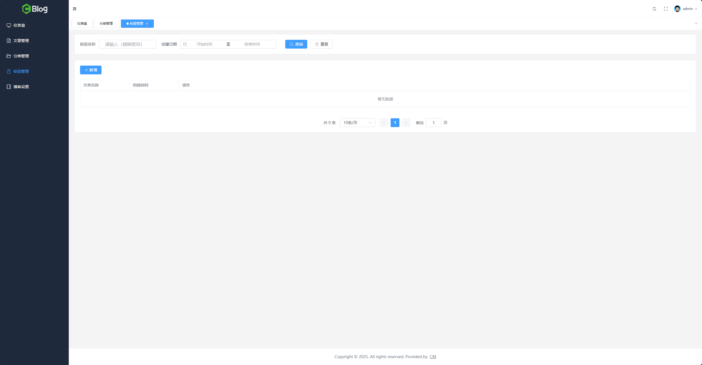
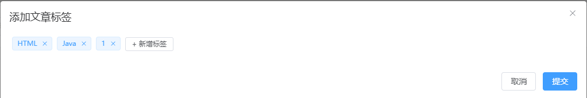

# 标签管理模块

## 一、需求分析

### 1.1、新增

- 前端新增标签表单模态框
- 后端新增标签接口

### 1.2、查询

- 前端查询类别数据渲染表格（可模糊查询类别名称）
- 后端分页查询标签接口

### 1.3、删除

- 前端删除确认框及操作
- 后端删除标签接口

### 1.4、所有标签的列表

- 前端发布文章要从所有标签中选择一个标签
- 后端不分页标签列表接口

## 二、前端标签管理页面样式布局

### 2.1、最终效果



### 2.2、前端布局

从效果中可以看出，标签管理与分类管理在样式布局上一模一样，所以可以沿用前面分类管理的代码，直接复制，修改变量名称，暂时注释请求与发送请求的代码，等接口完成后再完善细节，`TagList.vue`最终内容如下：

```vue
<script setup>
import { Search, RefreshRight } from "@element-plus/icons-vue"
import {
  ref,
  reactive
} from "vue"
// import { addTag, getTagPageList, deleteTag } from "@/api/admin/tag"
import { showMessage } from "@/utils/message"
import { showModel } from "@/utils/model"

import FormDialog from "@/components/FormDialog.vue"
import moment from "moment"

const form = reactive({
  name: ""
})

const formDialogRef = ref(null)
const formRef = ref(null)

function openDialog() {
  formDialogRef.value.open()
}

const rules = {
  name: [
    {
      required: true,
      message: "标签名称不能为空",
      trigger: "blur"
    },
    {
      min: 1,
      max: 10,
      message: "标签名称字数要求大于 1 个字符，小于 10 个字符",
      trigger: "blur"
    }
  ]
}

function onSubmit() {
  formRef.value.validate(async (valid) => {
    if (valid) {
      formDialogRef.value.switchLoading()
      try {
        const { success, message } = await addTag(form)
        if (success) {
          showMessage("添加成功")
          formDialogRef.value.close()
          form.name = ""

          // 渲染表格数据
          await getTableData()
        } else {
          showMessage(message, "error")
        }
      } catch(e) {
        console.log(e)
      } finally {
        formDialogRef.value.switchLoading()
      }
    }
  })
}

const shortcuts = [
  {
    text: "最近一周",
    value: () => {
      const end = new Date()
      const start = new Date()
      start.setTime(start.getTime() - 3600 * 1000 * 24 * 7)
      return [start, end]
    },
  },
  {
    text: '最近一个月',
    value: () => {
      const end = new Date()
      const start = new Date()
      start.setTime(start.getTime() - 3600 * 1000 * 24 * 30)
      return [start, end]
    },
  },
  {
    text: '最近三个月',
    value: () => {
      const end = new Date()
      const start = new Date()
      start.setTime(start.getTime() - 3600 * 1000 * 24 * 90)
      return [start, end]
    },
  }
]

const pickedDate = ref(null)
const searchTagName = ref("")
const current = ref(1)
const total = ref(0)
const size = ref(10)
const tableData = ref([])
const isTableLoading = ref(false)

async function getTableData(p = current.value) {
  current.value = p
  isTableLoading.value = true
  try {
    // let startDate = ""
    // let endDate = ""
    // if (pickedDate.value) {
    //   startDate = moment(pickedDate.value[0]).format("YYYY-MM-DD HH:mm:ss")
    //   endDate = moment(pickedDate.value[1]).format("YYYY-MM-DD HH:mm:ss")
    // }
    // const { data, current: currentPage, success, size: pageSize, total: totalCount } = await getTagPageList({
    //   current: current.value,
    //   size: size.value,
    //   name: searchTagName.value,
    //   startDate,
    //   endDate,
    // })
    // if (success) {
    //   tableData.value = data
    //   current.value = currentPage
    //   size.value = pageSize
    //   total.value = totalCount
    // }
  } catch(e) {
    console.log(e)
  } finally {
    isTableLoading.value = false
  }
}

getTableData()

function handleSizeChange(chosenSize) {
  size.value = chosenSize
  getTableData(1)
}

function resetQueryParams() {
  searchTagName.value = ""
  pickedDate.value = null
}

function showDeleteCategoryConfirmModal(r) {
  showModel('是否确定要删除该标签？').then(async () => {
    try {
      // const { success, message } = await deleteTag(r.id)
      // if (success) {
      //   showMessage('删除成功')
      //   getTableData()
      // } else {
      //   showMessage(message, "error")
      // }
    } catch(e) {
      console.log(e)
    }
  }).catch(() => {
    console.log('取消了')
  })
}
</script>

<template>
  <div>
    <!-- 表头分页查询条件， shadow="never" 指定 card 卡片组件没有阴影 -->
    <el-card shadow="never" class="mb-5">
      <!-- flex 布局，内容垂直居中 -->
      <div class="flex items-center">
        <el-text>标签名称</el-text>
        <div class="ml-3 w-52 mr-5"><el-input placeholder="请输入（模糊查询）" v-model="searchTagName" /></div>

        <el-text>创建日期</el-text>
        <div class="ml-3 w-30 mr-5">
          <!-- 日期选择组件（区间选择） -->
          <el-date-picker :shortcuts="shortcuts" v-model="pickedDate" type="daterange" range-separator="至" start-placeholder="开始时间" end-placeholder="结束时间" size="default" />
        </div>

        <el-button type="primary" class="ml-3" :icon="Search" @click="getTableData(1)">查询</el-button>
        <el-button class="ml-3" :icon="RefreshRight" @click="resetQueryParams">重置</el-button>
      </div>
    </el-card>

    <el-card shadow="never">
      <!-- 新增按钮 -->
      <div class="mb-5">
        <el-button type="primary" @click="openDialog">
          <el-icon class="mr-1">
            <Plus />
          </el-icon>
          新增
        </el-button>
      </div>

      <!-- 分页列表 -->
      <el-table v-loading="isTableLoading" :data="tableData" border stripe style="width: 100%">
        <el-table-column prop="name" label="分类名称" width="180" />
        <el-table-column prop="createTime" label="创建时间" width="180" />
        <el-table-column label="操作" >
          <template #default="scope">
            <el-button type="danger" size="small" @click="showDeleteCategoryConfirmModal(scope.row)">
              <el-icon class="mr-1">
                <Delete />
              </el-icon>
              删除
            </el-button>
          </template>
        </el-table-column>
      </el-table>

      <div class="mt-10 flex justify-center">
        <el-pagination
            layout="total, sizes, prev, pager, next, jumper"
            :page-sizes="[10, 20, 50]"
            :small="false"
            :background="true"
            :total="total"
            v-model:current-page="current"
            v-model:page-size="size"
            @size-change="handleSizeChange"
            @current-change="getTableData"
        />
      </div>

    </el-card>

    <FormDialog ref="formDialogRef" title="添加文章标签" width="40%" @submit="onSubmit">
      <el-form ref="formRef" :rules="rules" :model="form">
        <el-form-item label="标签名称" prop="name" label-width="80px" class="align-middle">
          <!-- 输入框组件 -->
          <el-input size="large" v-model="form.name" placeholder="请输入标签名称" maxlength="10" show-word-limit clearable/>
        </el-form-item>
      </el-form>
    </FormDialog>
  </div>
</template>
```

## 三、新增标签功能开发

### 3.1、新增标签接口开发

#### 3.1.0、目标

- 请求地址：`/admin/tag/add`

- 请求方法：`POST`

- 入参：

  ```json
  {
      "name": ["名称1", "名称2", ...]
  }
  ```

- 名称填写不规范时返回如下：

  ```json
  {
    "success": false,
    "message": "标签名称字数限制在 1 ~ 10 之间，当前值：输入的标签名称值",
    "code": "10001",
    "data": null
  }
  ```

- 添加成功的情况：

  ```json
  {
    "success": true,
    "message": null,
    "code": null,
    "data": null
  }
  ```

#### 3.1.1、建表

> 与分类表相近，可以通过修改分类表的建表语句来创建标签表

```sql
CREATE TABLE `t_tag` (
  `id` bigint(20) unsigned NOT NULL AUTO_INCREMENT COMMENT '标签id',
  `name` varchar(60) NOT NULL DEFAULT '' COMMENT '标签i名称',
  `create_time` datetime NOT NULL DEFAULT CURRENT_TIMESTAMP COMMENT '创建时间',
  `update_time` datetime NOT NULL DEFAULT CURRENT_TIMESTAMP COMMENT '最后一次更新时间',
  `is_deleted` tinyint(2) NOT NULL DEFAULT '0' COMMENT '逻辑删除标志位：0：未删除 1：已删除',
  PRIMARY KEY (`id`) USING BTREE,
  UNIQUE KEY `uk_name` (`name`) USING BTREE,
  KEY `idx_create_time` (`create_time`) USING BTREE
) ENGINE=InnoDB DEFAULT CHARSET=utf8mb4 ROW_FORMAT=DYNAMIC COMMENT='文章标签表';
```

#### 3.1.2、创建对应的 DO 类

在`weblog-module-common`模块中的`/domain/dos`包下，创建`TagDO`实体类，字段与表中字段一一对应：

```java
package com.cm.weblog.common.domain.dos;

import com.baomidou.mybatisplus.annotation.IdType;
import com.baomidou.mybatisplus.annotation.TableId;
import com.baomidou.mybatisplus.annotation.TableName;
import lombok.AllArgsConstructor;
import lombok.Builder;
import lombok.Data;
import lombok.NoArgsConstructor;

import java.time.LocalDateTime;

@Data
@AllArgsConstructor
@NoArgsConstructor
@Builder
@TableName("t_tag")
public class TagDO {
    @TableId(type = IdType.AUTO)
    private Long id;

    private String name;

    private LocalDateTime createTime;

    private LocalDateTime updateTime;

    private Boolean isDeleted;
}
```

#### 3.1.3、创建对应的 mapper

在`/domain/mapper`包下，创建`TagMapper`接口，新建根据名称查询类别的默认方法`selectByName`：

```java
package com.cm.weblog.common.domain.mapper;

import com.baomidou.mybatisplus.core.mapper.BaseMapper;
import com.cm.weblog.common.domain.dos.TagDO;

public interface TagMapper extends BaseMapper<TagDO> {
}

```

#### 3.1.4、创建入参实体类

编辑`weblog-module-admin`子模块，在`vo`包下，新增`tag`包，后续所有和标签相关的`VO`实体类均放在此包下，然后创建`AddTagReqVO`入参实体类，代码如下：

```java
package com.cm.weblog.admin.model.vo.tag;

import io.swagger.annotations.ApiModel;
import lombok.AllArgsConstructor;
import lombok.Builder;
import lombok.Data;
import lombok.NoArgsConstructor;

import javax.validation.constraints.NotEmpty;
import java.util.List;

/**
 * 添加标签入参实体类
 */
@Data
@AllArgsConstructor
@NoArgsConstructor
@Builder
@ApiModel(value = "新增标签入参实体类")
public class AddTagReqVO {
    @NotEmpty(message = "标签名称集合不能为空")
    private List<String> tags;
}

```

#### 3.1.5、添加对应的服务接口及其实现类

在`service`包下创建`AdminTagService`接口，统一规划分类服务的功能，在该接口中添加新增分类的方法`addTag`：

```java
package com.cm.weblog.admin.service;

import com.cm.weblog.admin.model.vo.tag.AddTagReqVO;
import com.cm.weblog.common.utils.Response;

/**
 * 标签服务
 */
public interface AdminTagService {
    /**
     * 新增标签
     * @param addTagReqVO 标签名称集合
     * @return 请求响应
     */
    Response<?> addTags(AddTagReqVO addTagReqVO);
}

```

然后在`impl`包下创建对应的实现类`AdminTagServiceImpl`，实现刚才添加的方法：

```java
package com.cm.weblog.admin.service.impl;

import com.baomidou.mybatisplus.extension.service.impl.ServiceImpl;
import com.cm.weblog.admin.model.vo.tag.AddTagReqVO;
import com.cm.weblog.admin.service.AdminTagService;
import com.cm.weblog.common.domain.dos.TagDO;
import com.cm.weblog.common.domain.mapper.TagMapper;
import com.cm.weblog.common.utils.Response;
import lombok.extern.slf4j.Slf4j;
import org.springframework.stereotype.Service;
import org.springframework.transaction.annotation.Transactional;

import javax.annotation.Resource;
import java.time.LocalDateTime;
import java.util.List;
import java.util.stream.Collectors;

/**
 * 标签服务实现类
 */
@Service
@Slf4j
public class AdminTagServiceImpl extends ServiceImpl<TagMapper, TagDO> implements AdminTagService {
    @Resource
    private TagMapper tagMapper;

    @Override
    @Transactional
    public Response<?> addTags(AddTagReqVO addTagReqVO) {
        // 1、VO 转 DO
        List<TagDO> tagDOs = addTagReqVO.getTags()
                .stream().map(tagName -> TagDO.builder()
                        .name(tagName.trim())
                        .createTime(LocalDateTime.now())
                        .updateTime(LocalDateTime.now())
                        .build())
                .collect(Collectors.toList());

        // 2、批量插入数据
        try {
            saveBatch(tagDOs);
        } catch (Exception e) {
            log.warn("该标签已存在", e);
        }

        return Response.success();
    }
}

```

> `AdminTagServiceImpl`继承`ServiceImpl`类以使用`MybatisPlus`中封装的批量插入

#### 3.1.6、控制层中添加接口

在`controller`包下创建`AdminTagController`分类控制器，添加目标中的`/admin/tag/add`接口：

```java
package com.cm.weblog.admin.controller;

import com.cm.weblog.admin.model.vo.tag.AddTagReqVO;
import com.cm.weblog.admin.service.AdminTagService;
import com.cm.weblog.common.aspect.ApiOperationLog;
import com.cm.weblog.common.utils.Response;
import io.swagger.annotations.Api;
import io.swagger.annotations.ApiOperation;
import org.springframework.security.access.prepost.PreAuthorize;
import org.springframework.validation.annotation.Validated;
import org.springframework.web.bind.annotation.PostMapping;
import org.springframework.web.bind.annotation.RequestBody;
import org.springframework.web.bind.annotation.RequestMapping;
import org.springframework.web.bind.annotation.RestController;

import javax.annotation.Resource;

@RestController
@RequestMapping("/admin")
@Api(tags = "Admin 标签模块")
public class AdminTagController {
    @Resource
    private AdminTagService adminTagService;

    @PostMapping("/tag/add")
    @ApiOperation(value = "添加标签")
    @ApiOperationLog(description = "添加标签")
    @PreAuthorize("hasRole('ROLE_ADMIN')")
    public Response<?> addTag(@RequestBody @Validated AddTagReqVO addTagReqVO) {
        return adminTagService.addTags(addTagReqVO);
    }
}

```

#### 3.1.7、测试

入参：

```json
{
    "tags": [
        "dolore eu",
        "veniam fugiat in laboris Excepteur"
    ]
}
```

响应：

```json
{
    "success": true,
    "message": null,
    "code": null,
    "data": null
}
```

数据库中也成功插入数据，测试成功！

### 3.2、新增标签前端开发

#### 3.2.1、在标签页替换自定义模态框组件插槽

目标效果如下：



在`TagList.vue`文件中修改`FormDialog`组件的插槽内容，插槽替换为如下内容：

```vue
<el-form>
	<el-form-item class="align-middle">
		<el-tag class="mx-1" clo<el-form>
        <el-form-item class="align-middle">
          <el-tag class="mx-1" closable :disable-transitions="false">
            标签1
          </el-tag>
          <span class="w-20">
            <el-input class="ml-1 w-20" size="small" />
            <el-button class="button-new-tag ml-1" size="small">
              + 新增标签
            </el-button>
          </span>
        </el-form-item>
      </el-form>sable :disable-transitions="false">
			标签1
		</el-tag>
		<el-input class="ml-1 w-20" size="small" />
		<el-button class="button-new-tag ml-1" size="small">
			+ 新增标签
		</el-button>
	</el-form-item>
</el-form>
```

在`script`中绑定相关变量与方法完善业务：

- 去除标签名称校验
- 点击新增标签按钮时输入框显示，按钮隐藏
- 输入框回车时添加标签
- 点击提交时发送请求

最终`script`中代码如下：

```js
import { Search, RefreshRight } from "@element-plus/icons-vue"
import {
  ref,
  reactive
} from "vue"
// import { addTag, getTagPageList, deleteTag } from "@/api/admin/tag"
import { showMessage } from "@/utils/message"
import { showModel } from "@/utils/model"
import { nanoid } from "nanoid"

import FormDialog from "@/components/FormDialog.vue"
import moment from "moment"

const form = reactive({
  name: ""
})

const formDialogRef = ref(null)

const inputtedTags = ref([])

function openDialog() {
  formDialogRef.value.open()
}

function onSubmit() {
  if (inputtedTags.value.length === 0) {
    formDialogRef.value.close()
  } else {
    formDialogRef.value.switchLoading()
    const tags = inputtedTags.value.map(i => i.name)
    console.log(tags)
    try {
      // 发送请求，暂未封装
      formDialogRef.value.switchLoading()
      formDialogRef.value.close()
    } catch(e) {
      console.log(e)
      formDialogRef.value.switchLoading()
    }
  }
}

const shortcuts = [
  {
    text: "最近一周",
    value: () => {
      const end = new Date()
      const start = new Date()
      start.setTime(start.getTime() - 3600 * 1000 * 24 * 7)
      return [start, end]
    },
  },
  {
    text: '最近一个月',
    value: () => {
      const end = new Date()
      const start = new Date()
      start.setTime(start.getTime() - 3600 * 1000 * 24 * 30)
      return [start, end]
    },
  },
  {
    text: '最近三个月',
    value: () => {
      const end = new Date()
      const start = new Date()
      start.setTime(start.getTime() - 3600 * 1000 * 24 * 90)
      return [start, end]
    },
  }
]

const pickedDate = ref(null)
const searchTagName = ref("")
const current = ref(1)
const total = ref(0)
const size = ref(10)
const tableData = ref([])
const isTableLoading = ref(false)

const isInputShow = ref(false)

async function getTableData(p = current.value) {
  current.value = p
  isTableLoading.value = true
  try {
    // let startDate = ""
    // let endDate = ""
    // if (pickedDate.value) {
    //   startDate = moment(pickedDate.value[0]).format("YYYY-MM-DD HH:mm:ss")
    //   endDate = moment(pickedDate.value[1]).format("YYYY-MM-DD HH:mm:ss")
    // }
    // const { data, current: currentPage, success, size: pageSize, total: totalCount } = await getTagPageList({
    //   current: current.value,
    //   size: size.value,
    //   name: searchTagName.value,
    //   startDate,
    //   endDate,
    // })
    // if (success) {
    //   tableData.value = data
    //   current.value = currentPage
    //   size.value = pageSize
    //   total.value = totalCount
    // }
  } catch(e) {
    console.log(e)
  } finally {
    isTableLoading.value = false
  }
}

getTableData()

function handleSizeChange(chosenSize) {
  size.value = chosenSize
  getTableData(1)
}

function resetQueryParams() {
  searchTagName.value = ""
  pickedDate.value = null
}

function showDeleteCategoryConfirmModal(r) {
  showModel('是否确定要删除该标签？').then(async () => {
    try {
      // const { success, message } = await deleteTag(r.id)
      // if (success) {
      //   showMessage('删除成功')
      //   getTableData()
      // } else {
      //   showMessage(message, "error")
      // }
    } catch(e) {
      console.log(e)
    }
  }).catch(() => {
    console.log('取消了')
  })
}

function addTag() {
  const value = form.name.trim()
  if (value) {
    inputtedTags.value.push({
      id: nanoid(),
      name: value
    })
  }
  isInputShow.value = false

  form.name = ""
}

function removeTag(i) {
  inputtedTags.value.splice(i, 1)
}
```

在模板中绑定变量如下：

```vue
<el-form>
	<el-form-item class="align-middle">
		<el-tag v-for="(t, i) in inputtedTags" :key="t.id" class="mx-1" closable :disable-transitions="false" @close="removeTag(i)">
			{{ t.name }}
		</el-tag>
		<span class="w-20">
			<el-input v-if="isInputShow" class="ml-1 w-20" size="small" v-model="form.name" @keyup.enter="addTag" />
			<el-button v-else class="button-new-tag ml-1" size="small" @click="isInputShow = true">
				+ 新增标签
			</el-button>
		</span>
	</el-form-item>
</el-form>
```

#### 3.2.2、封装请求

创建api/admin/tag.js`文件，在其中中添加新增标签的请求：

```js
import axios from "@/utils/axios.js"

/**
 * 新增标签请求
 * @param data 标签名称数组
 * @returns {Promise<axios.AxiosResponse<any>>}
 */
export function addTags(data) {
    return axios.post("/admin/tag/add", data)
}
```

#### 3.2.3、在表单提交事件中发送请求

最终`onSubmit`函数的内容如下：

```js
async function onSubmit() {
  if (inputtedTags.value.length === 0) {
    formDialogRef.value.close()
  } else {
    formDialogRef.value.switchLoading()
    const tags = inputtedTags.value.map(i => i.name)
    try {
      const { success, message } = await addTags({ tags })
      if (success) {
        showMessage("添加成功")
        formDialogRef.value.close()
        form.name = ""
        // 渲染表格数据，暂未封装
      } else {
        showMessage(message, "error")
      }
      formDialogRef.value.switchLoading()
      formDialogRef.value.close()
      inputtedTags.value = []
    } catch(e) {
      console.log(e)
      formDialogRef.value.switchLoading()
    }
  }
}
```

## 四、分页查询功能开发

### 4.1、接口开发

#### 4.1.1、设计接口模型

- 请求地址：`/admin/tag/list`

- 请求方法：`POST`

- 请求入参：

  ```json
  {
      "current": 1, // 页码
      "size": 10, // 每页的数据量
      "name": "", // 要模糊查询的标签名称
      "startDate": "xxxx-xx-xx" // 要搜索的创建时间起始值
      "endDate": "xxxx-xx-xx" // 要搜索的创建时间截止值
  }
  ```

- 请求响应：

  ```json
  {
      "success": true,
      "message": null,
      "code": null,
      "data": [
          {
              "id": 1, // ID
              "name": "标签名称",
              "createTime": "xxxx-xx-xx xx:xx:xx"
          }
      ]
  }
  ```

#### 4.1.2、模型转化出入参 VO

**入参`VO`：**

在`/model/vo/tag`包下新建入参实体类`FindTagPageListReqVO`，根据入参模型完善此类：

```java
package com.cm.weblog.admin.model.vo.tag;

import com.cm.weblog.common.model.BasePageQuery;
import com.fasterxml.jackson.annotation.JsonFormat;
import io.swagger.annotations.ApiModel;
import lombok.*;

import java.time.LocalDateTime;

@EqualsAndHashCode(callSuper = true)
@Data
@AllArgsConstructor
@NoArgsConstructor
@Builder
@ApiModel("分页查询标签接口入参")
public class FindTagPageListReqVO extends BasePageQuery {
    // 名称
    private String name;

    // 起始日期
    @JsonFormat(pattern = "yyyy-MM-dd HH:mm:ss") // 注解将"yyyy-MM-dd HH:mm:ss"这种形式的时间日期字符串解析为LocalDateTime
    private LocalDateTime startDate;

    // 截止日期
    @JsonFormat(pattern = "yyyy-MM-dd HH:mm:ss") // 注解将"yyyy-MM-dd HH:mm:ss"这种形式的时间日期字符串解析为LocalDateTime
    private LocalDateTime endDate;
}

```

**响应`VO`：**

同样在`tag`包下新建响应实体类``，根据响应模型完善该类：

```java
package com.cm.weblog.admin.model.vo.tag;

import lombok.AllArgsConstructor;
import lombok.Builder;
import lombok.Data;
import lombok.NoArgsConstructor;

import java.time.LocalDateTime;

/**
 * 分页查询标签接口响应实体类
 */
@Data
@AllArgsConstructor
@NoArgsConstructor
@Builder
public class FindTagPageListRspVO {
    // 标签 ID
    private Long id;
    
    // 标签名称
    private String name;
    
    // 标签创建时间
    private LocalDateTime createTime;
}

```

#### 4.1.3、在业务层创建方法签名

在`AdminTagService`中添加将要实现的分页查询标签的方法签名：

```java
/**
 * 分页查询标签
 * @param findTagPageListReqVO 查询条件
 * @return 响应标签集合
*/
PageResponse<List<FindTagPageListRspVO>> findTagPageList(FindTagPageListReqVO findTagPageListReqVO);
```

#### 4.1.4、在控制层添加接口

在`AdminTagController`中添加分页查询的接口，调用刚刚在业务层创建的方法：

```java
@PostMapping("tag/list")
@ApiOperation("分页查询标签")
@ApiOperationLog(description = "分页查询标签")
public PageResponse<List<FindTagPageListRspVO>> findTagList(@RequestBody @Validated FindTagPageListReqVO findTagPageListReqVO) {
	return adminTagService.findTagPageList(findTagPageListReqVO);
}
```

#### 4.1.5、封装数据库相关操作

修改位于`weblog-module-common`模块中的`TagMapper`，添加根据分页查询条件搜索数据的默认方法：

```java
package com.cm.weblog.common.domain.mapper;

import com.baomidou.mybatisplus.core.conditions.query.LambdaQueryWrapper;
import com.baomidou.mybatisplus.core.mapper.BaseMapper;
import com.baomidou.mybatisplus.extension.plugins.pagination.Page;
import com.cm.weblog.common.domain.dos.TagDO;

import java.time.LocalDateTime;
import java.util.Objects;

public interface TagMapper extends BaseMapper<TagDO> {
    /**
     * 分页查询标签接口数据库查询
     * @param current 页码
     * @param size 每页数据量
     * @param name 标签名称
     * @param startDate 起始时间
     * @param endDate 截止时间
     * @return 标签信息
     */
    default Page<TagDO> selectPageList(long current, long size, String name, LocalDateTime startDate, LocalDateTime endDate) {
        // 1、构造分页器
        Page<TagDO> page = new Page<>(current, size);
        
        // 2、构建查询条件
        LambdaQueryWrapper<TagDO> wrapper = new LambdaQueryWrapper<>();
        wrapper
                // 第一个字段用于当前端并不需要查询标签名称时略过这个条件
                .like(Objects.nonNull(name), TagDO::getName, name)
                .ge(Objects.nonNull(startDate), TagDO::getCreateTime, startDate)
                .le(Objects.nonNull(endDate), TagDO::getCreateTime, endDate)
                .orderByDesc(TagDO::getCreateTime);
        
        // 3、执行数据库操作
        return selectPage(page, wrapper);
    }
}

```

#### 4.1.6、业务层实现刚创建的方法签名

在`impl`包下的`AdminTagServiceImpl`类中实现`findTagList`方法：

```java
 @Override
public PageResponse<List<FindTagPageListRspVO>> findTagPageList(FindTagPageListReqVO findTagPageListReqVO) {
	// 1、获取分页查询条件
	Long current = findTagPageListReqVO.getCurrent();
	Long size = findTagPageListReqVO.getSize();
	String name = findTagPageListReqVO.getName();
	LocalDateTime startDate = findTagPageListReqVO.getStartDate();
	LocalDateTime endDate = findTagPageListReqVO.getEndDate();
        
	// 2、执行查询操作
	Page<TagDO> page = tagMapper.selectPageList(current, size, name, startDate, endDate);
	List<TagDO> tagDOs = page.getRecords();
        
	// 3、DO 转 VO
	List<FindTagPageListRspVO> vos = Collections.emptyList();
        
	if (!CollectionUtils.isEmpty(tagDOs)) {
		vos = tagDOs.stream()
				.map(tagDO -> FindTagPageListRspVO.builder()
					.id(tagDO.getId())
					.name(tagDO.getName())
					.createTime(tagDO.getCreateTime())
					.build())
				.collect(Collectors.toList());
	}
        
	return PageResponse.success(page, vos);
}
```

#### 4.1.7、测试

重启项目，请求接口

**无查询条件**

入参：

```json
{
    "current": 2,
    "size": 10,
    "name": "",
    "startDate": "",
    "endDate": ""
}
```

响应：

```json
{
    "success": true,
    "message": null,
    "code": null,
    "data": [
        {
            "id": 3,
            "name": "voluptate Lorem sint culpa",
            "createTime": "2025-11-06 22:16:20"
        }
    ],
    "total": 11,
    "size": 10,
    "current": 2,
    "pages": 2
}
```

**带查询条件**

入参：

```json
{
    "current": 1,
    "size": 10,
    "name": "t",
    "startDate": "2025-11-06 00:00:00",
    "endDate": "2025-11-07 23:59:59"
}
```

响应：

```json
{
    "success": true,
    "message": null,
    "code": null,
    "data": [
        {
            "id": 5,
            "name": "veniam fugiat in laboris Excepteur",
            "createTime": "2025-11-06 22:16:57"
        },
        {
            "id": 3,
            "name": "voluptate Lorem sint culpa",
            "createTime": "2025-11-06 22:16:20"
        },
        {
            "id": 2,
            "name": "id fugiat deserunt tempor cupidatat",
            "createTime": "2025-11-06 22:16:20"
        }
    ],
    "total": 3,
    "size": 10,
    "current": 1,
    "pages": 1
}
```

**未查询到数据**

入参：

```json
{
    "current": 3,
    "size": 10,
    "name": "",
    "startDate": "",
    "endDate": ""
}
```

响应：

```json
{
    "success": true,
    "message": null,
    "code": null,
    "data": [],
    "total": 11,
    "size": 10,
    "current": 3,
    "pages": 2
}
```

