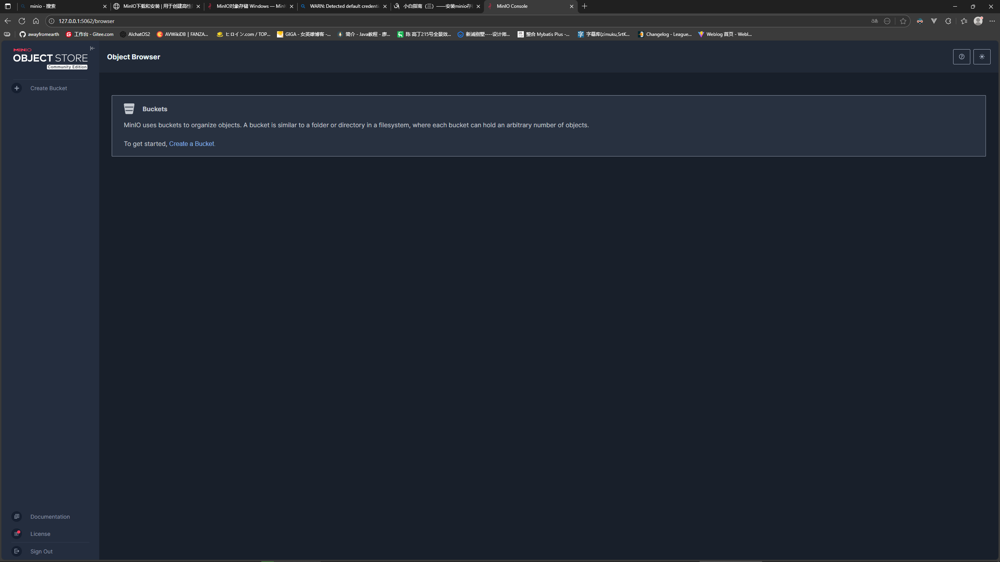
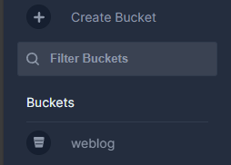
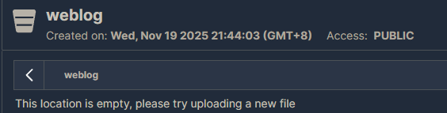
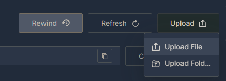
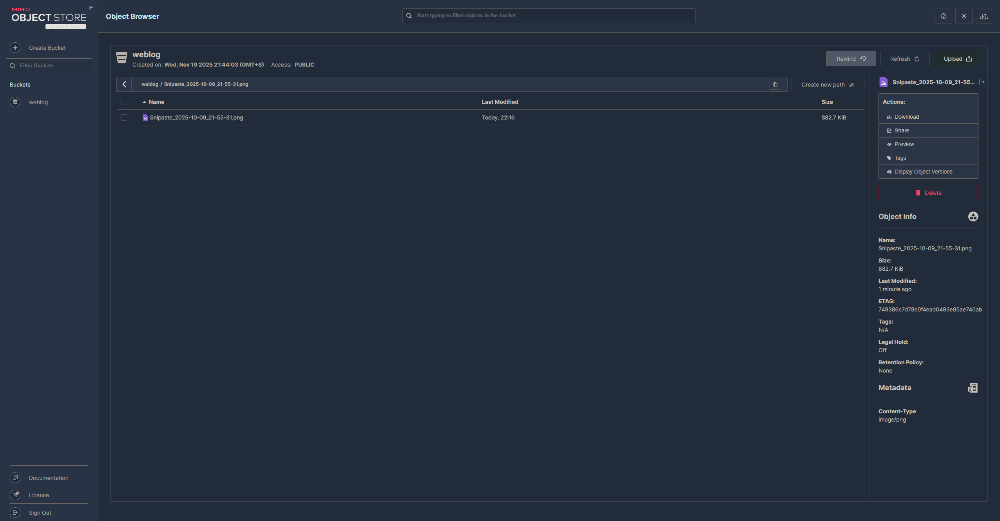
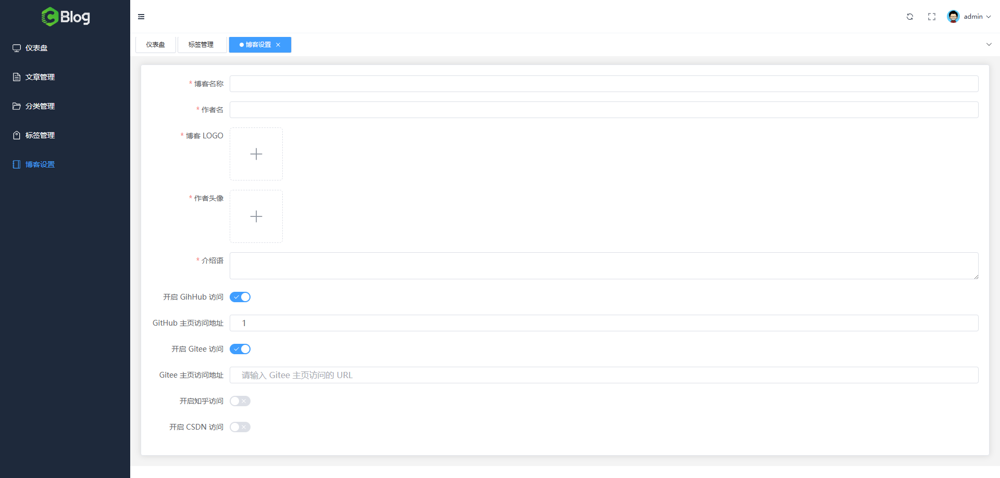
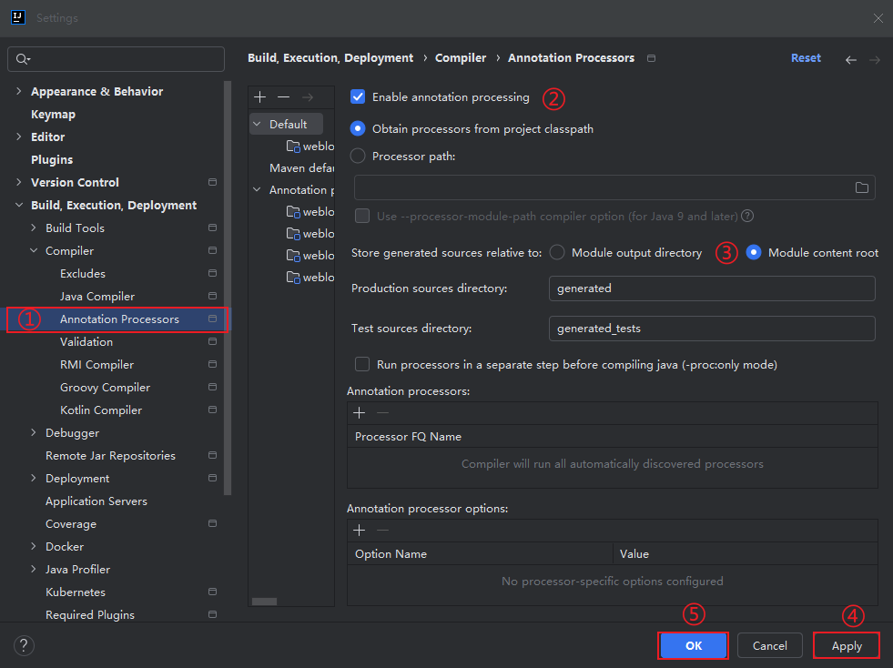
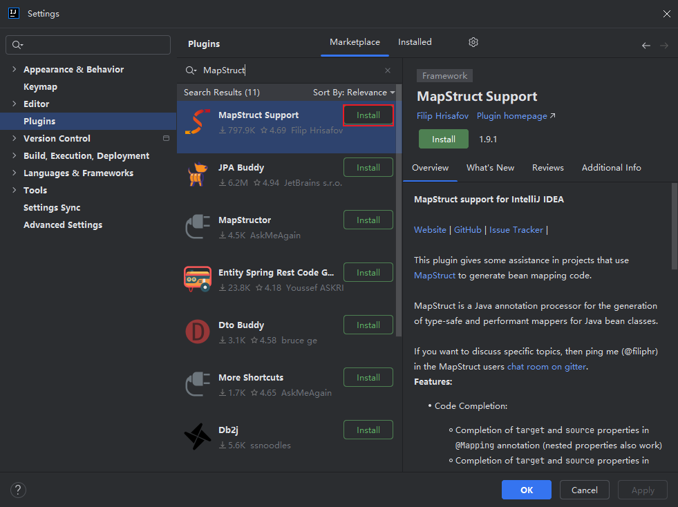

# 博客设置模块

## 一、前置准备

### 1.1、数据库操作

#### 1.1.1、建表

```sql
CREATE TABLE `t_blog_settings` (
  `id` bigint(20) unsigned NOT NULL AUTO_INCREMENT COMMENT 'id',
  `logo` varchar(120) NOT NULL DEFAULT '' COMMENT '博客Logo',
  `name` varchar(60) NOT NULL DEFAULT '' COMMENT '博客名称',
  `author` varchar(20) NOT NULL DEFAULT '' COMMENT '作者名',
  `introduction` varchar(120) NOT NULL DEFAULT '' COMMENT '介绍语',
  `avatar` varchar(120) NOT NULL DEFAULT '' COMMENT '作者头像',
  `github_homepage` varchar(60) NOT NULL DEFAULT '' COMMENT 'GitHub 主页访问地址',
	`csdn_homepage` varchar(60) NOT NULL DEFAULT '' COMMENT 'CSDN 主页访问地址',
  `gitee_homepage` varchar(60) NOT NULL DEFAULT '' COMMENT 'Gitee 主页访问地址',
  `zhihu_homepage` varchar(60) NOT NULL DEFAULT '' COMMENT '知乎主页访问地址',
  PRIMARY KEY (`id`) USING BTREE
) ENGINE=InnoDB DEFAULT CHARSET=utf8mb4 ROW_FORMAT=DYNAMIC COMMENT='博客设置表';
```

#### 1.1.2、插入一条写死的数据

```sql
INSERT INTO `t_blog_settings` VALUES(1, 'https://img.quanxiaoha.com/quanxiaoha/f97361c0429d4bb1bc276ab835843065.jpg', 'CM 的博客', 'CM', '平安喜乐', 'https://img.quanxiaoha.com/quanxiaoha/f97361c0429d4bb1bc276ab835843065.jpg', '', '', '', '');
```

### 1.2、MINIO 安装及配置

#### 1.2.1、安装

下载地址：https://dl.minio.org.cn/server/minio/release/windows-amd64/minio.exe

文档地址：https://www.minio.org.cn/docs/minio/windows/index.html

本地安装目录：D:\application\Back-end Development\MINIO

#### 1.2.2、访问 MINIO 控制台

在安装目录先创建`data`目录用于存放数据，运行时指定这个目录：

```shell
minio.exe server D:\application\Back-end Development\MINIO\data
```

打开`http://127.0.0.1:9000`访问控制台

默认用户名：minioadmin；默认密码：minioadmin



### 1.3、测试图片上传

#### 1.3.1、新建一个 Bucket

点击`Create a Bucket`按钮新建一个桶用于存储图片，指定`Bucket Name`为`weblog`，点击`Create Bucket`按钮

刷新`Buckets`列表，查看创建是否成功



#### 1.3.2、修改权限

安装mc，下载地址：https://dl.minio.org.cn/client/mc/release/windows-amd64/mc.exe，将其转移到`minio.exe`同一目录下，连接minio控制台并指定别名：

```shell
mc.exe alias set myminio http://127.0.0.1:9000
```

设置`weblog`桶的权限为`public`：

```shell
mc anonymous set public myminio/weblog
```



#### 1.3.3、上传图片



点击`Upload File`，选择要上传的图片，成功后显示如下：



访问http://127.0.0.1:9000/weblog/Snipaste_2025-10-09_21-55-31.png，图片可以正常显示，上传成功

## 二、需求分析

### 2.1、前端页面分析

目标效果如下：



整体由卡片容器包裹，内含表单内容

表单可分为两个内容，从上往下依次为作者信息（包含图片上传组件），第三方链接跳转信息

### 2.2、接口分析

根据需求分析，该功能共需三个接口：

- 获取博客设置详情接口
- 图片上传接口
- 更新博客设置接口

## 三、前端静态页面搭建

### 3.1、卡片布局

编辑 `/pages/admin/BlogSetting.vue` 博客设置页，首先添加一个 `<el-card>` 卡片组件，用来包裹住里面的表单元素，代码如下：

```vue
<template>
  <el-card></el-card>
</template>
```

### 3.2、添加表单

向卡片组件中填充表单内容：

```vue
<script setup>
import { reactive, ref, onMounted } from "vue"
import { Check, Close } from "@element-plus/icons-vue"
import { getBlogSettingDetail } from "@/api/admin/blogSetting"

const formRef = ref()
const form = reactive({
  name: "",
  author: "",
  logo: "",
  avatar: "",
  introduction: "",
  githubHomePage: "",
  giteeHomepage: "",
  zhihuHomepage: "",
  csdnHomepage: "",
})
const rules = {
  name: [
    {
      required: true,
      message: "请输入博客名称",
      trigger: "blur"
    }
  ],
  author: [
    {
      required: true,
      message: "请输入作则名称",
      trigger: "blur"
    }
  ],
  logo: [
    {
      required: true,
      message: "请上传博客 LOGO",
      trigger: "blur"
    }
  ],
  avatar: [
    {
      required: true,
      message: "请上传作者头像",
      trigger: "blur"
    }
  ],
  introduction: [
    {
      required: true,
      message: "请输入介绍语",
      trigger: "blur"
    }
  ]
}
const isGithubChecked = ref(false)
const isGiteeChecked = ref(false)
const isZhihuChecked = ref(false)
const isCSDNChecked = ref(false)

onMounted(getBlogSettingInfo)

async function getBlogSettingInfo() {
  try {
    const { data, success } = await getBlogSettingDetail()
    if (success) {
      form.name = data.name
      form.author = data.author
      form.introduction = data.introduction
      form.logo = data.logo
      form.avatar = data.avatar
      if (data.githubHomePage) {
        form.githubHomePage = data.githubHomePage
        isGithubChecked.value = true
      }
      if (data.giteeHomepage) {
        form.githubHomepage = data.giteeHomepage
        isGiteeChecked.value = true
      }
      if (data.zhihuHomepage) {
        form.zhihuHomepage = data.zhihuHomepage
        isZhihuChecked.value = true
      }
      if (data.csdnHomepage) {
        form.csdnHomepage = data.csdnHomepage
        isCSDNChecked.value = true
      }
    }
  } catch(e) {
    console.log(e)
  }
}
</script>

<template>
  <el-card>
    <el-form ref="formRef" :model="form" label-width="150px" :rules="rules">
      <el-form-item label="博客名称" prop="name">
        <el-input v-model="form.name" clearable />
      </el-form-item>
      <el-form-item label="作者名" prop="author">
        <el-input v-model="form.author" clearable />
      </el-form-item>
      <el-form-item label="博客 LOGO" prop="logo">
        <el-upload
          class="avatar-uploader"
          :show-file-list="false"
        >
          
          <el-icon v-else class="avatar-uploader-icon">
            <Plus />
          </el-icon>
        </el-upload>
      </el-form-item>
      <el-form-item label="作者头像" prop="avatar">
        <el-upload
            class="avatar-uploader"
            :show-file-list="false"
        >
          
          <el-icon v-else class="avatar-uploader-icon">
            <Plus />
          </el-icon>
        </el-upload>
      </el-form-item>
      <el-form-item label="介绍语" prop="introduction">
        <el-input v-model="form.introduction" type="textarea" />
      </el-form-item>
      <el-form-item label="开启 GihHub 访问">
        <el-switch v-model="isGithubChecked" inline-prompt :active-icon="Check" :inactive-icon="Close" @change="form.githubHomepage = ''" />
      </el-form-item>
      <el-form-item label="GitHub 主页访问地址" v-if="isGithubChecked">
        <el-input v-model="form.githubHomepage" clearable placeholder="请输入 GitHub 主页访问的 URL" />
      </el-form-item>
      <el-form-item label="开启 Gitee 访问">
        <el-switch v-model="isGiteeChecked" inline-prompt :active-icon="Check" :inactive-icon="Close" @change="form.giteeHomepage = ''" />
      </el-form-item>
      <el-form-item label="Gitee 主页访问地址" v-if="isGiteeChecked">
        <el-input v-model="form.giteeHomepage" clearable placeholder="请输入 Gitee 主页访问的 URL" />
      </el-form-item>
      <el-form-item label="开启知乎访问">
        <el-switch v-model="isZhihuChecked" inline-prompt :active-icon="Check" :inactive-icon="Close" @change="form.zhihuHomepage = ''" />
      </el-form-item>
      <el-form-item label="知乎主页访问地址" v-if="isZhihuChecked">
        <el-input v-model="form.zhihuHomepage" clearable placeholder="请输入知乎主页访问的 URL" />
      </el-form-item>
      <el-form-item label="开启 CSDN 访问">
        <el-switch v-model="isCSDNChecked" inline-prompt :active-icon="Check" :inactive-icon="Close" @change="form.csdnHomepage = ''" />
      </el-form-item>
      <el-form-item label="CSDN 主页访问地址" v-if="isCSDNChecked">
        <el-input v-model="form.csdnHomepage" clearable placeholder="请输入 CSDN 主页访问的 URL" />
      </el-form-item>
    </el-form>
  </el-card>
</template>

<style scoped>
.el-card {
  width: 100%;
  max-height: calc(100vh - 148px);
  overflow: auto;
}

:deep(.avatar-uploader .avatar) {
  width: 100px;
  height: 100px;
  display: block;
}

:deep(.avatar-uploader .el-upload) {
  border: 1px dashed var(--el-border-color);
  border-radius: 6px;
  cursor: pointer;
  position: relative;
  overflow: hidden;
  transition: var(--el-transition-duration-fast);
}

:deep(.avatar-uploader .el-upload:hover) {
  border-color: var(--el-color-primary);
}

:deep(.el-icon.avatar-uploader-icon) {
  font-size: 28px;
  color: #8c939d;
  width: 100px;
  height: 100px;
  text-align: center;
}

.avatar {
  width: 100px;
  height: 100px;
  display: block;
}
</style>
```

## 四、获取博客详情

### 4.1、接口开发

#### 4.1.1、接口设计

##### 4.1.1.1、定义接口模型

- 请求地址：`/admin/blog/settings/detail`

- 入参：无——数据库中仅保留一条数据，查询`ID`为`1`的数据即可

- 响应：

  ```json
  {
    "success": true,
    "message": null,
    "code": null,
    "data": {
      "logo": "https://img.quanxiaoha.com/quanxiaoha/f97361c0429d4bb1bc276ab835843065.jpg",
      "name": "犬小哈的博客test",
      "author": "小哈学Java",
      "introduction": "平安喜乐test",
      "avatar": "https://img.quanxiaoha.com/quanxiaoha/f97361c0429d4bb1bc276ab835843065.jpg",
      "githubHomepage": "",
      "csdnHomepage": "",
      "giteeHomepage": "",
      "zhihuHomepage": ""
    }
  }
  ```

##### 4.1.1.2、创建对应出入参 VO

在 `weblog-module-admin` 模块中创建 `/modle/vo/blogsettings` 包，在该包下创建名为 `FindBlogSettingsRspVO` 响应实体类，代码如下：

```java
package com.cm.weblog.admin.model.vo.blogSettings;

import lombok.AllArgsConstructor;
import lombok.Builder;
import lombok.Data;
import lombok.NoArgsConstructor;

@Data
@AllArgsConstructor
@NoArgsConstructor
@Builder
public class FindBlogSettingsRspVO {
    private String logo;

    private String name;

    private String author;

    private String introduction;

    private String avatar;

    private String githubHomepage;

    private String csdnHomepage;

    private String giteeHomepage;

    private String zhihuHomepage;
}

```

#### 4.1.2、整合MapStruct：简化属性映射

> ```java
> vos = categoryDOList.stream().map(categoryDO -> FindCategoryPageListRspVO.builder()
>                     .id(categoryDO.getId())
>                     .name(categoryDO.getName())
>                     .createTime(categoryDO.getCreateTime())
>                     .build())
>                     .collect(Collectors.toList());
> ```
>
> 在之前的代码中遇到`DO`与`VO`互相转换的情况常常是手动调用每个字段对应的方法实现属性映射。而当一个实例有大量字段时，这种方式会导致大段繁复的代码，为避免这种情况，可以使用`MapStruct`简化这个属性映射的过程

##### 4.1.2.1、添加依赖

向父项目`pom.xml`中添加`MapStruct`版本及插件信息：

```xml
<properties>
	<mapstruct.version>1.5.5.Final</mapstruct.version>
</properties>

<dependencyManagement>
	<dependencies>
    	<!-- MapStruct 属性映射依赖 -->
        <dependency>
        	<groupId>org.mapstruct</groupId>
            <artifactId>mapstruct</artifactId>
            <version>${mapstruct.version}</version>
        </dependency>
    </dependencies>
</dependencyManagement>

<build>
	<pluginManagement>
    	<plugins>
        	<plugin>
            	<groupId>org.apache.maven.plugins</groupId>
                <artifactId>maven-compiler-plugin</artifactId>
                <configuration>
                	<source>${java.version}</source>
                    <target>${java.version}</target>
                    <annotationProcessorPaths>
                    	<path>
                        	<groupId>org.projectlombok</groupId>
                            <artifactId>lombok</artifactId>
                            <version>${lombok.version}</version>
                        </path>
                        <path>
                        	<groupId>org.mapstruct</groupId>
                            <artifactId>mapstruct-processor</artifactId>
                            <version>${mapstruct.version}</version>
                        </path>
                    </annotationProcessorPaths>
                </configuration>
            </plugin>
        </plugins>
    </pluginManagement>
</build>
```

然后在`weblog-module-admin`中引入依赖：

```xml
<dependency>
	<groupId>org.mapstruct</groupId>
    <artifactId>mapstruct</artifactId>
</dependency>
```

最后在`weblog-web`中添加编译插件：

```xml
<build>
	<pluginManagement>
		<plugins>
			<plugin>
				<groupId>org.apache.maven.plugins</groupId>
				<artifactId>maven-compiler-plugin</artifactId>
			</plugin>
		</plugins>
	</pluginManagement>
</build>
```

##### 4.1.2.2、IDEA 配置 Mapstruct

首先启用注解处理器：



然后安装`Mapstruct`插件：



##### 4.1.2.3、添加 convert 接口

完成相关配置后，在`weblog-module-admin`模块下新建一个`convert`包，在该包下创建一个`BlogSettingsConvert` 转换接口备用：

```java
package com.cm.weblog.admin.convert;

import com.cm.weblog.admin.model.vo.blogSettings.FindBlogSettingsRspVO;
import org.mapstruct.Mapper;
import org.mapstruct.Mapping;
import org.mapstruct.factory.Mappers;

@Mapper
public interface BlogSettingsConvert {
    // 初始化转换器实例
    BlogSettingsConvert INSTANCE = Mappers.getMapper(BlogSettingsConvert.class);
    
    FindBlogSettingsRspVO convertDO2VO(BlogSettingsDO bean);
}

```

> 在`MapStruct`中不需要手动编写转换逻辑，依赖会根据这个方法签名自动生成转换的代码
>
> `BlogSettingsDO`这个数据库对应的实体类会在下一步中创建

#### 4.1.3、创建 Controller、Service、DO&Mapper

在`weblog-module-admin`中添加`AdminBlogSettingsController`控制器：

```java
package com.cm.weblog.admin.controller;

import io.swagger.annotations.Api;
import org.springframework.web.bind.annotation.RequestMapping;
import org.springframework.web.bind.annotation.RestController;

@RestController
@RequestMapping("/admin")
@Api(tags = "Admin 博客设置模块")
public class AdminBlogSettingsController {
}

```

在`service`包中创建`AdminBlogSettingsService`接口：

```java
package com.cm.weblog.admin.service;

public interface AdminBlogSettingsService {
}

```

在`weblog-module-common`模块中的`domain/dos`包下创建`BlogSettingsDO`实体类：

```java
package com.cm.weblog.common.domain.dos;

import com.baomidou.mybatisplus.annotation.IdType;
import com.baomidou.mybatisplus.annotation.TableId;
import com.baomidou.mybatisplus.annotation.TableName;
import lombok.AllArgsConstructor;
import lombok.Builder;
import lombok.Data;
import lombok.NoArgsConstructor;

@Data
@AllArgsConstructor
@NoArgsConstructor
@Builder
@TableName("t_blog_settings")
public class BlogSettingsDO {
    @TableId(type = IdType.AUTO)
    private Long id;

    private String logo;

    private String name;

    private String author;

    private String introduction;

    private String avatar;

    private String githubHomepage;

    private String csdnHomepage;

    private String giteeHomepage;

    private String zhihuHomepage;
}

```

在刚才的`convert`转换接口中引入实体类

然后在`domain/mapper`包下创建`BlogSettingsMapper`接口：

```java
package com.cm.weblog.common.domain.mapper;

import com.baomidou.mybatisplus.core.mapper.BaseMapper;
import com.cm.weblog.common.domain.dos.BlogSettingsDO;

public interface BlogSettingsMapper extends BaseMapper<BlogSettingsDO> {
}

```

#### 4.1.4、向控制器中添加接口

修改`AdminBlogSettingsController`，添加查询博客设置详情的接口及`Service`：

```java
package com.cm.weblog.admin.controller;

import com.cm.weblog.admin.service.AdminBlogSettingsService;
import com.cm.weblog.common.aspect.ApiOperationLog;
import com.cm.weblog.common.utils.Response;
import io.swagger.annotations.Api;
import io.swagger.annotations.ApiOperation;
import org.springframework.web.bind.annotation.GetMapping;
import org.springframework.web.bind.annotation.RequestMapping;
import org.springframework.web.bind.annotation.RestController;

import javax.annotation.Resource;

@RestController
@RequestMapping("/admin")
@Api(tags = "Admin 博客设置模块")
public class AdminBlogSettingsController {
    @Resource
    private AdminBlogSettingsService adminBlogSettingsService;
    
    @GetMapping("/blog/settings/detail")
    @ApiOperation(value = "获取博客设置详情")
    @ApiOperationLog(description = "获取博客设置详情")
    public Response<?> findBlogSettingDetail() {
        return adminBlogSettingsService.findBlogSettingDetail();
    }
}

```

#### 4.1.5、完善服务层

向`AdminBlogSettingsService`服务中添加方法签名：

```java
package com.cm.weblog.admin.service;

import com.cm.weblog.common.utils.Response;

public interface AdminBlogSettingsService {
    /**
     * 获取博客设置详情
     * @return 请求响应
     */
    Response<?> findBlogDetail();
}

```

在实现类中实现这个方法：

```java
package com.cm.weblog.admin.service.impl;

import com.baomidou.mybatisplus.extension.service.impl.ServiceImpl;
import com.cm.weblog.admin.convert.BlogSettingsConvert;
import com.cm.weblog.admin.model.vo.blogSettings.FindBlogSettingsRspVO;
import com.cm.weblog.admin.service.AdminBlogSettingsService;
import com.cm.weblog.common.domain.dos.BlogSettingsDO;
import com.cm.weblog.common.domain.mapper.BlogSettingsMapper;
import com.cm.weblog.common.utils.Response;
import org.springframework.stereotype.Service;

import javax.annotation.Resource;

@Service
public class AdminBlogSettingsServiceImpl extends ServiceImpl<BlogSettingsMapper, BlogSettingsDO> implements AdminBlogSettingsService {
    @Resource
    private BlogSettingsMapper blogSettingsMapper;

    @Override
    public Response<?> findBlogSettingDetail() {
        // 1、查询 ID 为 1 的数据
        BlogSettingsDO blogSettingsDO = blogSettingsMapper.selectById(1L);
        
        // 转化为 VO
        FindBlogSettingsRspVO vo = BlogSettingsConvert.INSTANCE.convertDO2VO(blogSettingsDO);
        
        return Response.success(vo);
    }
}

```

#### 4.1.6、测试

请求接口`/admin/blog/settings/detail`

返回：

```json
{
    "success": true,
    "message": null,
    "code": null,
    "data": {
        "logo": "https://img.quanxiaoha.com/quanxiaoha/f97361c0429d4bb1bc276ab835843065.jpg",
        "name": "CM 的博客",
        "author": "CM",
        "introduction": "平安喜乐",
        "avatar": "https://img.quanxiaoha.com/quanxiaoha/f97361c0429d4bb1bc276ab835843065.jpg",
        "githubHomepage": "",
        "csdnHomepage": "",
        "giteeHomepage": "",
        "zhihuHomepage": ""
    }
}
```

### 4.2、前端开发

#### 4.2.1、封装接口

在`/api/admin/blogSetting.js`中封装请求如下：

```js
import axios from "@/utils/axios"

/**
 * 获取博客设置详情请求
 * @returns {Promise<axios.AxiosResponse<any>>}
 */
export function getBlogSettingDetail() {
    return axios.get("/admin/blog/settings/detail")
}
```

#### 4.2.2、回显表单

在`BlogSetting.vue`中调用接口并回显表单：

```js
onMounted(getBlogSettingInfo)

async function getBlogSettingInfo() {
  try {
    const { data, success } = await getBlogSettingDetail()
    if (success) {
      form.name = data.name
      form.author = data.author
      form.introduction = data.introduction
      if (data.githubHomePage) {
        form.githubHomePage = data.githubHomePage
        isGithubChecked.value = true
      }
      if (data.giteeHomepage) {
        form.githubHomepage = data.giteeHomepage
        isGiteeChecked.value = true
      }
      if (data.zhihuHomepage) {
        form.zhihuHomepage = data.zhihuHomepage
        isZhihuChecked.value = true
      }
      if (data.csdnHomepage) {
        form.csdnHomepage = data.csdnHomepage
        isCSDNChecked.value = true
      }
    }
  } catch(e) {
    console.log(e)
  }
}
```

## 五、图片上传功能

### 5.1、接口开发

#### 5.1.1、配置 Minio

**添加`Minio`依赖**

首先在父项目的`pom.xml`中添加依赖管理：

```xml
<properties>
	<!-- ... -->
    <minio.version>8.2.1</minio.version>
</properties>

<dependency>
	<groupId>io.minio</groupId>
    <artifactId>minio</artifactId>
    <version>${minio.version}</version>
</dependency>
```

然后向`weblog-module-admin`模块添加依赖：

```xml
<!-- 对象存储 Minio -->
<dependency>
	<groupId>io.minio</groupId>
    <artifactId>minio</artifactId>
</dependency>
```

**添加`Minio`连接配置**

修改`application-dev.yml`，添加`minio`连接的相关配置项：

```yml
spring:
  datasource:
    driver-class-name: com.p6spy.engine.spy.P6SpyDriver
    url: jdbc:p6spy:mysql://127.0.0.1:3306/weblog?useUnicode=true&characterEncoding=UTF-8&autoReconnect=true&useSSL=false&zeroDateTimeBehavior=convertToNull
    username: root
    password: admin123456
    hikari:
      minimum-idle: 5 # 最小空闲连接数
      maximum-pool-size: 20 # 连接池最大允许连接数
      auto-commit: true # 自动提交事务
      idle-timeout: 30000 # 连接闲置最长时间（超过这个时间会被释放）
      pool-name: Weblog-HikariCP # 连接池命名
      max-lifetime: 1800000 # 连接在连接池最大存活时间（超过这个时间会被强制关闭）
      connection-timeout: 30000 # 连接超时时间
      connection-test-query: SELECT 1 # 测试连接是否可用

  security:
    user:
      name: admin
      password: 123456

# minio
minio:
  endPoint: http://127.0.0.1:9000
  accessKey: minioadmin
  secretKey: minioadmin
  bucketName: weblog
```

**创建`Minio`配置类**

在`weblog-module-admin`模块的`config`包下创建`MinioProperties`用于读取刚才`Minio`的配置：

```java
package com.cm.weblog.admin.config;

import lombok.Data;
import org.springframework.boot.context.properties.ConfigurationProperties;
import org.springframework.stereotype.Component;

@ConfigurationProperties(prefix = "minio")
@Component
@Data
public class MinioProperties {
    private String endpoint;
    private String accessKey;
    private String secretKey;
    private String bucketName;
}

```

**创建`Minio`客户端配置类**

继续在`config`包下创建`MinioConfig`用于配置客户端：

```java
package com.cm.weblog.admin.config;

import io.minio.MinioClient;
import org.springframework.context.annotation.Bean;
import org.springframework.context.annotation.Configuration;

import javax.annotation.Resource;

@Configuration
public class MinioConfig {
    @Resource
    private MinioProperties minioProperties;
    
    @Bean
    public MinioClient minioClient() {
        // 构建客户端
        return MinioClient.builder()
                .endpoint(minioProperties.getEndpoint())
                .credentials(minioProperties.getAccessKey(), minioProperties.getSecretKey())
                .build();
    }
}

```

**配置`Spring Boot`上传文件大小限制**

修改`application.yml`限制最大文件大小为`10MB`：

```yml
spring:
  profiles:
    active: '@env@'
    
  servlet:
    multipart:
      max-file-size: 10MB # 限制单个文件上传最大为10MB
      max-request-size: 10MB # 限制多文件上传时大小总和最大为10MB

jwt:
  # 签发人
  issuer: CM
  # 秘钥
  secret: JUjN5GvIe/mc04kQA7I4Iy5CtroT5zUsYM29Iyu3RwYcpdh/ZcaYcJBDHrUuQINcyxuOiKX3prlNmuc7Y0868g==
  # Token 过期时间（分钟）
  tokenExpireTime: 1440
  # Token 请求头 key 值
  tokenHeaderKey: Authorization
  # Token 值前缀
  tokenPrefix: Bearer
```

#### 5.1.2、设计接口模型完善对应配置

- 地址：`/admin/file/upload`

- 请求方法：`POST`

- 入参：

  | 字段名 | 描述 |
  | ------ | ---- |
  | file   | 文件 |

- 响应：

  ```json
  {
      "success": true,
      "message": null,
      "code": null,
      "data": {
          "url": "文件的访问地址"
      }
  }
  ```

**创建请求响应 `VO`**

在`weblog-module-admin`模块的`/model/vo`包下新增`file`包，并创建`UploadFileRspVO`实体类：

```java
package com.cm.weblog.admin.model.vo.file;

import lombok.AllArgsConstructor;
import lombok.Builder;
import lombok.Data;
import lombok.NoArgsConstructor;

@Data
@AllArgsConstructor
@NoArgsConstructor
@Builder
public class UploadFileRspVO {
    private String url;
}

```

**添加文件上传失败枚举**

```java
FILE_UPLOAD_FAILED("20008", "文件上传失败")
```

**新增文件上传服务**

向`weblog-module-admin`模块的`service`包中添加`AdminFileService`接口，并定义一个文件上传方法：

```java
package com.cm.weblog.admin.service;

import com.cm.weblog.common.utils.Response;
import org.springframework.web.multipart.MultipartFile;

public interface AdminFileService {
    /**
     * 上传文件
     * @param file 文件
     * @return 请求响应
     */
    Response<?> uploadFile(MultipartFile file);
}

```

**新增控制器**

在`controller`包下新增`AdminFileController`控制器，并新增上传文件的接口：

```java
package com.cm.weblog.admin.controller;

import com.cm.weblog.admin.service.AdminFileService;
import com.cm.weblog.common.aspect.ApiOperationLog;
import com.cm.weblog.common.utils.Response;
import io.swagger.annotations.Api;
import io.swagger.annotations.ApiOperation;
import org.springframework.web.bind.annotation.PostMapping;
import org.springframework.web.bind.annotation.RequestMapping;
import org.springframework.web.bind.annotation.RequestParam;
import org.springframework.web.bind.annotation.RestController;
import org.springframework.web.multipart.MultipartFile;

import javax.annotation.Resource;

@RestController
@RequestMapping("/admin")
@Api(tags = "Admin 文件模块")
public class AdminFileController {
    @Resource
    private AdminFileService adminFileService;
    
    @PostMapping("/file/upload")
    @ApiOperation(value = "文件上传")
    @ApiOperationLog(description = "文件上传")
    public Response<?> uploadFile(@RequestParam MultipartFile file) {
        return adminFileService.uploadFile(file);
    }
}

```

> 文件是以`Form-Data`形式提交，所以要用`@RequestParam`注解

#### 5.1.3、封装图片上传工具类

在该模块下新建`utils`包，然后创建`MinioUtil`工具类，并添加一个处理上传文件的方法：

```java
package com.cm.weblog.admin.utils;

import com.cm.weblog.admin.config.MinioProperties;
import io.minio.MinioClient;
import io.minio.PutObjectArgs;
import lombok.extern.slf4j.Slf4j;
import org.springframework.stereotype.Component;
import org.springframework.web.multipart.MultipartFile;

import javax.annotation.Resource;
import java.util.UUID;

@Component
@Slf4j
public class MinioUtil {
    @Resource
    private MinioProperties minioProperties;
    
    @Resource
    private MinioClient minioClient;
    
    public String uploadFile(MultipartFile file) throws Exception {
        // 1、判断文件是否为空
        if (file == null || file.getSize() <= 0) {
            log.error("==> 上传文件异常：文件为空");
            throw new RuntimeException("文件不能为空");
        }
        
        /*
        * 2、获取文件相关信息
        * */
        // 原始名称
        String fileName = file.getOriginalFilename();
        // 类型
        String contentType = file.getContentType();
        
        /*
        * 3、生成存储信息
        * */
        // 名称
        String key = UUID.randomUUID().toString().replace("-", "");
        // 后缀
        assert fileName != null;
        String suffix = fileName.substring(fileName.lastIndexOf("."));
        // 拼接
        String objectName = String.format("%s%s", key, suffix);
        
        log.info("==> 文件开始上传至 Minio ，ObjectName: {}", objectName);
        
        /*
        * 4、上传文件
        * */
        minioClient.putObject(PutObjectArgs.builder()
                .bucket(minioProperties.getBucketName())
                .object(objectName)
                .stream(file.getInputStream(), file.getSize(), -1)
                .contentType(contentType)
                .build());
        
        /*
        * 5、返回链接
        * */
        String url = String.format("%s%s%s", minioProperties.getEndpoint(), minioProperties.getBucketName(), objectName);
        log.info("==> 文件上传成功，访问路径：{}", url);
        
        return url;
    }
}

```

#### 5.1.4、完善 Service 层服务

在`impl`包下创建该接口的实现类实现`service`接口中定义的方法：

```java
package com.cm.weblog.admin.service.impl;

import com.cm.weblog.admin.model.vo.file.UploadFileRspVO;
import com.cm.weblog.admin.service.AdminFileService;
import com.cm.weblog.admin.utils.MinioUtil;
import com.cm.weblog.common.enums.ResponseCodeEnum;
import com.cm.weblog.common.exception.BizException;
import com.cm.weblog.common.utils.Response;
import lombok.extern.slf4j.Slf4j;
import org.springframework.stereotype.Service;
import org.springframework.web.multipart.MultipartFile;

import javax.annotation.Resource;

@Service
@Slf4j
public class AdminFileServiceImpl implements AdminFileService {
    @Resource
    private MinioUtil minioUtil;
    
    @Override
    public Response<?> uploadFile(MultipartFile file) {
        try {
            String url = minioUtil.uploadFile(file);
            
            return Response.success(UploadFileRspVO.builder().url(url).build());
        } catch (Exception e) {
            log.error("==> 文件上传出错：", e);
            throw new BizException(ResponseCodeEnum.FILE_UPLOAD_FAILED);
        }
    }
}

```

#### 5.1.5、测试

重启项目，发送请求，上传图片查看结果

响应：

```json
{
    "success": true,
    "message": null,
    "code": null,
    "data": {
        "url": "http://127.0.0.1:9000/weblog/f52d99341a284f63b2047f660ba1c8ca.png"
    }
}
```

打开链接，检查是否可正常访问

### 5.2、前端开发

#### 5.2.1、封装接口

在`/api/admin`文件夹下新建一个`file.js`文件存放文件相关的接口：

```js
import axios from "@/utils/axios"

/**
 * 文件上传接口
 * @param form 文件表单数据
 * @returns {Promise<axios.AxiosResponse<any>>}
 */
export function uploadFile(form) {
    return axios.post("/admin/file/upload", form)
}
```

#### 5.2.2、LOGO 上传功能

编辑`BlogSettings.vue`中的上传组件，监听`change`事件，调用接口：

```vue
<script>
async function handleLogoChange(file) {
  const formData = new FormData()
  formData.append("logo", file.raw)
  try {
    const { success, data, message } = await getBlogSettingDetail()
    if (success) {
      form.logo = data.url
      showMessage("上传成功")
    } else {
      showMessage(message, "error")
    }
  } catch (e) {
    console.log(e)
  }
}
</script>

<template>
	<el-upload
		class="avatar-uploader"
		action="#"
		:show-file-list="false"
		:on-change="handleLogoChange"
		:auto-upload="false"
	>
		
		<el-icon v-else class="avatar-uploader-icon">
			<Plus />
		</el-icon>
	</el-upload>
</template>	
```

#### 5.2.3、头像上传功能

与`LOGO`类似，代码如下：

```vue
<script>
async function handleAvatarChange(file) {
  const formData = new FormData()
  formData.append("file", file.raw)
  try {
    const { success, data, message } = await uploadFile(formData)
    if (success) {
      form.avatar = data.url
      showMessage("上传成功")
    } else {
      showMessage(message, "error")
    }
  } catch (e) {
    console.log(e)
  }
}
</script>

<template>
	<el-form-item label="作者头像" prop="avatar">
		<el-upload
			class="avatar-uploader"
			action="#"
			:show-file-list="false"
			:on-change="handleAvatarChange"
			:auto-upload="false"
		>
			
			<el-icon v-else class="avatar-uploader-icon">
				<Plus />
			</el-icon>
		</el-upload>
	</el-form-item>
</template>	
```

## 六、更新博客设置功能开发

### 6.1、接口开发

#### 6.1.1、设计接口模型

- 请求地址：`/admin/blog/settings/update`

- 请求方法：`POST`

- 入参：

  ```json
  {
    "author": "", // 作者
    "avatar": "", // 作者头像
    "introduction": "", // 介绍语
    "logo": "", // 博客 LOGO
    "name": "", // 博客名称
    "csdnHomepage": "", // csdn 主页地址
    "giteeHomepage": "", // gitee 主页地址
    "githubHomepage": "", // github 主页地址
    "zhihuHomepage": "" // 知乎主页地址
  }
  ```

- 响应：

  ```json
  {
    "success": true,
    "message": null,
    "code": null,
    "data": null
  }
  ```

#### 6.1.2、定义出入参 VO

> 根据请求模型，该接口并未响应具体数据，无需创建出参`VO`，仅需入参`VO`

在`weblog-module-admin`模块的`/model/vo/blogsettings`包下创建名为`UpdateBlogSettingsReqVO`的请求入参类，根据接口模型完善此类：

```java
package com.cm.weblog.admin.model.vo.blogSettings;

import io.swagger.annotations.ApiModel;
import lombok.AllArgsConstructor;
import lombok.Builder;
import lombok.Data;
import lombok.NoArgsConstructor;

import javax.validation.constraints.NotBlank;

@Data
@AllArgsConstructor
@NoArgsConstructor
@Builder
@ApiModel(value = "博客基础信息修改 VO")
public class UpdateBlogSettingsReqVO {
    @NotBlank(message = "博客 LOGO 不能为空")
    private String logo;
    
    @NotBlank(message = "博客名称不能为空")
    private String name;
    
    @NotBlank(message = "博客作者不能为空")
    private String author;
    
    @NotBlank(message = "博客介绍语不能为空")
    private String introduction;
    
    @NotBlank(message = "博客头像不能为空")
    private String avatar;
    
    private String githubHomepage;
    
    private String csdnHomepage;
    
    private String giteeHomepage;
    
    private String zhihuHomepage;
}

```

#### 6.1.3、添加服务与控制器

业务层编辑博客设置服务接口，写入更新博客设置的方法签名：

```java
/**
 * 修改博客设置
 * @param updateBlogSettingsReqVO 新博客设置
 * @return 响应请求
*/
Response<?> updateBlogSettings(UpdateBlogSettingsReqVO updateBlogSettingsReqVO);
```

控制层博客设置控制器中写入更新博客设置的接口调用服务中定义的方法签名：

```java
@PostMapping("/update")
@ApiOperation(value = "更新博客设置")
@ApiOperationLog(description = "更新博客设置")
public Response<?> updateBlogSettings(@RequestBody @Validated UpdateBlogSettingsReqVO updateBlogSettingsReqVO) {
	return adminBlogSettingsService.updateBlogSettings(updateBlogSettingsReqVO);
}
```

#### 6.1.4、实现更新博客设置的具体逻辑

首先在业务层`impl`包下创建服务对应的实现类`AdminBlogSettingsServiceImpl`，在此类中实现更新博客设置的方法签名。

> 1. 将接收到的入参`VO`转换成`DO`
> 2. 执行`Mapper`中的保存或更新方法
> 3. 返回响应结果

具体代码如下：

```java
@Override
@Transactional
public Response<?> updateBlogSettings(UpdateBlogSettingsReqVO updateBlogSettingsReqVO) {
    /*
    * 1、VO 转 DO
    * */
    BlogSettingsDO blogSettingsDO = BlogSettingsDO.builder()
            .id(1L)
            .logo(updateBlogSettingsReqVO.getLogo())
            .name(updateBlogSettingsReqVO.getName())
            .avatar(updateBlogSettingsReqVO.getAvatar())
            .author(updateBlogSettingsReqVO.getAuthor())
            .introduction(updateBlogSettingsReqVO.getIntroduction())
            .csdnHomepage(updateBlogSettingsReqVO.getCsdnHomepage())
            .giteeHomepage(updateBlogSettingsReqVO.getGiteeHomepage())
            .githubHomepage(updateBlogSettingsReqVO.getGithubHomepage())
            .zhihuHomepage(updateBlogSettingsReqVO.getZhihuHomepage())
            .build();

    saveOrUpdate(blogSettingsDO);

    return Response.success();
}
```

#### 6.1.5、测试

重启项目，发送请求

入参：

```json
{
    "author": "CM test",
    "avatar": "http://127.0.0.1:9000/weblog/6c861e22e2e04fc78ce8a17f22ffe164.png",
    "csdnHomepage": "",
    "giteeHomepage": "",
    "githubHomepage": "",
    "introduction": "平安喜乐 test",
    "logo": "http://127.0.0.1:9000/weblog/94ea716edfdc4ad1a5d9a9d69309d2f7.png",
    "name": "CM 的博客 test",
    "zhihuHomepage": ""
}
```

响应：

```json
{
    "success": true,
    "message": null,
    "code": null,
    "data": null
}
```

查看数据库中数据是否已经被更新

### 6.2、前端开发

#### 6.2.1、封装请求

编辑`api/admin/blogSettings.js`文件，添加更新博客设置的请求：

```js
/**
 * 更新博客设置接口
 * @param data 新博客设置信息
 * @returns {Promise<axios.AxiosResponse<any>>}
 */
export function updateBlogSettings(data) {
    return axios.post("/admin/blog/settings", data)
}
```

#### 6.2.2、保存按钮绑定事件

编辑`BlogSettings.vue`页面，添加保存按钮并添加点击事件，发送更新博客请求：

```vue
<script>
const isSubmitting = ref(false)
function saveBlogSettings() {
  formRef.value.validate(async (valid) => {
    if (valid) {
      isSubmitting.value = true
      try {
        const { success, message } = await updateBlogSettings(form)
        if (!success) {
          return showMessage(message, "error")
        }

        await getBlogSettingInfo()
        showMessage("保存成功")
      } finally {
        isSubmitting.value = false
      }
    }
  })
}
</script>

<template>
  <el-form>
    <!-- 省略 -->
    <el-button type="primary" :loading="isSubmitting" @click="saveBlogSettings">保存</el-button>
  </el-form>
</template>
```

