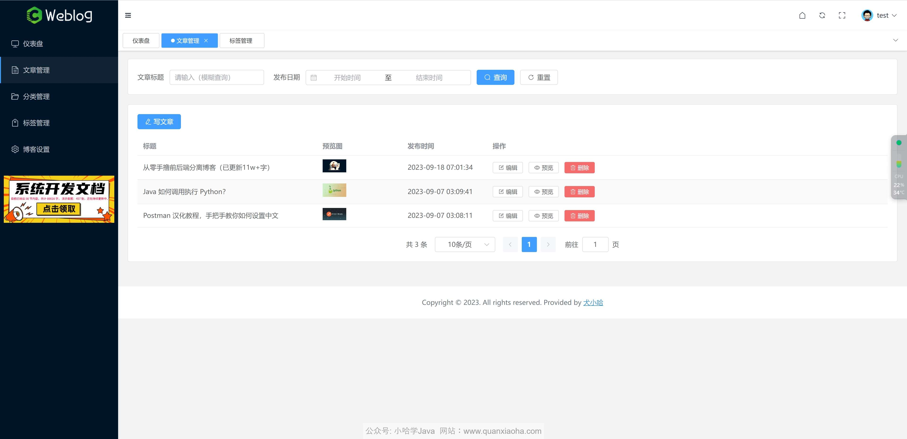
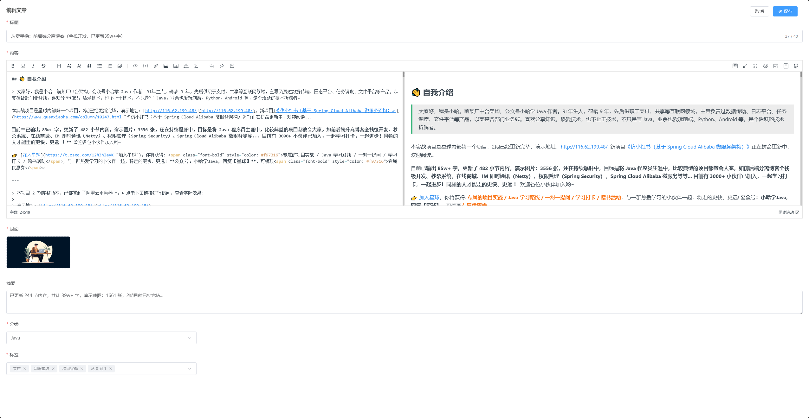

# 文章模块开发

## 一、模块功能分析及表设计

### 1.1、前端功能分析

前端页面原型1：



首先是文章列表页面，要实现四个功能：

- 分页条件查询文章列表
- 提供编辑入口
- 提供预览入口
- 删除文章


前端页面原型2：



点击编辑或新增后弹出全屏的编辑文章对话框，要实现如下功能：

- 点击新增时显示空白内容的全屏文章编辑对话框
- 点击编辑时渲染对应的文章标题、摘要、内容(`Markdown`)、封面、分类、标签
- 保存

### 1.2、后端接口设计

根据前端所要实现的功能，后端大致需要提供如下接口：

- 分页查询文章列表
- 删除文章
- 发布文章
- 获取文章详情
- 更新文章

### 1.3、表设计

#### 1.3.1、文章表

分析完接口后，可设计此模块所需的表。因为为存储的文章内容数据文本较大且只有访问文章详情的时候才需要查询，将表拆分为两张，一张存储文章基础信息，一张存储文章内容以文章`id`作关联

文章基础信息表需要字段如下：

- id
- 标题
- 封面
- 摘要
- 创建时间
- 更新时间
- 删除标志位
- 被阅读次数

最终建表语句如下：

```sql
CREATE TABLE `t_article` (
	`id` BIGINT(20) UNSIGNED NOT NULL AUTO_INCREMENT COMMENT '文章id',
	`title` VARCHAR(120) NOT NULL DEFAULT '' COMMENT '文章标题',
	`cover` VARCHAR(120) NOT NULL DEFAULT '' COMMENT '文章封面',
	`summary` VARCHAR(160) DEFAULT '' COMMENT '文章摘要',
	`create_time` DATETIME NOT NULL DEFAULT CURRENT_TIMESTAMP COMMENT '创建时间',
	`update_time` DATETIME NOT NULL DEFAULT CURRENT_TIMESTAMP COMMENT '更新时间',
	`is_deleted` TINYINT(2) NOT NULL DEFAULT '0' COMMENT '删除标志位：0：未删除 1：已删除',
	`read_num` int(11) UNSIGNED NOT NULL DEFAULT '0' COMMENT '被阅读数',
	PRIMARY KEY (`id`) USING BTREE,
	KEY `idx_create_time` (`create_time`) USING BTREE
) ENGINE=InnoDB DEFAULT CHARSET=utf8mb4 ROW_FORMAT=DYNAMIC COMMENT='文章表';
```

文章内容表需要字段如下：

- 文章内容`id`
- 文章`id`
- 文章内容正文

最终建表语句如下：

```sql
CREATE TABLE `t_article_content` (
	`id` BIGINT(20) UNSIGNED NOT NULL AUTO_INCREMENT COMMENT '文章内容id',
	`article_id` BIGINT(20) NOT NULL COMMENT '文章id',
	`content` TEXT COMMENT '文章正文',
	PRIMARY KEY (`id`) USING BTREE,
	KEY `idx_article_id` (`article_id`) USING BTREE
) ENGINE=InnoDB DEFAULT CHARSET=utf8mb4 ROW_FORMAT=DYNAMIC COMMENT='文章内容表';
```

#### 1.3.2、文章关联关系表

文章发布时还需选择文章归属的分类，每篇文章选择一个分类，因此还需建立文章与类别的关联表：

```sql
CREATE TABLE `t_article_category_rel` (
  `id` bigint(20) unsigned NOT NULL AUTO_INCREMENT COMMENT 'id',
  `article_id` bigint(20) unsigned NOT NULL COMMENT '文章id',
  `category_id` bigint(20) unsigned NOT NULL COMMENT '分类id',
  PRIMARY KEY (`id`) USING BTREE,
  UNIQUE KEY `uni_article_id` (`article_id`) USING BTREE,
  KEY `idx_category_id` (`category_id`) USING BTREE
) ENGINE=InnoDB DEFAULT CHARSET=utf8mb4 ROW_FORMAT=DYNAMIC COMMENT='文章所属分类关联表';
```

> 因为原型页中，一个文章只能归属于一个分类，所以，这里对其添加了`UNIQUE KEY`唯一索引。

此外，每篇文章可以绑定多个标签，因此还需建立一个文章与标签的关联表：

```sql
CREATE TABLE `t_article_tag_rel` (
  `id` bigint(20) unsigned NOT NULL AUTO_INCREMENT COMMENT 'id',
  `article_id` bigint(20) unsigned NOT NULL COMMENT '文章id',
  `tag_id` bigint(20) unsigned NOT NULL COMMENT '标签id',
  PRIMARY KEY (`id`) USING BTREE,
  KEY `idx_article_id` (`article_id`) USING BTREE,
  KEY `idx_tag_id` (`tag_id`) USING BTREE
) ENGINE=InnoDB DEFAULT CHARSET=utf8mb4 ROW_FORMAT=DYNAMIC COMMENT='文章对应标签关联表';
```

## 二、文章发布接口开发

### 2.1、接口模型设计

- 请求地址：`/admin/article/publish`

- 请求方式：`POST`

- 请求入参：

  ```json
  {
      "categoryId": "分类 ID",
      "content": "文章内容",
      "cover": "文章封面",
      "summary": "文章摘要",
      "tags": ["文章标签"],
      "title": "文章标题"
  }
  ```

- 请求返回：

  - 异常情况：

    ```json
    {
        "success": false,
        "code": "20009",
        "message": "提交的分类不存在！",
        "data": null
    }
    ```

  - 正常响应：

    ```json
    {
        "success": true,
        "code": null,
        "message": null,
        "data": null
    }
    ```

### 2.2、接口相关配置建立与初始化

#### 2.2.1、添加异常响应枚举值

向全局响应枚举`ResponseCodeEnum`中添加提交分类不存在的枚举：

```java
CATEGORY_NOT_EXISTED("20009", "提交的分类不存在！")
```

#### 2.2.2、出入参 VO

- 入参：

在`weblog-module-admin`模块下的`/model/vo`包中新建一个`article`包用于统一放置文章相关`VO`，创建`PublishArticleReqVO`入参实体类：

```java
package com.cm.weblog.admin.model.vo.article;

import io.swagger.annotations.ApiModel;
import lombok.AllArgsConstructor;
import lombok.Builder;
import lombok.Data;
import lombok.NoArgsConstructor;
import org.hibernate.validator.constraints.Length;

import javax.validation.constraints.NotBlank;
import javax.validation.constraints.NotEmpty;
import javax.validation.constraints.NotNull;
import java.util.List;

@Data
@AllArgsConstructor
@NoArgsConstructor
@Builder
@ApiModel(value = "发布文章 VO")
public class PublishArticleReqVO {
    @NotBlank(message = "文章标题不能为空")
    @Length(min = 1, max = 40, message = "文章标营字数需在1到40之间")
    private String title;
    
    @NotBlank(message = "文章内容不能为空")
    private String content;
    
    @NotBlank(message = "文章封面不能为空")
    private String cover;
    
    private String summary;
    
    @NotNull(message = "文章分类不能为空")
    private Long categoryId;
    
    @NotEmpty(message = "文章标签不能为空")
    private List<String> tags;
}

```

- 出參：无

#### 2.2.3、Controller

在`controller`包中新建`AdminArticleController`用于统一放置文章相关的接口，然后添加文章发布接口：

```java
package com.cm.weblog.admin.controller;

import com.cm.weblog.admin.model.vo.article.PublishArticleReqVO;
import com.cm.weblog.common.aspect.ApiOperationLog;
import com.cm.weblog.common.utils.Response;
import io.swagger.annotations.Api;
import io.swagger.annotations.ApiOperation;
import org.springframework.security.access.prepost.PreAuthorize;
import org.springframework.validation.annotation.Validated;
import org.springframework.web.bind.annotation.PostMapping;
import org.springframework.web.bind.annotation.RequestBody;
import org.springframework.web.bind.annotation.RequestMapping;
import org.springframework.web.bind.annotation.RestController;

import javax.annotation.Resource;

@RestController
@RequestMapping("/admin/article")
@Api(tags = "Admin 文章模块")
public class AdminArticleController {
    @Resource
    private AdminArticleService adminArticleService;
    
    @PostMapping("/publish")
    @ApiOperation(value = "文章发布")
    @ApiOperationLog(description = "文章发布")
    @PreAuthorize("hasRole('ROLE_ADMIN')")
    public Response<?> publishArticle(@RequestBody @Validated PublishArticleReqVO publishArticleReqVO) {
        return adminArticleService.publishArticle(publishArticleReqVO);
    }
}

```

#### 2.2.4、Service

在`Service`层中创建`AdminArticleService`接口，并创建刚才在`Controller`层中调用的方法签名：

```java
package com.cm.weblog.admin.service;

import com.cm.weblog.admin.model.vo.article.PublishArticleReqVO;
import com.cm.weblog.common.utils.Response;

public interface AdminArticleService {
    /**
     * 发布文章服务
     * @param publishArticleReqVO 入参
     * @return 请求响应
     */
    Response<?> publishArticle(PublishArticleReqVO publishArticleReqVO);
}

```

#### 2.2.5、DO & Mapper

在`weblog-module-common`模块的`/domain/dos`包下新建文章表与对应关系表相关的`DO`以及在`mapper`包下创建对应的`mapper`，分别如下：

**文章表：`ArticleDO`、`ArticleMapper`**

```java
package com.cm.weblog.common.domain.dos;

import com.baomidou.mybatisplus.annotation.IdType;
import com.baomidou.mybatisplus.annotation.TableId;
import com.baomidou.mybatisplus.annotation.TableName;
import lombok.AllArgsConstructor;
import lombok.Builder;
import lombok.Data;
import lombok.NoArgsConstructor;

import java.time.LocalDateTime;

@Data
@AllArgsConstructor
@NoArgsConstructor
@Builder
@TableName("t_article")
public class ArticleDO {
    @TableId(type = IdType.AUTO)
    private Long id;
    
    private String title;
    
    private String cover;
    
    private String summary;
    
    private LocalDateTime createTime;
    
    private LocalDateTime updateTime;
    
    private Boolean isDeleted;
    
    private Long readNum;
}

```

```java
package com.cm.weblog.common.domain.mapper;

import com.baomidou.mybatisplus.core.mapper.BaseMapper;
import com.cm.weblog.common.domain.dos.ArticleDO;

public interface ArticleMapper extends BaseMapper<ArticleDO> {
}

```

**文章内容表：`ArticleContentDO`、`ArticleContentMapper`**

```java
package com.cm.weblog.common.domain.dos;

import com.baomidou.mybatisplus.annotation.IdType;
import com.baomidou.mybatisplus.annotation.TableId;
import com.baomidou.mybatisplus.annotation.TableName;
import lombok.AllArgsConstructor;
import lombok.Data;
import lombok.NoArgsConstructor;

@Data
@AllArgsConstructor
@NoArgsConstructor
@TableName("t_article_content")
public class ArticleContentDO {
    @TableId(type = IdType.AUTO)
    private Long id;
    
    private Long articleId;
    
    private String content;
}

```

```java
package com.cm.weblog.common.domain.mapper;

import com.baomidou.mybatisplus.core.mapper.BaseMapper;
import com.cm.weblog.common.domain.dos.ArticleContentDO;

public interface ArticleContentMapper extends BaseMapper<ArticleContentDO> {
}

```

**文章分类关联关系表：`ArticleCategoryRelDO`、`ArticleCategoryRelMapper`**

```java
package com.cm.weblog.common.domain.dos;

import com.baomidou.mybatisplus.annotation.IdType;
import com.baomidou.mybatisplus.annotation.TableId;
import com.baomidou.mybatisplus.annotation.TableName;
import lombok.AllArgsConstructor;
import lombok.Builder;
import lombok.Data;
import lombok.NoArgsConstructor;

@Data
@AllArgsConstructor
@NoArgsConstructor
@Builder
@TableName("t_article_category_rel")
public class ArticleCategoryRelDO {
    @TableId(type = IdType.AUTO)
    private Long id;
    
    private Long articleId;
    
    private Long categoryId;
}

```

```java
package com.cm.weblog.common.domain.mapper;

import com.baomidou.mybatisplus.core.mapper.BaseMapper;
import com.cm.weblog.common.domain.dos.ArticleCategoryRelDO;

public interface ArticleCategoryRelMapper extends BaseMapper<ArticleCategoryRelDO> {
}

```

**文章标签关联关系表：`ArticleTagRelDO`、`ArticleTagRelMapper`**

```java
package com.cm.weblog.common.domain.dos;

import com.baomidou.mybatisplus.annotation.IdType;
import com.baomidou.mybatisplus.annotation.TableId;
import com.baomidou.mybatisplus.annotation.TableName;
import lombok.AllArgsConstructor;
import lombok.Builder;
import lombok.Data;
import lombok.NoArgsConstructor;

@Data
@AllArgsConstructor
@NoArgsConstructor
@Builder
@TableName("t_article_tag_rel")
public class ArticleTagRelDO {
    @TableId(type = IdType.AUTO)
    private Long id;
    
    private Long articleId;
    
    private Long tagId;
}

```

```java
package com.cm.weblog.common.domain.mapper;

import com.baomidou.mybatisplus.core.mapper.BaseMapper;
import com.cm.weblog.common.domain.dos.ArticleTagRelDO;

public interface ArticleTagRelMapper extends BaseMapper<ArticleTagRelDO> {
}

```

### 2.3、基础接口实现

在`service/impl`包下创建接口对应的实现类`AdminArticleServiceImpl`，具体操作如下：

> 1. 开启事务回滚注解，保证方法内所有操作是原子性的即全部成功或全部失败避免部分成功的情况
> 2. `VO`转`ArticleDO`并保存
> 3. `vo`转`ArticleContentDO`并保存
> 4. 校验文章分类并处理
> 5. 保存文章标签

代码如下：

```java
package com.cm.weblog.admin.service.impl;

import com.cm.weblog.admin.model.vo.article.PublishArticleReqVO;
import com.cm.weblog.admin.service.AdminArticleService;
import com.cm.weblog.common.domain.dos.ArticleCategoryRelDO;
import com.cm.weblog.common.domain.dos.ArticleContentDO;
import com.cm.weblog.common.domain.dos.ArticleDO;
import com.cm.weblog.common.domain.dos.CategoryDO;
import com.cm.weblog.common.domain.mapper.ArticleCategoryRelMapper;
import com.cm.weblog.common.domain.mapper.ArticleContentMapper;
import com.cm.weblog.common.domain.mapper.ArticleMapper;
import com.cm.weblog.common.domain.mapper.CategoryMapper;
import com.cm.weblog.common.enums.ResponseCodeEnum;
import com.cm.weblog.common.exception.BizException;
import com.cm.weblog.common.utils.Response;
import lombok.extern.slf4j.Slf4j;
import org.springframework.stereotype.Service;
import org.springframework.transaction.annotation.Transactional;

import javax.annotation.Resource;
import java.time.LocalDateTime;
import java.util.List;
import java.util.Objects;

@Service
@Slf4j
public class AdminArticleServiceImpl implements AdminArticleService {
    @Resource
    private ArticleMapper articleMapper;
    
    @Resource
    private ArticleContentMapper articleContentMapper;
    
    @Resource
    private CategoryMapper categoryMapper;
    
    @Resource
    private ArticleCategoryRelMapper articleCategoryRelMapper;
    
    @Override
    @Transactional(rollbackFor = Exception.class) // 1、开启事务回滚
    public Response<?> publishArticle(PublishArticleReqVO publishArticleReqVO) {
        /*
        * 2、VO 转 ArticleDO 并保存
        * */
        ArticleDO articleDO = ArticleDO.builder()
                .title(publishArticleReqVO.getTitle())
                .cover(publishArticleReqVO.getCover())
                .summary(publishArticleReqVO.getSummary())
                .createTime(LocalDateTime.now())
                .updateTime(LocalDateTime.now())
                .build();
        articleMapper.insert(articleDO);
        // 插入后拿到 ID
        Long articleId = articleDO.getId();
        
        /*
        * 3、VO 转 ArticleContentDO 并保存
        * */
        ArticleContentDO articleContentDO = ArticleContentDO.builder()
                .articleId(articleId)
                .content(publishArticleReqVO.getContent())
                .build();
        articleContentMapper.insert(articleContentDO);
        
        /*
        * 4、校验文章分类并处理
        * */
        Long categoryId = publishArticleReqVO.getCategoryId();
        CategoryDO categoryDO = categoryMapper.selectById(categoryId);
        if (Objects.isNull(categoryDO)) {
            log.warn("==> 分类不存在，category: {}", categoryId);
            throw new BizException(ResponseCodeEnum.CATEGORY_NAME_IS_EXISTED);
        }
        ArticleCategoryRelDO articleCategoryRelDO = ArticleCategoryRelDO.builder()
                .articleId(articleId)
                .categoryId(categoryId)
                .build();
        articleCategoryRelMapper.insert(articleCategoryRelDO);
        
        /*
        * 5、保存文章标签
        * */
        List<String> publishTags = publishArticleReqVO.getTags();
        insetTags(publishTags);
        
        return Response.success();
    }

    /**
     * 保存标签
     * @param tags 标签集合
     */
    private void insetTags(List<String> tags) {
        // TODO
    }
}

```

### 2.4、简单测试

**模拟运行时错误：**

在保存文章标签之前手动抛出一个运行时异常：

```java
int i = 10 / 0;
```

运行后查看相关记录是否被添加到数据库中，若未添加，则测试成功

入参：

```json
{
    "categoryId": 1,
    "content": "内容",
    "cover": "http://127.0.0.1:9000/weblog/6c861e22e2e04fc78ce8a17f22ffe164.png",
    "summary": "测试摘要",
    "tags": ["Java", "Test"],
    "title": "测试标题"
}
```

**提交一个不存在的分类：**

去除运行时异常

入参：

```json
{
    "categoryId": 2,
    "content": "内容",
    "cover": "http://127.0.0.1:9000/weblog/6c861e22e2e04fc78ce8a17f22ffe164.png",
    "summary": "测试摘要",
    "tags": ["Java", "Test"],
    "title": "测试标题"
}
```

响应：

```json
{
    "success": false,
    "message": "提交的分类不存在！",
    "code": "20009",
    "data": null
}
```

**正确数据提交：**

入参：

```json
{
    "categoryId": 1,
    "content": "内容",
    "cover": "http://127.0.0.1:9000/weblog/6c861e22e2e04fc78ce8a17f22ffe164.png",
    "summary": "测试摘要",
    "tags": ["Java", "Test"],
    "title": "测试标题"
}
```

响应：

```java
{
    "success": true,
    "message": null,
    "code": null,
    "data": null
}
```

除标签外其它数据表内容也被成功添加！